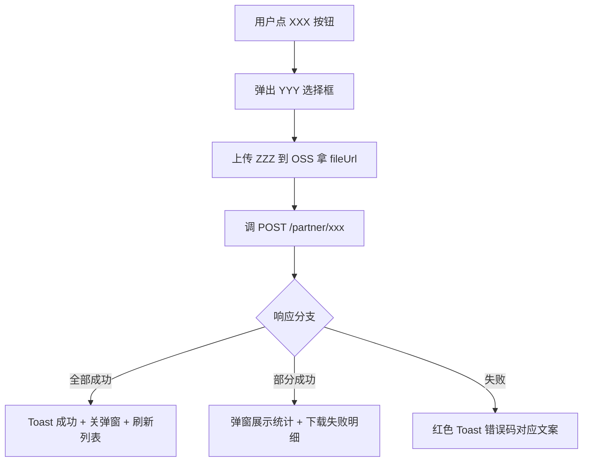

- # {功能名} 前端接入说明（模板）

> ⚠️ **本文件是模板，新需求按此结构落地到** `v{版本}/前端接入说明/{序号}_{功能名}/前端接入说明.md`。

---

## 🔴 文档纪律（强制）

⚠️ **全生命周期同步约束**：本文档是给前端看的**接口契约真源**之一，**详设 / 开发期 / 评审期任何接口或字段改动，必须同步修订本文档**：

| 触发时机 | 同步动作 |
|---|---|
| 详设阶段写完 / 修订 | 后端在 `v{版本}/前端接入说明/{序号}_{功能名}/` 下落地 / 更新本文档 |
| 详设评审 / 复评改了接口契约 | 同步改本文档（不允许只改详设不改本文档）|
| **开发过程中**改了接口路径 / 字段 / 错误码 / 报文结构 | **当次 commit 同步改本文档**——不允许"先开发再补"|
| Phase 6 / 上线前自检 | 跟实际代码 grep 一遍接口契约一致 |

**违反 = 前端跟着旧契约对接，联调踩坑 = 严重违规**。

---

## 文件归档约定

| 路径 | 用途 |
|---|---|
| `ips-doc-engineering/docs/backend/v{版本}/前端接入说明/{序号}_{功能名}/前端接入说明.md` | 本文档（每个需求一份 markdown）|
| `ips-doc-engineering/docs/backend/v{版本}/前端接入说明/{序号}_{功能名}/img/` | 原型站红框截图 |

文件命名约定：
- 文档统一叫 `前端接入说明.md`
- 截图命名 `{端}-{页面}-{改动点}.png`，例：`客户端-门店收款码-禁用时段卡片行.png`、`运营端-远程收款码列表-禁用时段列.png`

---

## 标准原型站地址

| 端 | URL | 默认登录态 |
|---|---|---|
| 商户端（智汇分账通）| http://192.168.10.34:3008/ | 已登录 |
| 运营端（支付运营中心）| http://192.168.10.34:3009/ | 已登录 |

**截图工具**：chrome-devtools-mcp + JS inject CSS `outline: 3px solid red; outline-offset: 4px;` 给改动元素加红框，再 take_screenshot。

---

## 📐 表达形式选择规则（强制统一）

| 内容类型 | 表达形式 | 原因 |
|---|---|---|
| 请求 / 响应**报文整体** | **JSON 代码块**（带示例值，不要占位符 `"xxx"`）| 前端复制粘贴直观 |
| **字段定义**（含类型 / 必填 / 含义） | **Table**（参数 / 类型 / 必填 / 说明）| 一眼对照 |
| **枚举值映射**（code → 文案） | **Table**（值 / 展示文案）| 前端按 code 翻 label |
| **影响接口清单**（一个改动涉及多个 endpoint） | **Table**（接口 / 方法 / 变更）| 范围一目了然 |
| **调用时序 / 页面交互流程** | **Mermaid flowchart**（绑业务节点，不绑技术细节）| 前端按图实现 UI 流程 |
| **业务约束 / 字段顺序 / 兼容历史数据等关键提醒** | **Callout 块**（`> 💡` / `> ⚠️` / `> ❌`）| 视觉强提醒 |
| **每端改动汇总** | **Checkbox 列表**（`- [ ] 改动项`） | 前端打勾验收 |
| **跨端 / 跨页面影响**（一份变更影响多个页面） | **多端影响矩阵 Table**（页面 × 需求） | 全景一览 |
| **错误码** | **Table**（code / message / 触发场景）| 前端按 code toast |
| **变更历史** | **变更日志 Table**（版本 / 日期 / 变更内容） | 多版本可追溯 |

**禁止**：
- ❌ 整段段落描述报文（用 JSON 代码块）
- ❌ Markdown 表格列接口（前端复制转发会失真,见 `code/frontend-changelog.md`)
- ❌ 只写字段名不写中文含义
- ❌ 枚举字段不列出 `code:label` 全集

---

# {功能名} 前端接入说明

> 关联详设：`v{版本}/详细设计/{序号}_{功能名}_详设.md`
> 商户端原型：http://192.168.10.34:3008/
> 运营端原型：http://192.168.10.34:3009/

---

## 变更日志

| 版本 | 日期 | 变更内容 |
|---|---|---|
| v1.1 | YYYY-MM-DD | **改动 X**：xxx；**改动 Y**：yyy |
| v1.0 | YYYY-MM-DD | 初始版本 |

---

## 一、变更总览

| # | 需求 | 接口变更类型 | 影响页面 |
|---|---|---|---|
| 1 | {一句话需求} | 已有接口返回值变更 / 已有接口字段新增 / **新增接口** / 校验规则变更 / 文案变更 | 客户端-XXX、运营端-XXX、小程序-XXX |
| 2 | ... | ... | ... |

---

## 二、需求 1：{需求名}

### 2.1 变更说明

{1-3 句业务背景：为什么改、改了什么。不要把详设搬过来。}

### 2.2 影响接口

| 接口 | 方法 | 变更点 |
|---|---|---|
| POST /partner/xxx | 创建 XXX | 返回值新增字段 / 请求体新增字段 / 校验规则变更 |
| GET /partner/yyy | 查询 XXX | 同上 |

### 2.3 改动点 1：{页面位置 + 改动}


> 截图位置说明：{元素在哪 / 红框含义 / 触发动作}

{2-3 句详述：用户点哪触发、展示什么、改动相比旧版差异}

### 2.4 改动点 2：{页面位置 + 改动}


{说明}

### 2.5 接口契约（按下面 N 个 endpoint 逐个列）

> 选择：**新增接口**用模板 A；**已有接口字段变更**用模板 B；**校验规则变更**用模板 C；**复用接口无字段变更**只列名 + 用法一句话。

#### 模板 A：新增接口 {METHOD} /partner/xxx

**用途**：{一句话用途}

**请求方式**：`application/json` / `multipart/form-data` / `query`

**请求参数报文**（JSON 示例）：
```json
{
  "fieldA": "示例值",
  "fieldB": 100,
  "fieldC": ["a", "b"]
}
```

**字段说明**：

| 参数 | 类型 | 必填 | 说明 |
|---|---|---|---|
| fieldA | String | 是 | 业务含义中文描述 |
| fieldB | Integer | 否 | 默认值 100，业务规则 |
| fieldC | List<String> | 否 | 数组类型说明 |

**响应报文**（JSON 示例）：
```json
{
  "code": "0",
  "msg": "成功",
  "data": {
    "resultField": "value",
    "nestedList": [{"id": 1, "name": "x"}]
  }
}
```

**响应字段**：

| 字段 | 类型 | 说明 |
|---|---|---|
| resultField | String | 含义 |
| nestedList | List<NestedItem> | 含义 |
| nestedList[].id | Long | 子字段含义 |
| nestedList[].name | String | 子字段含义 |

**枚举值**（如有枚举字段）：

| 字段 | 值 | 展示文案 |
|---|---|---|
| xxxStatus | PENDING | 待处理 |
| xxxStatus | SUCCESS | 成功 |

**业务规则**（如有）：

> 💡 {规则 1：什么情况下接口怎么表现}
>
> ⚠️ {规则 2：限制 / 上限 / 兼容历史数据等}

**错误码**：

| code | 文案 | 触发场景 |
|---|---|---|
| API001001 | 商户不属于当前租户 | 跨租户调用 |
| API016012 | Excel 文件为空或无有效数据 | 两个 Sheet 都没数据行 |

#### 模板 B：已有接口 {METHOD} /partner/xxx 字段变更

**用途**：{一句话用途}

**新增字段**（请求或响应）：

| 字段 | 类型 | 位置 | 说明 |
|---|---|---|---|
| newField | String | 响应 data.newField | 新增含义 |

**删除字段**：

| 字段 | 原意 | 删除原因 |
|---|---|---|
| oldField | xxx | yyy |

**修改字段**：

| 字段 | 旧定义 | 新定义 | 兼容策略 |
|---|---|---|---|
| someField | Long（分） | String（元）| 历史值后端自动转换 |

**枚举值变更**（已有字段的枚举集合有增删改时**必填**）：

> 💡 出现下面任一情况都要列:
> - 已有枚举字段**新增** code(如 `txnType` 加 `POS_DOMESTIC_DEBIT` 等 4 个新值)
> - 已有枚举字段**删除** code(如下线某状态值)
> - 已有枚举值**重命名 / 改文案**(如 `POS:刷卡支付` → `POS:境内借记卡`)
> - 已有枚举字段**含义变化**(如某状态的触发条件改了)

| 字段 | 类型 | 变更 | 旧值 | 旧文案 | 新值 | 新文案 |
|---|---|---|---|---|---|---|
| txnType | 新增 | - | - | POS_DOMESTIC_DEBIT | 境内借记卡 |
| txnType | 新增 | - | - | POS_DOMESTIC_CREDIT | 境内信用卡 |
| xxxStatus | 删除 | OBSOLETE | 已下线 | - | - |
| yyyType | 重命名 | OLD | 旧文案 | NEW | 新文案 |

**枚举值前端兼容策略**(如有历史数据迁移):

> 💡 历史数据迁移前可能仍出现旧枚举值(如 `POS`),前端**必须兼容展示**为对应文案,直到 DML 回填完成。

**前端展示口径**(如新字段直接绑某 UI 位置):

> 「付款方式」列 → 取 `txnTypeName`
> 「收款方式」列 → 取 `rcptMethodName`

#### 模板 C：已有接口 {METHOD} /partner/xxx 校验规则变更

**用途**：{一句话用途}

**校验规则变更**：

| 字段 | 旧规则 | 新规则 |
|---|---|---|
| bankBranch | 必填 | 非必填 |

**前端同步动作**：

> ⚠️ 前端去除「开户支行」必填星号 + 表单校验，否则用户填了空再次被前端拦住，体感跟后端不一致

#### 模板 D：复用接口（无字段变更）

`POST /partner/xxx`：{一句话用途 + 前端如何衔接本次新增接口的响应}

### 2.6 调用时序 / 页面交互流程

> 多步骤交互（如上传 → 调用 → 提示 → 跳转）必须画 Mermaid 流程图。



### 2.7 限制与错误处理（如有）

| 限制 | 说明 |
|---|---|
| 单次最多 200 条 | 个人 + 企业合计不超过，超出整行标失败 |
| 文件内去重 | 按银行账号；重复行单行失败 |
| 第三方失败 | 单行失败不影响其它行 |

### 2.8 前端改动清单

- [ ] {端}-{页面}：{改动 1}
- [ ] {端}-{页面}：{改动 2}
- [ ] {端}-{页面}：{改动 3}

---

## 三、需求 2：{需求名}

（同需求 1 结构）

---

## 四、多端影响矩阵

> 一份变更涉及多端 / 多页面时，用矩阵 table 给全景一览。

| 页面 | 需求 1 | 需求 2 | 需求 3 | 需求 4 |
|---|---|---|---|---|
| 运营端-收款订单 | txnType 展示+筛选 | - | - | - |
| 运营端-退款订单 | txnType 展示+筛选 | rcptMethod 新增 | - | - |
| 商户端-余额分账 | - | - | - | 导入收款方 |
| 小程序-订单列表 | txnType | - | - | - |

---

## 五、数据库变更（如有，前端只看部署节奏）

### DDL（部署代码前执行）

```sql
ALTER TABLE xxx ADD COLUMN new_col VARCHAR(50) DEFAULT NULL COMMENT '新字段';
```

### DML（部署代码后执行，历史数据回填）

详见 `sql/{功能名}-DML.sql`，包含 N 个回填语句。

---

## 六、部署顺序

> ✅
> **1.** 执行 DDL（加列，无风险）
> **2.** 部署后端代码
> **3.** 部署前端代码
> **4.** 执行 DML（历史数据回填，建议低峰期）

---

## 📋 写作纪律（每份接入说明都要满足）

1. **变更日志 + 变更总览必有** —— 让前端 5 秒看完本次有啥变化
2. **每个改动点都要"截图红框 + 文字说明"配套** —— 没截图的不算合格
3. **接口契约简洁**：只写有改动的接口（新增 / 字段变更 / 删除）。**未变动的旧接口只在模板 D 简短列名**
4. **字段类型 + 枚举值要全**：每个枚举字段写明 `code:label`，前端按此映射;**已有字段的枚举值有新增 / 删除 / 重命名 / 含义变化时,必须在「枚举值变更」表单独列出**(见模板 B),前端 grep 此表确认所有 code 都处理到
5. **错误码完整**：每个新接口可能抛的错误码都要列出，前端按此 toast
6. **多步骤交互必有 Mermaid 流程图**：避免文字描述歧义
7. **如果某端不涉及改动**：整章删，不要留空骨架
8. **截图必须从真实原型站抓**：商户端 3008 / 运营端 3009；不存在的页面在文档显式标注「⏳ 待开发期 admin 页面就绪补真截图」，**不允许**用 PRD 图片代替
9. **变更日志按版本倒序**：最新版本放最上面
