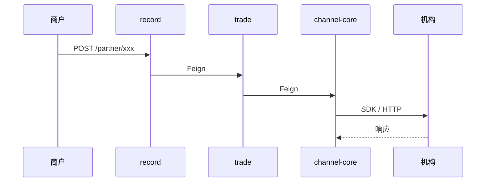
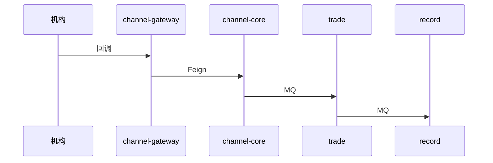
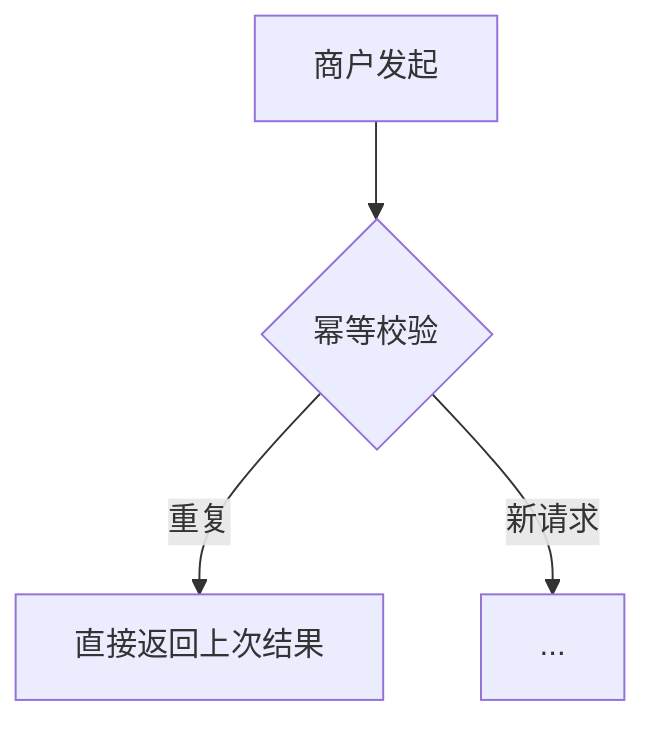

# {功能名称} 详细设计

> 版本：v1.0
> 状态：草稿 / 评审中 / 已定稿 / 已实现
> 作者：
> 日期：YYYY-MM-DD
> 需求/任务背景：
> 涉及服务：record / trade / channel-core / channel-gateway
> 核心关键词：

---

## 📁 文档归档位置（强制路径约定）

⚠️ **本节要求**：所有详设 / 进度文档必须按以下规则归档，**禁止放错位置**。

| 文档类型 | 路径规则 | 示例 |
|---|---|---|
| 详细设计文档 | `ips-doc-engineering/docs/backend/v{版本号}/详细设计/{序号}_{功能名称}_详设.md` | `ips-doc-engineering/docs/backend/v1.2/详细设计/01_易宝H5收银台主线_详设.md` |
| 开发进度文档 | `ips-doc-engineering/docs/backend/v{版本号}/开发进度/{序号}_{功能名称}_进度.md` | `ips-doc-engineering/docs/backend/v1.2/开发进度/01_易宝H5收银台主线_进度.md` |
| **开发自测归档**（Phase 4 自测产物，**按需建** —— 有业务文件 / 页面产物才建）| `ips-doc-engineering/docs/backend/v{版本号}/开发自测归档/{序号}_{功能名称}_自测产物/` | `ips-doc-engineering/docs/backend/v1.0.1/开发自测归档/04_收款码禁用时段_自测产物/`（含新生成的二维码 PNG / HTML 模板样品 / 真实业务文件等"最终结果产物"）|
| 渠道公共文档 | `ips-doc-engineering/docs/backend/latest/支付机构/{渠道}/{文档名}.md` | `ips-doc-engineering/docs/backend/latest/支付机构/易宝/易宝业务说明.md`、`ips-doc-engineering/docs/backend/latest/支付机构/易宝/易宝回调地址清单.md` |

> ⚠️ **开发自测归档目录纪律（用户原话 2026-05-21「只放你自测重要的结果」+「以后记得都要这么干哦」+「没有什么产物就不要归档」）**：
>
> - **按需建，不是默认必建**：本需求 Phase 4 自测真有"业务文件 / 页面产物"产出才建（如二维码 PNG / HTML 模板 / 跑通的 xlsx / 真实 PDF）；纯算法 / 纯逻辑 / 不涉及文件 / 不涉及页面的需求**不建**
> - **只放重要结果**：① 最终业务真品（开发期要直接拷过去用的）② 真实业务样本（评审 / 部署测试要看的）
> - **禁止放过程产物**：自测脚本 `.py` / 跑通日志 `.log` / 从 dev / COS 下载的副本 / chrome-devtools 截图 / `*_自测留档.md` 总结文档 —— 这些跑完即删
> - 真要建时，版本目录下没有 `开发自测归档/` 父目录则一并新建
> - 详细黑白名单 + 历史案例 + 与详设 §9 / 进度 §2.3 的分工见 `.claude/skills/ips-detail-design-writer/references/phase4-self-test-policy.md` §3
| 项目总览 | `ips-doc-engineering/docs/backend/latest/业务/业务功能总览.md` | 全局唯一 |

**路径字段说明**：

- `{渠道接入}`：例如 `易宝接入` / `微信接入` / `支付宝接入`（按渠道分目录，跨渠道场景另起目录如 `跨渠道-XX接入`）
- `{版本号}`：例如 `v2.0` / `v2.1`（同一版本内的功能在同一子目录）
- `{序号}`：例如 `01` / `02`（同一 v 版本内顺延，01 = 第一个，02 = 第二个）
- `{功能名称}`：与商户管理平台功能命名一致，例如 `易宝H5收银台接入` / `易宝出款`

**详设与进度文档必须成对**：序号 + 功能名称完全一致（差异只在后缀 `_详设.md` / `_进度.md`），便于交叉索引。

---

> **本文件是 IPS 详设文档"模板 + 约束"合一版本**：每章节顶部 ⚠️ 块是**硬性要求**，正文是**占位符**；不满足 ⚠️ 块要求的文档视为"详设不完整，不可进入开发"。
>
> ## 📚 写详设前必读 latest/ 长期文档（**这里是项目最新真源，写详设前先翻一遍熟悉项目**）
>
> 以下 3 个目录是 IPS **每次开发完都会回流的长期文档**——内容最新、覆盖最广，是写详设前最高效的项目入门 + 不重复造轮子检查路径：
>
> | 目录 | 用途 | 何时必读 |
> |---|---|---|
> | `ips-doc-engineering/docs/backend/latest/业务/业务功能总览.md` | 项目全景图（微服务划分 / 表归属 / 业务模块 / 接口索引）| **每次写详设前必读** |
> | `ips-doc-engineering/docs/backend/latest/接口文档/` | 当前所有对外 / 管理台 / Feign 接口的最新契约 | 涉及新接口 / 改接口时必读，看是否能复用 |
> | `ips-doc-engineering/docs/backend/latest/支付机构/{渠道}/` | 各渠道业务说明 + 回调地址清单（机构侧最新参考）| 接渠道时必读 |
>
> **🔴 强制**：详设 §0 前置确认必须确认"已读 latest/ 下相关目录"才能进入正文。
>
> ---
>
> **其它配套**：
> - 进度模板：[开发进度文档模板.md](./开发进度文档模板.md)
> - 规则库：`.claude/rules/README.md`（含 `architecture/long-doc-sync.md` 长期文档同步规则）
> - 业务 skills：`.claude/skills/ips-*-integration/`
> - 字段映射对照参考：`.claude/skills/ips-lingong-diff-check/SKILL.md`（铁律：严格对照官方文档/源码，禁止臆想加文档没有的逻辑）

---

## 🔗 机构官方文档地址（每个用到的接口都必须挂上）

⚠️ **本节要求**：详设涉及的每一个机构接口（下单、查询、回调、退款、关单、对账等），**必须在表格里挂出官方文档原始 URL + SDK 类**，方便评审 / 开发 / 排查时直接跳转核对。**禁止只写接口名不写 URL**。

| 接口用途 | API path | HTTP 方法 | SDK 类 | 官方文档地址 |
|---|---|---|---|---|
| {例：下单} | `/rest/v1.0/xxx` | POST | `XxxClient.method` | https://open.xxx.com/docs/... |
| {例：查询} | `/rest/v1.0/xxx` | GET | `XxxClient.method` | https://open.xxx.com/docs/... |
| {例：异步回调} | (机构主推到 IPS notifyUrl) | POST | (统一回调网关) | https://open.xxx.com/docs/... |
| {例：退款} | `/rest/v1.0/xxx` | POST | `XxxClient.method` | https://open.xxx.com/docs/... |

> 复用 IPS 已有接口（如已接好的退款链路）也要挂 URL，标注"复用现有 XxxHandler"。

---

## 0. 前置确认

⚠️ **写正文前必做**（任一未完成不能进入下一章）：

- [ ] 🔴 **已浏览 latest/ 长期文档**（项目最新真源，写详设前必读）：
  - `latest/业务/业务功能总览.md` —— 项目全景图，看是否重复造轮子
  - `latest/接口文档/` —— 涉及新接口 / 改接口时看有无可复用
  - `latest/支付机构/{渠道}/` —— 接渠道时看现有渠道业务说明 + 回调清单
- [ ] 已读项目总览 `ips-doc-engineering/docs/backend/latest/业务/业务功能总览.md`，确认本需求不重复造轮子
- [ ] 已识别命中的 **渠道专属 skill**：`ips-{渠道}-channel`（按当前接入渠道填具体名）
  - 接入新渠道前**必须先建** `.claude/skills/ips-{渠道}-channel/` skill，承担该渠道独有的 SDK / 回调架构 / 字段映射 / 踩坑约束
  - 已建：`ips-yeepay-channel`（易宝）
- [ ] 已识别本次接入业务对应的 **rule**（按业务命中）：`.claude/rules/channel-integration/handler-and-callback.md`（Handler 5 段 / Callback 4 段 / 配置 SQL）+ `service-provider-mode.md`（SP / 特约 / 直连分流）+ `money-axis-review.md`（资金类必读）
- [ ] 已识别命中的 **前置 skill**：`ips-framework-standards`（所有 IPS 业务必读）
- [ ] 已识别命中的 rules（按 `.claude/rules/README.md` 触发条件映射列出）：
- [ ] 迁移类需求已对照灵工源码 `/Users/wax/OtherCode/nhb-smart-staff/smartstaff-module-pay`

> **开发标准工作流（"4 件套"，所有渠道通用）**：
> ① **渠道 skill** `ips-{渠道}-channel`（用户提渠道关键词自动加载） + ② **业务 skill** `ips-{业务}-integration`（自动加载） + ③ 本详设 + 配套进度文档 + ④ `.claude/rules/*`（pattern 命中自动触发）
> 用户只需说一句"接入 {渠道} {业务}"即可触发整套，详见 CLAUDE.md "渠道对接标准流程"。

---

## 1. 方案概述

⚠️ **本节要求**：业务背景 / 功能目标 / 适用范围 / **非目标范围**（明确不做什么）/ 必要时给术语。

### 1.1 业务背景
（为什么要做这个需求）

### 1.2 功能目标
（具体要实现什么能力，1-3 条）

### 1.3 适用范围
（哪些业务 / 用户 / 商户类型）

### 1.4 非目标范围
（本次明确不做什么）

### 1.5 术语说明
（必要时）

---

## 2. 兼容性与影响分析

⚠️ **本节要求**：必须单独成表，不得散落描述。**禁止漏填或写"无影响"敷衍**。

| 维度 | 是否影响 | 影响内容 | 兼容策略 |
|---|---|---|---|
| 老接口调用方 | | | |
| 老数据 | | | |
| 老 SQL / Mapper | | | |
| 老 MQ 消费方 | | | |
| 老回调处理 | | | |
| 管理台 / 前端 | | | |

---

## 3. 服务归属与微服务链路

⚠️ **本节要求**：
- 必须含服务职责表 + 主请求链路（Mermaid）+ 回调链路 + MQ 链路
- 落点规则（详见 `.claude/rules/architecture/service-boundary.md`）：
  - 订单 / 流水 / 资金主表 → `ips-trade`
  - 非订单型直连机构主表 → `ips-channel-core`
  - 记录 / 副本 / 管理查询 → `ips-record`

### 3.1 服务职责

| 服务 | 本次承担 |
|---|---|
| ips-record | |
| ips-trade | |
| ips-channel-core | |
| ips-channel-gateway | |

### 3.2 主请求链路



### 3.3 回调链路（若有）



### 3.4 MQ / 补偿链路（若有）

---

## 4. 复用 vs 新增设计决策

⚠️ **本节要求**：先做决策表再写实现。**禁止跳过"复用 vs 新增"分析**。

| 设计对象 | 复用 / 新增 / 修改 | 落点 | 理由 |
|---|---|---|---|

---

## 5. 接口设计

⚠️ **本节要求**：
- 每个接口必须给出：接口名 / 服务 / 形态 / 路径 + 方法 / 幂等键 / 锁粒度 / 事务边界 / 请求参数表 / 响应参数表 / 异常码 / 兼容性 / **IAM 权限码(partner / admin 执行类必填)**
- 异常码必须引用对应服务的 `*ErrorCode` 常量类（`API` / `TRA` / `CNL` / `CNG` 前缀）
- 凡涉及新增接口或改字段，必须在 §10 "前端改动清单" 按纯文本格式输出（详见 `.claude/rules/code/frontend-changelog.md`）
- **执行接口必须声明 IAM 权限码**(命名 `{ips-merchant|ips-saas}:{业务子域}:{动作}`,与 `iam-catalog/payment-center-{merchant,platform}.yaml` button code 字面量一致)。详见 `.claude/rules/code/iam-permission.md`。查询 / open 接口不需声明。

### 5.1 {接口名 1}

| 项 | 内容 |
|---|---|
| 接口名称 | |
| 所属服务 | |
| 接口形态 | 本地闭环 / 调外部 / 回调 / Feign / MQ |
| 新增 or 修改 | |
| 路径 + HTTP 方法 | |
| 性质(执行 / 查询) | |
| **IAM 权限码**(执行类 partner/admin 必填,查询/open 留空) | 例:`ips-merchant:withdraw-card:bind` |
| **catalog yaml 同步**(执行类 partner/admin 必填) | `payment-center-{merchant\|platform}.yaml` 加 button:挂哪个菜单 key / 顶层 `permissions:` 数组 |
| 幂等键 | |
| 锁粒度（资金 / 状态变更必填） | |
| 事务边界（写操作必填） | |
| 异常码 | |
| 兼容性 | |

**请求参数表**

| 字段名 | 中文名 | 类型 | 必填 | 示例 | 说明 | 来源 |
|---|---|---|---|---|---|---|

**响应参数表**

| 字段名 | 中文名 | 类型 | 必返 | 示例 | 说明 |
|---|---|---|---|---|---|

### 5.2 {接口名 2}
（按 5.1 格式重复）

---

## 5A. 机构请求字段映射（**支付系统最重要的内容之一**）

⚠️ **本节要求**：
- 详设涉及的**每一个调机构接口**，都必须给出"机构字段 → IPS 字段"完整映射表
- 字段映射**禁止臆想**：必须严格按官方文档（§头部已挂 URL）逐字段对照；按 `.claude/skills/ips-lingong-diff-check/SKILL.md` 铁律走
- 取值字段必须明确：`MerchantContext.xxx` / `request.getXxx()` / `spRef.getXxx()` / `Constants.XXX` / 常量类等
- 服务商场景下，`parentMerchantNo` / `merchantNo` 取值必须按 `.claude/rules/channel-integration/service-provider-mode.md` 走（**禁止从 callback / 上游 DTO 透传**，必须从 `sp_merchant_ref` 真源取）
- 凡是有"枚举值"语义的字段，必须在"备注"列写明枚举类名 + 公共方法（如 `PayWayEnum.H5_PAY.getCode()`）

### 5A.1 {接口名 1} 请求字段映射表

> **下表行内容是"以易宝为例"的演示**，实际写详设时按当前接入渠道的官方文档逐字段填写，**机构字段名 / 类型 / 取值规则均按当前渠道**。

| # | 机构字段 | 中文名 | 类型 | 是否必传 | 含义 | IPS 取值 | 备注 / 枚举类 |
|---|---|---|---|---|---|---|---|
| 1 | `parentMerchantNo` | 发起方商编 | string(11) | 是 | 服务商主体易宝商编 | `context.getSpMerchantRef().getBankAccountNo()` | **服务商模式必须从 sp_merchant_ref 真源取**，禁止从上游 DTO 透传 |
| 2 | `merchantNo` | 收款商户编号 | string(11) | 是 | 特约子商编 | `context.getSpMerchantRef().getSubBankAccountNo()` | 同上 |
| 3 | `orderId` | 商户收款请求号 | string(64) | 是 | IPS 业务单号 | `context.getOrderNo()`（= IPS receiptOrderNo / refundOrderNo 等） | 幂等键 |
| 4 | `orderAmount` | 订单金额 | number | 是 | 单位元，精度 2 位 | `request.getReceiptAmount()` → `YeePayUtils.safeAmount(...)` | 全链路 BigDecimal |
| 5 | `notifyUrl` | 异步通知地址 | string(256) | 是 | 机构回调地址 | 从 `channel_base.callback_url` 取 + `StringFormatUtils.fillPathParamsOfUrl(url, channelCode, orderNo)` 拼 path | 按 `handler-and-callback.md §1.6.5.2` |
| 6 | `fundProcessType` | 分账标识 | string | 否 | 分账类型 | 本次固定 `"REAL_TIME"` / 后续按业务取 | 枚举：REAL_TIME / DELAY_SETTLE / REAL_TIME_DIVIDE |
| ... | ... | ... | ... | ... | ... | ... | ... |

### 5A.2 {接口名 2} 请求字段映射表
（按 5A.1 格式重复，每个调机构接口都要有一张）

---

## 5B. 机构响应字段映射（同步返回）

⚠️ **本节要求**：每一个调机构接口的**同步响应字段**必须列出，并明确：
- IPS 落到哪个表的哪个字段（如果落库）
- 错误码 code 处理（`OPR00000` 成功 / 其它子码映射到 `*ErrorCode`）

### 5B.1 {接口名 1} 响应字段映射表

| # | 机构字段 | 中文名 | 类型 | 含义 | IPS 落点（表.字段 / DTO 字段） | 备注 |
|---|---|---|---|---|---|---|
| 1 | `code` | 返回码 | string | 接口成功标识 | 用于 `validateExternalResponse` 校验 | `OPR00000` / `00000` 成功；非成功按子码抛对应 `ChannelCoreErrorCode` |
| 2 | `message` | 返回信息 | string | 失败时的提示 | 落 `channel_base.error_msg_format` | |
| 3 | `uniqueOrderNo` | 易宝订单号 | string | 机构内部单号 | `trade_receipt_order.bank_receipt_no` | |
| 4 | `cashierUrl` | 收银台链接 | string | 前端跳转地址 | `trade_receipt_order.bank_http_form` 内 `BankHttpFormDTO.url` | 沿用 `BankHttpFormDTO` 透传约定 |

### 5B.2 错误码映射表

| 机构子码 | 含义 | IPS 处理 | IPS 错误码 |
|---|---|---|---|
| `00000` | 成功 | 继续 | - |
| `00002` | 参数错误 | 抛错 | `BANK_REQUEST_PARAM_ERROR` |
| `00102` | 订单已成功 | 调查询同步 | - |
| `99999` | 系统异常 | 抛错 | `BANK_SYSTEM_ERROR` |
| ... | ... | ... | ... |

---

## 5C. 机构回调字段映射（异步通知）

⚠️ **本节要求**：
- 每条回调必须列出**机构通知字段 → IPS 落库 / 推进字段**完整映射
- **机构枚举值**（status / payWay / channel 等）**必须**对应到 IPS 已有的枚举类 + 公共方法（`getEnum` / `getNameByCode` / `isXxxStatus`）—— 按 `.claude/rules/code/enum.md` 和 `code/reuse-existing-first.md`
- **禁止**机构原值直接落 IPS 主表字段（必须先映射）

### 5C.1 {回调名 1} 字段映射表

| # | 机构字段 | 中文名 | 含义 | IPS 落点（表.字段 / MQ DTO 字段） | 取值 / 映射规则 |
|---|---|---|---|---|---|
| 1 | `parentMerchantNo` | 发起方商编 | 服务商主体 | `BankReceiptResultDTO.bankAccountNo` | **不可信**，必须 `requireSpMerchantRef(data.getMerchantNo())` 反查 `sp_merchant_ref.bank_account_no` 真源 |
| 2 | `merchantNo` | 收款商户号 | 特约子商编 | （反查 sp_merchant_ref 拿 IPS `merchant_no`）| 反查后落 `BankReceiptResultDTO.merchantNo`（IPS 内部商户号）|
| 3 | `orderId` | 商户收款请求号 | IPS 主单号 | `BankReceiptResultDTO.receiptOrderNo` | 直接对应 |
| 4 | `uniqueOrderNo` | 易宝订单号 | | `trade_receipt_order.bank_receipt_no` | |
| 5 | `status` | 订单状态 | 机构状态 | `trade_receipt_order.receipt_status` | **映射** → 见 §5D |
| 6 | `payWay` | 支付方式 | 机构枚举 | `trade_receipt_order.pay_way` | **映射** → 见 §5D |
| 7 | `channel` | 渠道类型 | 机构枚举 | `trade_receipt_order.bank_code` | **映射** → 见 §5D |
| 8 | `failCode` | 失败码 | 失败标识 | `channel_base.bank_status_msg_format` | 拼接 failCode + failReason |
| 9 | `failReason` | 失败原因 | | 同上 | |
| ... | ... | ... | ... | ... | ... |

---

## 5D. 机构枚举 → IPS 枚举映射（**禁止机构原值落主表**）

⚠️ **本节要求**：
- 所有"状态 / 类型 / 方向 / 支付方式 / 渠道"等机构枚举值，**必须**对应到 IPS 已有的 `*Enum` 类
- IPS 枚举提供统一公共方法：`getEnum(code)` / `getNameByCode(code)` / `isXxxStatus(code)`（按 `.claude/rules/code/enum.md`）
- 枚举类放在 `common-core / enums` 下，**禁止重复造**
- 涉及主表/副本表持久化的，**禁止机构原值直接 set**，必须先调 `XxxEnum.getEnum(机构原值)` 转换

### 5D.1 状态枚举映射

| 机构字段 / 取值 | IPS 枚举类 | IPS 枚举值 | 公共方法 |
|---|---|---|---|
| `status=PROCESSING` | `ReceiptStatusEnum` | `PAYING` | `ReceiptStatusEnum.PAYING.getCode()` |
| `status=SUCCESS` | 同上 | `SUCCESS` | `ReceiptStatusEnum.isSuccessStatus(status)` |
| `status=FAIL` | 同上 | `FAIL` | `ReceiptStatusEnum.isFailStatus(status)` |
| `status=TIME_OUT` | 同上 | `FAIL` | （映射到 FAIL，bankStatusMsgFormat 标注"订单已过期"） |
| `status=CLOSE` | 同上 | `CLOSED` | `ReceiptStatusEnum.isClosedStatus(status)` |

### 5D.2 支付方式枚举映射

| 机构 `payWay` 值 | IPS `PayWayEnum` 值 | 公共方法 |
|---|---|---|
| `H5_PAY` | `PayWayEnum.H5_PAY` | `PayWayEnum.getEnum("H5_PAY")` |
| `USER_SCAN` | `PayWayEnum.USER_SCAN` | 同上 |
| `WECHAT_OFFIACCOUNT` | `PayWayEnum.WECHAT_OFFIACCOUNT` | 同上 |
| `ALIPAY_LIFE` | `PayWayEnum.ALIPAY_LIFE` | 同上 |
| ... | ... | ... |

> 落库前用 `PayWayEnum.getEnum(机构payWay).getCode()` 转一遍；展示用 `PayWayEnum.getNameByCode(code)` 取中文名。

### 5D.3 渠道枚举映射

| 机构 `channel` 值 | IPS `BankCodeEnum` 值 | 公共方法 |
|---|---|---|
| `WECHAT` | `BankCodeEnum.WECHAT` | `BankCodeEnum.getEnum("WECHAT")` |
| `ALIPAY` | `BankCodeEnum.ALIPAY` | 同上 |
| `UNIONPAY` | `BankCodeEnum.UNIONPAY` | 同上 |
| ... | ... | ... |

### 5D.4 其它枚举（按需补，列出所有涉及的）

例：fundProcessType / tradeType / cardType / preAuthStatus 等。

### 5D.5 新增枚举值（**禁止漏列**）

⚠️ **本节要求**：本次详设如果要**新增枚举值**（无论是新增枚举类还是在已有枚举类追加值），**只列下列两张表**：

- **禁止贴整段枚举类原文**（含构造 / getter / `getEnum` / `getNameByCode` 标准方法）——遵守附录 A §15/§16
- 标准方法（`getEnum` / `getNameByCode` / `isXxxStatus` / `getUnBeUpdateStatusList`）按 `.claude/rules/code/enum.md` 默认落地，不在详设里展开

**表 1：新增枚举类（如有）**

| 枚举类 | 所属包 | 类型 | 是否含状态机方法 | 备注 |
|---|---|---|---|---|
| 例：`XxxStatusEnum` | common-core / enums | 状态枚举 | 是（`isSuccessStatus` / `getUnBeUpdateStatusList`）| 本次为新枚举，code/name 见表 2 |

**表 2：新增枚举值（涵盖"新枚举类的全部值"+"在已有枚举类追加的值"）**

| 枚举类 | 新增 code | 新增 name | 对应机构原值 | `@Schema` 同步引用点 | 备注 |
|---|---|---|---|---|---|
| 例：`PayWayEnum`（已有） | `H5_PAY` | `H5支付` | 易宝 `payWay=H5_PAY` | `ChannelReceiptRequestDTO.payWay` | 本次新增 |

> **强制**：表 2 列出的所有新增值，必须同步更新所有引用该枚举的 `@Schema(description = "枚举：code:name，...")` —— 引用点在表 2"@Schema 同步引用点"列逐一列出，禁止遗漏。

---

## 6. 物理模型设计

⚠️ **本节要求**：
- 先做表归属决策 → 再写字段设计 → 最后给 DDL
- 资金字段统一 `decimal(22,2)` 默认 `0.00`
- 继承 `BaseEntity` 的 id 列**禁用** `AUTO_INCREMENT`
- 改表 / 加字段必须说明：为何现有字段不够 / 是否需要回填 / 影响哪些 SQL
- DDL 必须同步生成 dev / test / prod 三套脚本

⚠️ **Flyway 强制约束（v1.0 已上线后所有版本都走 Flyway，无 v2.0 例外）**：
- 1.0.0 是从 0→1 期间表结构改动剧烈的初始 baseline，`sql/{env}/1.0.0.sql` 只承载 baseline 不再变动
- **v1.0 已上线 → 1.0.0 之后的任意新版本（v1.0.1 / v1.1 / v1.2 / v2.0 / ...）所有 DDL / 配置数据 init 改动**必须通过 Flyway migration 自动随服务启动执行
- DDL 文件命名：`V{版本}__{描述}.sql`（例：`V1.0.1.1__create_file_export_task.sql` / `V1.2.1__add_h5_cashier_columns.sql`），放在 `ips-{service}/src/main/resources/db/migration/{env}/`
- **禁止再手动改 `1.0.0.sql` / `1.0.0-init-config.sql`** —— 它们只承载 1.0.0 baseline，1.0.0 之后任意改动**只走 Flyway**
- 同步生成 dev / test / prod 三套 migration（业务字段名 / 索引一致；仅库前缀差异）
- 服务启动时 Flyway 自动检测 → 自动执行 → 失败启动报错（不允许手动跳过 / `flyway:repair`）
- **`@TableLogic` 软删除主表不允许手动 ALTER**，必须走 Flyway —— 防止某环境漏跑导致字段不一致

### 6.1 模型决策表

| 表名 | 复用 / 新增 / 修改 | 落点服务 | 理由 |
|---|---|---|---|

### 6.2 表字段设计

**表名：xxx**

| 字段名 | 类型 | 非空 | 默认值 | 索引 | 说明 | 理由 |
|---|---|---|---|---|---|---|

### 6.3 Flyway Migration 脚本 + baseline 双写同步

**核心规则**：1.0 已上线 → **1.0.0 之后任意版本所有 DDL / 配置数据 init 改动走 Flyway**，服务启动自动 apply，禁止人工执行 SQL。

🔴 **双写强约束（每次 DDL 改动都必须做两处，缺一不可）**：

| 写入位置 | 角色 | 何时执行 |
|---|---|---|
| ① **Flyway migration**：`ips-{service}/src/main/resources/db/migration/{env}/V{版本}__xxx.sql` | **实际执行**：已上线环境（dev / test / prod）服务启动时 Flyway 自动 apply（incremental 升级），保证生产库结构正确 | 每次部署自动 |
| ② **baseline 同步更新**：`ips-{service}/src/main/resources/sql/{env}/1.0.0.sql`（或 `1.0.0-init-config.sql`）| **当前最新结构真源**：必须**同步反映**所有 Flyway migration 已加的字段 / 表 / 索引，AI 和开发人员随时翻这个文件就能看到"当前生产库长什么样" | 新建环境一次性 apply（含本表 + V*.sql 同号增量执行历史）|

**双写口径**：
- 新建表 → ② baseline 加完整 CREATE TABLE；① Flyway 也写完整 CREATE TABLE IF NOT EXISTS
- 加字段 → ② baseline 在原 CREATE TABLE 里把新字段插到正确位置（保持业务顺序）；① Flyway 用 ALTER TABLE ADD COLUMN
- 加索引 → ② baseline KEY 段追加；① Flyway 用 ALTER TABLE ADD KEY
- 配置数据 init → ② baseline `INSERT ... ON DUPLICATE KEY UPDATE`；① Flyway 同款

**三服务全适用**（`ips-record` / `ips-trade` / `ips-channel-core`，3 库 × 3 env = 9 套都要同步）。

**文件命名 + 路径**：

```
ips-{service}/src/main/resources/db/migration/{env}/V{主版本}_{次版本}_{序号}__{snake_case 描述}.sql
```

**版本号约定**（强制）：

- **格式**：`V{主版本}_{次版本}_{序号}`（下划线分隔，Flyway 字符串递增比较），如 `V1.2.1` / `V1.2.2` / ... / `V1_3_1`
- **与系统版本对齐**：v1.2 这一期的 migration 全部用 `V1.2.X`，v1.3 用 `V1.3.X`，依此类推。**禁止**用与系统版本脱节的编号（如系统是 v1.2 但 migration 写成 `V2.0.X`）
- **同库独立编号空间**：`ips_trade_dev` / `ips_record_dev` / `ips_channel_dev` 各自维护一套 `V1.2.X` 连续编号，**从 `V1.2.1` 起严格递增不跳号**。两库编号空间彼此独立（同号 `V1.2.1` 可在两个库各存在一份，因为 `flyway_schema_history` 表互不感知）
- **同系统版本多份详设共用编号空间**：v1.2 期间多份详设（01 / 02 / 03 / ...）同库共用一个连续编号空间，**按业务依赖顺序顺延**（01 占前段、02 接续、03 接续，跨详设全局不冲突）
- **{snake_case 描述}**：`add_xxx_to_yyy_table` / `create_zzz_table` / `alter_aaa_index` 等动作短语
- **{env}**：`dev` / `test` / `prod` 三套同步生成，缺一不可

**示例**（v1.2 这一期）：

```sql
-- File: ips-trade/src/main/resources/db/migration/dev/V1.2.1__add_h5_cashier_columns.sql
USE ips_trade_dev;

ALTER TABLE `trade_receipt_order`
    ADD COLUMN `is_pre_settle_split` tinyint(1) NOT NULL DEFAULT '0' COMMENT '是否结算前分账（0=否 / 1=是）'
    AFTER `xxx`;
```

**编号空间规划表**（每份详设 §6 必须给出，多份详设全局合并核对）：

| 库 | 编号 | 文件名 | 内容 | 来源详设 |
|---|---|---|---|---|
| `ips_trade_dev` | `V1.2.1` | `V1.2.1__add_h5_cashier_columns.sql` | 主表字段补齐 | 01 H5 主线 |
| `ips_trade_dev` | `V1.2.2` | `V1.2.2__add_split_columns_to_trade_receipt_order.sql` | 分账字段 | 02 |
| ... | ... | ... | ... | ... |

**禁止**：

- **只写 Flyway 不同步更新 `sql/{env}/1.0.0.sql` baseline**（违反双写约束 = AI / 开发人员翻 baseline 看不到当前最新结构，新环境部署后结构落后）
- **只改 baseline 不写 Flyway**（违反双写约束 = 已上线环境部署后字段没有，运行时报错）
- 缺 dev/test/prod 任一环境的 migration 文件 / baseline
- 同一版本号下两个 `V*.sql` 冲突（多份详设必须全局核对编号空间）
- 用与系统版本脱节的编号（如系统是 v1.2 但写 `V2.0.X`）
- 已上线的 migration 文件被改动 / 删除（Flyway 校验 checksum 会失败 → 服务启动报错）

---

## 7. 业务流程设计

⚠️ **本节要求**：
- 每个核心流程必须 **图（Mermaid）+ 步骤说明** 同时存在
- 状态机必须列：初始态 / 处理中态 / 终态 / 触发条件 / 是否可逆 / 终态不可覆盖规则
- 终态保护通过对应枚举 `isXxxStatus()` / `getUnBeUpdateStatusList()` 实现
- 资金类必须按 `.claude/rules/channel-integration/money-axis-review.md` 走"金额维度对账"，预校验和实扣必须同口径

### 7.1 主流程



**步骤说明**：

1. ...
2. ...

### 7.2 异常流程

### 7.3 状态机 + 状态流转映射

⚠️ **本节要求**：
- 状态机必须含"机构状态 → IPS 状态"映射列（与 §5D.1 完全对齐）
- 终态保护必须用枚举 `isXxxStatus()` / `getUnBeUpdateStatusList()`（按 `code/enum.md`），**禁止字符串比较**

⚠️ **列名约束**：
- **"IPS 当前状态" / "IPS 下一状态"** 是 IPS 主表字段（`receipt_status` / `refund_status` 等）的取值，禁止与机构状态混称
- **"触发事件（机构状态 / 业务动作）"** 列里所有机构原值用反引号包起来，例如 `` 回调 `status=SUCCESS` ``，避免和 IPS 状态混淆

| 对象 | IPS 当前状态 | 触发事件（机构状态 / 业务动作）| IPS 下一状态 | 是否终态 | 落库字段 | 备注 |
|---|---|---|---|---|---|---|
| 例：trade_receipt_order | BUILD | 调机构下单成功 | PAYING | 否 | receipt_status | bank_receipt_no = uniqueOrderNo |
| 例：trade_receipt_order | PAYING | 回调 `status=SUCCESS` | SUCCESS | 是 | receipt_status + success_time | + createTradeBaseForReceipt + 商户余额 |
| 例：trade_receipt_order | PAYING | 回调 `status=FAIL` | FAIL | 是 | receipt_status + bank_status_msg_format | 失败原因落 bankStatusMsgFormat |
| 例：trade_receipt_order | PAYING | 查询 `status=TIME_OUT` | FAIL | 是 | 同上 | "订单已过期"语义 |
| 终态 | SUCCESS/FAIL/CLOSED | 任何输入 | 不变 | - | - | 终态保护用 `XxxStatusEnum.getUnBeUpdateStatusList()` |

### 7.4 金额计算（资金类）

| 计算项 | 公式 | 变量说明 | 示例 | 边界说明 |
|---|---|---|---|---|

**金额变动表**

| 触发时机 | 账户 / 字段 | 加 / 减 | 金额来源 |
|---|---|---|---|

---

## 8. 代码设计

⚠️ **本节要求**：按服务拆分，列出新增 / 修改 / 删除类。关键方法职责必须到方法粒度。**禁止写"实现 xxx 逻辑"这种空话**。
>
> **硬约束**（违反任一即不可入审）：
> 1. 禁止魔法字符串：apiCode / Header / 机构字段必须常量化
> 2. 状态判断必须用枚举 `isXxxStatus()`，禁止字符串比较
> 3. 方法拆分清晰：`build / validate / invoke / handle`
> 4. 异常用 `ServiceException + 错误码`，禁止裸抛 `RuntimeException`
> 5. 金额全链路 `BigDecimal`，数据库 `decimal(22,2)`
> 6. 渠道 Handler 必须复用模板，禁止新增并行顶层模板
> 7. 回调统一入口，禁止新增渠道专属 `CallbackController`

⚠️ **类名约束**：
- **禁止在详设里写全限定类名**（`com.xxx.yyy.ZzzClass` 长串路径），统一用简单类名（`ZzzClass`）
- 包路径在"所属服务"列里用简短形式表达即可（如 `channel-core / receipt/yeepay`）
- IPS 全项目**类名必须全局唯一**——不允许两个不同包下出现同名类（命名冲突会让人写代码时 import 错包）

### 8.1 新增类清单

| 类名 | 所属服务 / 包简称 | 职责 |
|---|---|---|
| 例：`YeePayCashierReceiptHandler` | channel-core / receipt/yeepay | 易宝 H5 收银台下单 |

### 8.2 修改类清单

| 类名 | 所属服务 / 包简称 | 修改的方法 | 改动内容 |
|---|---|---|---|
| 例：`YeePayReceiptSdkCallbackService` | channel-core / receipt/yeepay | 新增 `handleCashierPayment` | 业务编排（详见 §5.6） |

### 8.3 关键方法职责

（必须到方法粒度）

---

## 8.9 🔴 实现状态门禁清单(开发完 / 自测完 / PR 提交前必须全 ✓)

> **铁律**:详设里写的每个 **响应字段 / 请求字段 / 错误码 / 业务分支 / Redis Key / MQ topic / 安全机制(`@PartnerTenantScope` / `@Idempotent` / SETNX / DuplicateKey catch / 文件大小 / ContentType 白名单 / 枚举校验 等)**,必须在下方两张表落 production 代码 grep 真存在 + E2ETest 真断言两个 ✓。任一 ✗ = **不许 PR / 不许说「开发完」/ 不许说「测完」**。
>
> 详设是叙述 + 表格混排,字段散落各章,开发容易把详设当背景跳过,测试只能断言代码已有字段 → 字段漏掉时测试也漏 → 假绿到上线。本章用 inventory + grep 命令兜底,把"字段必须落 production"和"必须有断言"这两件事变成可机械核验的 checkbox。

### 8.9.A production 必须实现项(开发完 grep 落点真存在才打 ✓)

| # | 类别 | 详设位置 | 内容(精确到字段名 / 错误码 / Key) | production 落点(类#方法) | grep 命令 | 状态 |
|---|---|---|---|---|---|---|
| 1 | 响应字段 | §5.x line N | `XxxResponseVO.fieldName` | `XxxService.buildResponse` | `grep -nE "fieldName" XxxResponseVO.java` | ⏳ |
| 2 | 错误码 | §5.4 line N | `XXX_YYY_ZZZ`(API0xxxxx) | `RecordErrorCode.XXX_YYY_ZZZ` + 抛点 | `grep -n "XXX_YYY_ZZZ" RecordErrorCode.java` | ⏳ |
| 3 | Redis Key | §6 line N | `IPS:XXX:YYY:{tenant_xxx}` TTL Ns | `XxxService.method` setIfAbsent/setex | `grep -nE "IPS:XXX:YYY" src/main/` | ⏳ |
| 4 | 安全注解 | §0 引 partner-tenant-scope | `@PartnerTenantScope(field="merchantNo")` | `XxxPartnerController.method` 上方 | `grep -n "@PartnerTenantScope" XxxPartnerController.java` | ⏳ |
| 5 | 并发兜底 | §X line N | DB UNIQUE 索引 + catch DuplicateKeyException | `XxxService.method` try-catch | `grep -nE "catch.*DuplicateKey" src/main/` | ⏳ |
| 6 | 枚举校验 | §10 line N | DTO 字段 `@EnumValue(XxxEnum.class)` | `XxxRequestDTO.field` | `grep -B 1 "private.*{字段}" XxxRequestDTO.java` | ⏳ |
| 7 | 安全机制 | §5.x.x 约束 | 文件大小上限 / ContentType 白名单 / 防伪 Token / try-catch 等 | `XxxService.method` 入口校验 | `grep -nE "{校验关键词}" src/main/` | ⏳ |
| ... | | | | | | |

### 8.9.B E2ETest 必须断言项(测试完 grep 断言真存在才打 ✓)

| # | case ID | 详设 §9.1 | 必须断言内容 | 测试方法名 | grep 命令 | 状态 |
|---|---|---|---|---|---|---|
| 1 | F25 | line N | `context.fieldName` notNullValue 且 equalTo(X) | `caseN_xxx_xxx` | `grep -nE "context.fieldName" XxxE2ETest.java` | ⏳ |
| 2 | F26 | line N | 抛 `API0xxxxx` | `caseN_xxx_throws_APIxxxxx` | `grep -nE "APIxxxxx" XxxE2ETest.java` | ⏳ |
| 3 | F27 | line N | 跨租户 page 返空 list / 不含本租户 taskNo set | `caseN_crossTenant_xxx` | `grep -nE "size.*equalTo.0.|notContains" XxxE2ETest.java` | ⏳ |
| ... | | | | | | |

### 8.9.C 三方对照硬卡口

PR / merge 前 reviewer 必须:
1. 表 A 每行 grep 一遍 production 落点真存在(`grep -nE "{pattern}" src/main/`)
2. 表 B 每行 grep 一遍 E2ETest 方法名 + 断言真存在(`grep -nE "{pattern}" src/test/`)
3. 任一 ⏳ → 打回开发 / 测试补
4. 全 ✓ 才能 approve

**绝对禁止**:
- ❌ 表 A/B 写"待办" / "TODO" / "未实现 — 上线后补"
- ❌ 跑通 mvn test 就跳过 grep 自检
- ❌ 表里的"详设位置"写成"详见 §X"(必须精确到 line N,review 1 秒能找到)

---

## 9. 测试要点 / TDD 自测章节

⚠️ **本节要求**（严格按 `.claude/rules/code/self-test-required.md` + `CLAUDE.md §工作纪律 §自测与交付汇报 §验证闭环`）：

**核心理念（详设-测试双向闭环）**：

> 详设是「开发预期」的真源，测试类是「预期验证」的真源——两者必须双向闭环：
> - 改详设 = 改了预期 → 对应测试 case 必须同步更新（否则代码和测试就脱钩）
> - 详设草稿评审通过后才能进开发 → 进开发前要先把测试类写完跑通（不允许"边开发边补测试"）
> - 评审详设时，§9 测试结论矛盾（如「已 PASS」但留档表空白）是 **P0 阻断项**

**最高红线（进开发硬性条件，违反即不可进开发）**：

> ⚠️ **两轮闭环硬约束**（按 `.claude/rules/code/self-test-required.md` 铁律 6）：
>
> **第 1 轮（详设可行性验证）**：① 写详设 13 章 → ② 按 §9.1 写测试类，实现仅留 `throw new UnsupportedOperationException` 骨架 → ③ 跑测试**必须全红**（控制台/commit 证据贴进度文档 §3）→ ④ 用户评审通过
>
> **第 2 轮（开发自测）**：⑤ 写实现让测试转绿 → ⑥ 自测全绿 + dev 集成 case 真实链路打通 → ⑦ 进度文档 §8 全 ✅ 才能向用户汇报「开发完成」
>
> **第 1 轮未完成（含用户评审），禁止进入第 2 轮**。一气呵成把详设+测试+实现都做完 = 流程违规，必须在进度文档 §7.2 如实复盘。

1. **TDD 强制顺序**：详设字段 / 接口 / 状态机变更对应的测试类**必须先写完跑红**，并经用户评审通过，才能进入开发实现
2. **测试不全绿 → 详设 v2.x 不可定稿**：§9.1 测试 case 表存在「失败」或「待开发」行 = 详设处于"草稿/评审中"状态，不能进开发
3. **禁止"先开发再补测试"**：绕过两轮闭环视为流程违规；评审详设时把"测试类先红、评审后转绿"作为 **P0 阻断项**
4. **§9.3 / §9.4 留档必须填实际数据**：写「已 PASS」但留档表全空 = 矛盾，**P0 必改**；未真测的 case「测试状态」列必须保持 `待开发`，禁止假断言「已通过」
5. **新功能必走 dev 集成自测**：Controller 入口 + 真实连 dev 库 + 真实调机构 + 数据可落 dev 表；通过标准 = HTTP 200 / IPS code=0 / 机构返回成功 / 三层落表正确 / 回调推进到终态
6. **离线 BehaviorTest 不能替代 dev 集成自测**：可作为字段映射 / 状态判定 / 序列化 / 工具方法等"纯逻辑"的辅助；新 Handler / 调机构 / 异步回调 / 跨服务 MQ 必须有 dev 集成自测
7. **自测产生的真实订单号 / 商户号必须记录到 §9.4 留档表**（dev 集成）+ 进度文档 §3 自测区
8. **详设 TDD 测试类必须长期保留**（关键变更）：本节列出的所有测试类（轨道 A `{需求主类}BehaviorTest` + 轨道 B `{需求主类}E2ETest`）都是验证详设可行性的核心交付物，**禁止 `rm` 删除**。仅当测试类**不对应**详设 §9 用例表任一行（纯粹为修 bug 临时复现 + 验证写的 BehaviorTest）时才允许测完即删——这类临时类**禁止写进详设**。判断口径见 `.claude/rules/code/self-test-required.md` 铁律 4
10. 🔴 **测试类双轨制硬约束**（最高红线）：每个需求**必须且只能**有 **1 个 `{需求主类}BehaviorTest`（轨道 A） + 1 个 `{需求主类}E2ETest`（轨道 B）**，两个测试类长期保留。同质 case 一律合并到这两个类内部以方法粒度组织，**严禁**按横向维度（`*ReporterBehaviorTest` / `*AspectBehaviorTest` / `*ServiceBehaviorTest` / `*UtilBehaviorTest` / `*BusinessIsolationBehaviorTest` 等）拆多个零散 BehaviorTest 文件；**严禁**只保留单轨（只 BehaviorTest 没 E2ETest = 没真实走代码；只 E2ETest 没 BehaviorTest = 没 TDD 骨架）；**严禁**用 fake JoinPoint / mock Spring 冒充"开发完成后真实走代码"。修 bug 临时 BehaviorTest 不归本约束（按 `self-test-required.md` 铁律 4 测完即删）。
9. 🔴 **详设修订必须同步改 Java 测试类 + 跑通自测**（最易漏，反复强调）：
   - 任何对详设字段 / 接口 / 状态机 / 金额公式 / SQL DDL / 错误码 / 业务流程的修订（含复评收口、bug 修正、跨文档对齐），必须**立即**：
     - (a) 同步更新 §9.1 测试 case 表的「期望输出」「断言」「关联测试类路径」三列
     - (b) **打开对应轨道 B 的 `.java` 测试类文件，按新的预期改断言**——不是只改 §9 文档表，**`.java` 文件本身要 Edit 改**
     - (c) `mvn test -Dtest={测试类}` 或 main 方法直接跑，确保**全绿**
     - (d) 进度文档 §3 自测区贴 commit 哈希 + 跑通时间 + 影响的测试方法名
   - **三件事（§9 表 / `.java` 文件 / 跑通）缺一不可**——只改 §9 文档没改 `.java` 文件 = 文档和测试脱钩、下次开发跑测试必红；只改 `.java` 没改 §9 = 详设和测试断言对不上、评审不过；改了不跑 = 假交付
   - 评审 / 复评时如发现详设修订项与 `.java` 测试类断言不一致，**直接打回，P0 阻断**
   - **代理 / 协作者执行修订任务时**：prompt 必须显式包含「同步改 `.java` 测试类 + 跑通」一项，不允许出现"不要写测试类 / 不要改测试类"的反向限制（除非确实是纯文档级排版改动如 typo / 路径占位 / 章节重排）

### 9.0 测试类双轨结构（**测试类双轨制 — 强制只 2 个类，禁止横向拆零散**）

⚠️ **本节要求（双轨制硬约束）**：

> 每个需求的测试类**必须且只能**组织成下方两个长期保留的测试类，分别对应「开发前 TDD」+「开发完成后真实走代码自测」。同质 case 合并到这两个类内部用方法粒度区分，**严禁**按横向维度（Service / Aspect / Reporter / Util / 业务隔离 ...）拆多个零散测试类文件。

**测试类双轨制详细约束**：

- **轨道 A —— 开发前 TDD 离线测试类**
  - 目的：测详设可行性骨架；**写在实现之前**；在用户评审详设阶段跑红，证明详设描述的行为合约能被代码层兑现
  - 命名：`{需求主类}BehaviorTest`（例 `WatchHubBehaviorTest` / `SettlementSplitBehaviorTest`）
  - 位置：业务主类所在 maven 模块的 `src/test/java/{对应包}/`
  - 形态：main + AssertionError（纯离线，**不启动 Spring / 不连 DB / 不连 MQ / 不连 Feign / 不连真实第三方**）
  - 范围：所有纯逻辑断言（状态枚举完整性 / 内部纯函数 / 序列化契约 / 异常隔离 / 业务零感知）
  - case 编号：与 §9.1 用例表「输入 / 期望输出 / 关联测试方法名」严格一一对应
  - 长期保留：详设修订后必须同步改断言 + 跑通；丢失 = 详设可行性无法被验证
- **轨道 B —— 开发完成后真实走代码自测类**
  - 目的：开发实现完成后，证明**真实 Spring 上下文 + 真实代理 + 真实业务方法 + 真实第三方 + 真实落地副作用**全链路打通
  - 命名：`{需求主类}E2ETest`（例 `WatchHubE2ETest` / `SettlementSplitE2ETest`）
  - 位置：能拉起真实 Spring 上下文 + 真实业务方法 + 真实第三方依赖的 maven 模块（IPS 中通常是 `ips-record/src/test/java/...`）
  - 形态：main 方法启动 `AnnotationConfigApplicationContext` + `@EnableAspectJAutoProxy` + 真实 Bean，调真实业务方法 + 真实第三方接口（dev 环境）
  - **5 条真实（缺一不可）**：① 真实 Spring 上下文 ② 真实 AOP 代理（业务类被 Spring 真实代理）③ 真实业务方法（非 mock）④ 真实第三方（dev / 沙箱真实接口）⑤ 真实落地副作用（真实写库 / 真实上报 / 真实 MQ）
  - case 编号：与 §9.1 用例表「集成测试」行严格一一对应
  - 长期保留：每次详设修订 / 实现修订都必须重跑

| 轨道 | 唯一允许的测试类（每个需求 1 个）| 落点示例 | 留删策略 | 详设留档位置 |
|---|---|---|---|---|
| **轨道 A：开发前 TDD 离线** | `{需求主类}BehaviorTest`（**只此 1 个**）| `src/test/java/.../{需求主类}BehaviorTest.java` | **长期保留**（详设可行性真源，禁止 `rm`）| §9.3 离线 BehaviorTest 留档（贴跑通证据 + 真实文件路径）|
| **轨道 B：开发后端到端真实走代码** | `{需求主类}E2ETest`（**只此 1 个**）| `src/test/java/.../{需求主类}E2ETest.java` | **长期保留**，定稿后开发完成仍可重跑，不删 | §9.4 dev 集成留档（贴真实订单号 + 时间戳 + 机构返回码 + SQL 摘要）|

**禁止事项（违反 = 详设打回）**：

- ❌ 按横向维度拆多个零散 BehaviorTest（如 `*ReporterBehaviorTest` / `*AspectBehaviorTest` / `*BusinessIsolationBehaviorTest` 分立成多个文件）
- ❌ 只保留单轨（只有 BehaviorTest 没 E2ETest = 没真实走代码；只有 E2ETest 没 BehaviorTest = 没 TDD 骨架）
- ❌ 修 bug 临时 BehaviorTest 命名跟双轨制混在一起（按 `self-test-required.md` 铁律 4，修 bug 临时类测完即删，且**不写进详设 §9**）
- ❌ 用 fake JoinPoint / mock Spring 冒充"开发完成后真实走代码"
- ❌ 详设 §9.1 「关联测试类路径」列出现 `{需求主类}BehaviorTest` / `{需求主类}E2ETest` 以外的测试类名

**开发完成后能否找到对应测试类去跑**（用户最高优先级）：

- 详设 §9.1 的「关联测试类路径」列**只允许**填这两个类之一（`{需求主类}BehaviorTest` 或 `{需求主类}E2ETest`），其它名一律视为违规
- 详设 §9.2 dev 集成自测用例必须显式列出 **`{需求主类}E2ETest` 的入口方法名**，方便后续 `mvn test -Dtest={需求主类}E2ETest#methodName` 重跑
- 项目里**没用过的接口测试类**（既不是双轨之一、也不属于回归资产）一律删除，不留

### 9.1 测试 case 清单（**必须以表格形式列出，禁止只写"已 PASS"**）

⚠️ **本节要求**：
- 详设涉及的**每一项**「新增字段 / 新增接口 / 新增状态枚举值 / 新增错误码 / 新增分支」都必须在下表里有至少 1 个 case 覆盖
- **测试粒度越细越好**：宁可 8 个 1 行 case，不要 1 个 100 行 case
- 修复类需求必须同时覆盖「修复原 case」+「regression 老 case」两类，两类都列入下表
- 「关联测试类路径」列**只允许填两个值之一**：① 轨道 A `{需求主类}BehaviorTest` 真实 `.java` 路径 ② 轨道 B `{需求主类}E2ETest` 真实 `.java` 路径；**禁止**出现其它命名（按 §9.0 双轨制硬约束）

| # | 用例编号 | 测试目标（一句话） | 输入（关键参数） | 期望输出（落表字段 / 错误码 / 状态枚举值） | 关联测试类路径 | 测试方法名 | 测试状态 |
|---|---|---|---|---|---|---|---|
| 1 | R1 | 正向下单：易宝 H5 收银台返回 cashierUrl 并落主表 PAYING | merchantNo=M202601000001 / receiptAmount=0.01 / payWay=H5_PAY | trade_receipt_order.receipt_status=PAYING / bank_receipt_no={uniqueOrderNo} 非空 / pay_way=H5_PAY | dev 集成 / curl 入口（见 §9.2 用例 1）| - | 待开发 |
| 2 | R2 | 回调推进到 SUCCESS | 易宝沙箱完成支付 → callback `status=SUCCESS` | trade_receipt_order.receipt_status=SUCCESS / success_time 非空 / trade_base 新增 1 条 IN | dev 集成 / 沙箱回调 | - | 待开发 |
| 3 | R3 | 终态保护：SUCCESS 不可被 FAIL 覆盖 | 主表已 SUCCESS / 模拟回调 `status=FAIL` | 主表 receipt_status 仍 SUCCESS / `ReceiptStatusEnum.getUnBeUpdateStatusList()` 拦截 | ips-trade/src/test/java/com/nhb/ips/trade/service/receipt/ReceiptStatusGuardBehaviorTest.java | testTerminalStatusNotCovered | 待开发 |
| 4 | R4 | 错误码 `BANK_REQUEST_PARAM_ERROR`：易宝返回 `00002` 抛错 | mock 易宝返回 code=00002 | 抛 `ChannelCoreErrorCode.BANK_REQUEST_PARAM_ERROR` | ips-channel-core/src/test/java/com/nhb/ips/channel/core/service/receipt/yeepay/YeePayCashierReceiptHandlerBehaviorTest.java | testParamErrorMapping | 待开发 |
| 5 | R5 | SP 模式：从 sp_merchant_ref 真源取 `parentMerchantNo` | spRef.bankAccountNo=10093213000 | SDK 请求 `parentMerchantNo` = 10093213000，**不取** callback / 上游 DTO | （同上 Handler 测试类）| testParentMerchantNoFromSpRef | 待开发 |
| 6 | R6 | 枚举映射：`PayWayEnum.getEnum("H5_PAY")` 非空 | 机构 payWay=H5_PAY | `PayWayEnum.H5_PAY` / `getNameByCode("H5_PAY")` 返回中文名 | ips-common-core/src/test/java/com/nhb/ips/common/core/enums/PayWayEnumBehaviorTest.java | testH5PayMapping | 待开发 |
| ... | ... | ... | ... | ... | ... | ... | ... |

**「测试状态」枚举值**（必须用以下三选一，禁止其它写法）：

| 取值 | 含义 | 是否允许定稿详设 |
|---|---|---|
| `待开发` | 测试类未写 / 未跑通 | ❌ 不允许定稿（详设处于草稿态）|
| `已通过` | 测试类已写 + 全绿 + 留档已填（dev 集成 / 离线 BehaviorTest 都保留在仓库，禁止删除）| ✅ 允许定稿 |
| `失败：{原因}` | 跑通但断言失败 / 跑挂 | ❌ 不允许定稿，必须修代码或修详设 |

**最少必测覆盖清单**（按 `self-test-required.md §1.5` 必须满足）：

- [ ] 每个新建 / 变更的 `*StatusEnum` 值：流转 + 终态保护 + `getNameByCode` / `getEnum` / `isXxxStatus` 三个方法都验
- [ ] 金额边界：0 / 0.01 / 最大值 / 负数（应拒绝）/ 高精度小数（应规整 2 位）
- [ ] 幂等键：重复触发 N 次只生效 1 次
- [ ] 机构真实调通（dev 集成）：机构返回真实成功码 + IPS 三层落表 + 异步回调推到终态
- [ ] 每个新增 `throw new ServiceException(XXX)`：都有 case 触发
- [ ] 每个新加的 if / else / switch 分支：分支覆盖率追求 100%
- [ ] 修复类需求：bug 报告原 case「修复前红 / 修复后绿」+ regression 老 case 仍通过

### 9.2 dev 集成自测用例详情（按 §9.1 编号展开）

按下方格式列**每一个 dev 集成 case**（覆盖正向 + 失败 + 回调 + SP 模式 + 金额边界 + 终态保护）。

```
> **下方用例内容以"易宝 H5 收银台正向下单"为示例**，实际写详设时按当前业务和渠道改写。

## 用例 R1：易宝 H5 收银台正向下单

### 入口请求（Controller）
方法：POST /partner/receipt/pay
入参（curl）：
  curl -X POST 'https://ips-dev.upfreework.cn/ips/record/partner/receipt/pay' \
    -H 'Authorization: Bearer <dev-token>' \
    -H 'Content-Type: application/json' \
    -d '{
      "merchantNo": "M202601000001",
      "outReceiptNo": "TEST20260513001",
      "channelCode": "YEEPAY",
      "payWay": "H5_PAY",
      "receiptAmount": "0.01",
      "description": "测试-易宝H5",
      "returnUrl": "https://ips-dev.upfreework.cn/test/pay-result"
    }'

### 期望机构响应
- 调机构 API：POST /rest/v1.0/cashier/unified/order
- 期望返回：code=OPR00000 / uniqueOrderNo 非空 / cashierUrl 非空

### 期望 IPS 落表（dev 库 SQL 验证）
- trade_receipt_order：receipt_status=PAYING / bank_receipt_no={uniqueOrderNo} / bank_http_form 含 cashierUrl / pay_way=H5_PAY
- channel_base：receipt_status=PAYING / bank_receipt_no={uniqueOrderNo} / callback_url 非空
- channel_gateway_request_record：api_code=YEEPAY_CASHIER_PAYMENT / bank_response_body 含 cashierUrl

### 异步回调验证（用例 R2）
- 触发：浏览器跳 cashierUrl → 易宝沙箱完成支付（用沙箱测试卡）
- 期望回调：易宝 POST 到 /ips/channel-gateway/yeepay-callback/cashier/payment
- 期望 IPS 状态推进：
  - trade_receipt_order.receipt_status：PAYING → SUCCESS
  - trade_receipt_order.success_time：非空
  - trade_base：新增 1 条 IN 流水 / trade_amount = receipt_amount
  - trade_merchant_balance.unsettled_amount：+receiptAmount
  - trade_receipt_order_record：副本同步

### 通过标准（任一不满足即未通过）
- [ ] HTTP 200 + IPS code = "0"
- [ ] cashierUrl 浏览器能跳易宝沙箱页面
- [ ] 三层落表字段全部正确（附 SQL 查询结果）
- [ ] 回调推进到 SUCCESS + 资金落账正确
```

> 至少覆盖：正向流程、各机构错误码（参数 / 商户异常 / 风控 / 系统异常）、回调成功 / 失败、查询主单非终态 / 终态、SP 模式校验、回调金额不一致

### 9.3 离线 BehaviorTest 留档（按 §9.1 编号展开）

⚠️ **本节要求**：每个走"离线 BehaviorTest"路径（§9.1 关联测试类路径列 `.java` 文件）的 case 必须在下表填实际数据，**禁止空白**。**测试类一律保留在仓库**，不允许 `rm`。

| # | 用例编号 | 测试类绝对路径（仓库内真实存在） | 跑通命令 | 关键断言输出 | 测试状态 |
|---|---|---|---|---|---|
| 1 | R3 | ips-trade/src/test/java/com/nhb/ips/trade/service/receipt/ReceiptStatusGuardBehaviorTest.java | `mvn test -Dtest=ReceiptStatusGuardBehaviorTest` | ✓ testTerminalStatusNotCovered 通过 / SUCCESS 不可覆盖 / 3/3 全绿 | 已通过 |
| 2 | R4 | （执行后回填）| | | 待开发 |
| ... | ... | ... | ... | ... | ... |

### 9.4 dev 集成自测真实数据留档（按 §9.1 编号展开）

⚠️ **本节要求**：每个走"dev 集成自测"路径的 case 必须在下表填实际数据，**禁止空白**。

| # | 用例编号 | dev 商户号 | outXxxNo | uniqueOrderNo / 机构单号 | 执行时间戳 | 机构返回码 | IPS 落表关键字段（贴 SQL 查询结果摘要）| 测试状态 |
|---|---|---|---|---|---|---|---|---|
| 1 | R1 | M202601000001 | TEST20260513001 | （执行后回填）| YYYY-MM-DD HH:mm:ss | OPR00000 | trade_receipt_order.receipt_status=PAYING / bank_receipt_no=... | 待开发 |
| 2 | R2 | （同上）| （同上）| （同上）| （回调时间）| 回调 status=SUCCESS | trade_receipt_order.receipt_status=SUCCESS / trade_base 新增 1 条 IN | 待开发 |
| ... | ... | ... | ... | ... | ... | ... | ... | ... |

### 9.5 改详设的同步检查清单（**每次详设 v2.x → v2.y 必走，双向闭环**）

⚠️ **本节要求**：详设进入下一版本（v2.0 → v2.1 / v2.0.1 / hotfix）时，按下表逐项核对 §9，**全部 ✅ 才允许重新评审**。

> **双向闭环原则**：§5 / §6 / §7 / §8 任一节有改动 → §9 必有对应 case / 留档同步更新；反之 §9 case 跑挂或新增 → §5 / §6 / §7 / §8 必须回头看是否预期写错了。**单向更新（只改详设不改 §9，或只改 §9 不回头核详设）一律视为流程违规**。

| 触发改动 | 必须同步检查 §9 的项 | 检查内容 | ✅ |
|---|---|---|---|
| §5（接口 / 字段映射）有改动 | §9.1 测试 case 表 | 新增字段是否覆盖「写入」case + 「读出」case | ☐ |
| §5A / §5B / §5C（机构字段映射）有改动 | §9.1 测试 case 表 | 新增机构字段映射是否有 case 验证序列化前后值一致 | ☐ |
| §5D（机构枚举映射）有改动 | §9.1 测试 case 表 | 每个新增枚举值是否有 `getEnum` / `getNameByCode` / `isXxxStatus` 三方法 case | ☐ |
| §6（DDL / Flyway migration）有改动 | §9.4 dev 集成留档 | 新字段是否需要补 dev 集成 case 验证落表 | ☐ |
| §7（业务流程 / 状态机）有改动 | §9.1 + §9.2 | 新状态流转是否有 case / 终态保护是否有 case / 异常分支是否覆盖 | ☐ |
| §8（错误码 / 新增异常）有改动 | §9.1 测试 case 表 | 每个新错误码是否有 case 触发它（mock 机构返回 / 构造异常输入）| ☐ |
| §8（代码设计 / 新增 if/else/switch 分支）有改动 | §9.1 测试 case 表 | 每个新分支是否都有 case 覆盖（分支覆盖率追求 100%）| ☐ |
| §10（前端改动清单）有改动 | §9.1 测试 case 表 | 前端依赖字段是否在 case 中验证非空 / 类型一致 | ☐ |

**强制原则**：**任一行未 ✅ → 详设不允许进开发**。检查完毕后，把本节复制到进度文档 §3 自测区作为对照表。

### 9.6 评审清单（**测试类同步 = P0 阻断项**）

⚠️ **详设评审时按下表逐项过；任一 P0 不通过 = 评审打回，不允许进开发**。

| 检查项 | 优先级 | 不通过表现 | 处置 |
|---|---|---|---|
| §9.1 表已填实际 case（不是占位）| P0 | 表内只剩示例 R1~R6 没改 | 打回，必须按本详设业务填实际 case |
| §9.1 「测试状态」无 `待开发` 残留 | P0 | 详设标"已定稿"但仍有 `待开发` | 打回，全部测过才能定稿 |
| §9.3 / §9.4 留档不全空 | P0 | §9.3 写「已 PASS」但留档表全空 | 打回，必须填实际跑通证据 |
| §9.5 同步检查清单全 ✅ | P0 | 任一行未勾 | 打回，逐项补齐 |
| 修复类需求：bug 报告原 case 已列入 §9.1 | P0 | 修复类详设但 §9.1 没原 case | 打回，必须先复现再修 |
| 修复类需求：regression 老 case 已列入 §9.1 | P0 | 缺老 case → 改坏存量风险 | 打回，必须证明存量行为不变 |
| §9.1 必测覆盖清单（最少必测）全勾 | P0 | 缺金额边界 / 终态保护 / 幂等 等任一项 | 打回，按 §9.1 必测清单补 |
| §9.4 dev 集成 case 含机构真实成功码 | P0 | 写了 case 但没机构返回码或全是 mock | 打回，必须真打机构沙箱 |
| §9.0 双轨表只有 2 行（轨道 A `{需求主类}BehaviorTest` + 轨道 B `{需求主类}E2ETest`）| P0 | 出现第三个或更多测试类（按 Service/Aspect/Reporter/Util 等横向拆零散）| 打回，按 §9.0 双轨制硬约束合并到 2 个类内部 |
| §9.1 「关联测试类路径」列只指向上述 2 个类名 | P0 | 出现 `*ReporterBehaviorTest` / `*AspectBehaviorTest` 等横向命名 | 打回，按 §9.0 双轨制硬约束统一 |
| §9.6 本评审清单自身完成 | P0 | 评审会议未走清单 | 流程违规，评审不算数 |

### 9.7 上线关注点

- 配置变更：
- SQL 执行顺序（含 Flyway migration 版本号）：
- 回滚策略：
- 监控点：

---

## 10. 前端改动清单（**独立文档 — 本节仅作指针**）

⚠️ **架构调整（2026-05-21）**：v1.0.1 起，「前端改动清单」**不再写在详设里**，拆出来作为**独立可执行交付物**：

| 路径 | 内容 |
|---|---|
| `v{版本号}/前端接入说明/{序号}_{功能名称}/前端接入说明.md` | 给前端看的完整接口契约 + 改动点说明 |
| `v{版本号}/前端接入说明/{序号}_{功能名称}/img/` | 商户端 3008 / 运营端 3009 原型站红框截图 |

**模板**：`ips-doc-engineering/docs/backend/latest/规范约束/前端接入说明模板.md`

**本章节填法**（详设里只写指针，不写具体接口契约）：

```
本需求前端接入说明已拆为独立文档：
- 文档：`v{版本}/前端接入说明/{序号}_{功能名}/前端接入说明.md`
- 截图：`v{版本}/前端接入说明/{序号}_{功能名}/img/`
- 改动概要：客户端 N 个改动点 + 运营端 M 个改动点 + 消费者 H5 K 个改动点（具体见独立文档）
```

⚠️ **全生命周期同步约束**（详见 `.claude/rules/code/frontend-changelog.md`）：

| 触发时机 | 同步动作 |
|---|---|
| 详设阶段写完 / 修订 | 拆出 / 更新独立前端接入说明文档 |
| 详设评审 / 复评改了接口契约 | 同步改前端接入说明文档（不允许只改详设不改）|
| **开发过程中**改了接口路径 / 字段 / 错误码 / 报文结构 | **当次 commit 同步改前端接入说明文档** |
| Phase 6 / 上线前 | 跟实际代码 grep 一遍接口契约一致 |

**违反 = 前端跟旧契约对接联调踩坑 = 严重违规**。

---

<!-- 下方 §10.1 / §10.2 模板片段保留供历史详设迁移期参考；新需求详设不再填这里，全部走独立前端接入说明文档 -->

### 10.1 新增接口（**已迁移到独立文档，新需求不填本节**）

```
1. 新增接口 POST /partner/xxx/yyy
请求参数报文：
{
  "merchantNo": "M202601000001",  // 商户号
  "amount": "100.00",             // 金额（元）
  "bankCode": "WXPAY"             // 银行编码（枚举：WXPAY:微信支付，YEEPAY:易宝支付）
}
响应参数报文：
{
  "orderNo": "R202601000001",     // 订单号
  "status": "SUCCESS",            // 订单状态（枚举：SUCCESS:成功，FAIL:失败，PROCESSING:处理中）
  "statusName": "成功"            // 订单状态描述
}
```

### 10.2 旧接口字段变更（**已迁移到独立文档，新需求不填本节**）

```
2. 旧接口 POST /partner/xxx/zzz
新增字段：
  - bankCode: 银行编码（枚举：WXPAY:微信支付，YEEPAY:易宝支付）
  - bankName: 银行名称
删除字段：
  - oldField: 已废弃
```

---

## 11. 关联文档

- 关联进度文档：`ips-doc-engineering/docs/backend/v{版本号}/开发进度/v{内部版本}/{序号}_{功能名称}_进度.md`
- 关联渠道公共文档：`ips-doc-engineering/docs/backend/latest/支付机构/{渠道}/`（开发完成后必须按 §12 回流）
- 关联灵工源码：
- 关联 issue / 需求文档：

---

## 12. 渠道 skill 回流清单（**开发 + 测试全部完成后必做**）

⚠️ **本节要求**：
- 详设阶段先**预填**本次接入预计会更新的位置（skill + 公共文档 + 回调清单）
- 进入开发后只**追加 / 修正**，不删空，确保上线前清单完整
- **开发 + dev 集成自测全部通过后**，按此清单逐项回流；权威源是 **skill**（AI Agent 触发依赖），公共文档同步更新（人类阅读源）
- 回流完成后在进度文档 §7.4 打 ✅

> **权威源说明**：
> - **`.claude/skills/ips-{渠道}-channel/`（SKILL.md + references/）** —— AI Agent 触发依赖的唯一权威源，覆盖架构 / Handler 速查 / SDK 模板 / 踩坑 / rules 指针。开发约束类内容**只**回流到此处
> - **`ips-doc-engineering/docs/backend/latest/支付机构/{渠道}/`** —— 人类阅读源，**只保留**「业务流程说明」和「回调地址清单」两类不重复内容（不再有"渠道接入公共文档.md"等总纲，已迁移到 skill）

### 12.1 回流清单（详设阶段预填，开发期间迭代）

| # | 回流目标位置 | 本次新增 / 修订内容 | 回流原因 | 完成 |
|---|---|---|---|---|
| 1 | **skill `ips-{渠道}-channel/references/handler-registry.md`** | 追加一行「{业务} / `{apiCode}` / `{Handler 类名}`」（例：易宝接入时 → 「H5 收银台收单 / `YEEPAY_CASHIER_PAYMENT` / `YeePayCashierReceiptHandler`」） | AI Agent 下次接入同渠道时一眼看到 | ☐ |
| 2 | **skill `ips-{渠道}-channel/references/pitfalls.md`** | 本次发现的渠道独家踩坑（例：易宝 `cashierUrl` 必须透传到 `BankHttpFormDTO.url`，不能放 paramMap）；**只回流"会再次发生在其他业务"的坑**，业务一次性细节留在进度文档 §7.2 | 跨业务复用 | ☐ |
| 3 | `ips-doc-engineering/docs/backend/latest/支付机构/{渠道}/{渠道}回调地址清单.md` | 新增回调路径一行（例：易宝新增 `/yeepay-callback/cashier/payment`） | 回调地址表完整性 | ☐ |
| 4 | `ips-doc-engineering/docs/backend/latest/支付机构/{渠道}/{渠道}业务说明.md` | 新业务流程图 / 关键时序补充 | 新业务讲解（人类阅读源） | ☐ |
| ... | ... | ... | ... | ☐ |

> **判断标准**：能在"未来其他同渠道接入"里被复用的知识 → 必须回流到 skill + 公共文档；只与本次业务强绑定的细节（如本次具体 outReceiptNo / 商户号）→ 不回流。

> **判断标准**：能在"未来其他同渠道接入"里被复用的知识 → 必须回流；只与本次业务强绑定的细节（如本次具体 outReceiptNo / 商户号）→ 不回流。

### 12.2 不回流的内容（明确边界）

| 类型 | 例子 | 去向 |
|---|---|---|
| 本次具体测试数据 | 真实 outReceiptNo / 商户号 | 留在进度文档 §3.3 dev 真实订单留档 |
| 本次具体踩坑 | 某次开发误把 `parentMerchantNo` 当作子商编 | 留在进度文档 §7.2 踩坑记录，**只有"该坑会再次发生在其他业务"才回流到公共文档 §5** |
| 本次内部 Service / Handler 类名 | `YeePayCashierReceiptHandler` | 留在本详设 §8 + 项目总览，**不进公共文档**（公共文档不列具体类清单） |

---

## 附录 A：禁止事项（评审硬门槛）

1. 禁止空话："复用现有逻辑"、"后续补充" 但无落点
2. 禁止漏改动点：改已有类必须到方法粒度
3. 禁止漏边界场景：重复请求 / 重复回调 / 超时 / 终态冲突 / 部分成功
4. 禁止接口无参数表、模型无字段表、流程无步骤说明
5. 禁止迁移场景脱离灵工源码口径臆造状态和金额规则
6. 禁止未读 rules / skills 就直接产出详设
7. 禁止写灰度章节（本项目当前口径不做灰度）
8. **禁止机构字段映射臆想**：必须按官方文档逐字段对照（按 `.claude/skills/ips-lingong-diff-check/SKILL.md` 铁律），任何"防御性兜底 / 优先级判断 / 默认值"在官方文档没写就不准加
9. **禁止机构原值直接落 IPS 主表**：所有 status / payWay / channel / type / 方向 等枚举字段必须先调 `XxxEnum.getEnum(机构原值)` 转换
10. **禁止从机构 callback 透传值取服务商主体商编**：必须 `requireSpMerchantRef(...)` 反查 `sp_merchant_ref` 真源（按 `service-provider-mode.md`）
11. **禁止漏挂机构官方文档 URL**：每个用到的机构接口（下单/查询/回调/退款/...）官方文档地址必须列在头部"机构官方文档地址"表里
12. **禁止文档放错位置**：详设/进度必须按头部"📁 文档归档位置"规则路径归档
13. **禁止在详设里写全限定类名**（FQN，含 `com.nhb.xxx` 长路径）——统一用简单类名，包路径在"所属服务/包简称"列简短表达
14. **类名全局唯一**：IPS 全项目（trade/channel-core/record/channel-gateway/parent 任意服务）类名不允许重复——新建类前必须 grep 全项目确认无同名类
15. **禁止贴整段代码（Java 类、方法体、SQL DDL、Properties）**：能用**表格**表达的用表格（字段映射 / 枚举 / 错误码 / 状态机 / 类清单）；能用 **JSON** 表达的用 JSON（请求/响应/回调报文）；只有"机构 SDK 调用签名"或"无法用表表达的关键 1~3 行"才允许贴片段
16. **只贴读者必须关心的部分**：枚举新增就贴新增的那几行字段表，**禁止把整个枚举原文（含 getter / 构造 / 不变的旧值）抄进来**；类改造只列新增 / 改动的方法签名，**禁止 dump 整个类**
17. **禁止跳过 skill 回流**：详设 §12 必须预填回流清单；开发 + dev 自测通过后**必须**把通用知识同步到对应 skill（`.claude/skills/ips-{渠道}-channel/references/`，AI Agent 权威源）；业务流程 / 回调清单补充到 `ips-doc-engineering/docs/backend/latest/支付机构/{渠道}/` 对应文件；并在进度文档 §7.4 打 ✅。**禁止**"开发完了直接进下一个需求"
18. **🔴 DDL 双写强约束（v1.0 已上线后所有版本都走 Flyway，无版本例外）**：1.0.0 之后任意版本（v1.0.1 / v1.1 / v1.2 / v2.0 / ...）所有表字段 / 索引 / 配置数据 init 改动**必须**双写：① Flyway migration `db/migration/{env}/V{版本}__xxx.sql`（实际执行）+ ② baseline `sql/{env}/1.0.0.sql` / `1.0.0-init-config.sql`（同步更新到"当前最新完整结构"，是 AI / 开发人员翻库的真源）；**禁止**只写一处；**禁止**缺 dev/test/prod 任一环境；**禁止**改动已上线的 migration 文件（checksum 会失败导致启动报错）。三服务（`ips-record` / `ips-trade` / `ips-channel-core`）3 库 × 3 env = 9 套都要同步

---

## 附录 B：发布前自检清单

提交评审前对照走一遍，全 ✅ 才能算定稿：

- [ ] 文档已按"📁 文档归档位置"规则放对路径
- [ ] 头部"🔗 机构官方文档地址"表已挂全（下单/查询/回调/退款/...）
- [ ] 已读项目总览，确认无重复造轮子
- [ ] 已读命中的 skills 和 rules（含 `ips-lingong-diff-check`）
- [ ] 已核对灵工源码（迁移场景）/ 机构官方文档（接入场景）
- [ ] 复用 vs 新增决策表已填
- [ ] 接口参数 / 响应表已填，包括异常码
- [ ] **§5A 机构请求字段映射表已填**（每个调机构接口一张）
- [ ] **§5B 机构响应字段映射表已填 + 错误码映射表已填**
- [ ] **§5C 机构回调字段映射表已填**（每个回调一张）
- [ ] **§5D 机构枚举 → IPS 枚举映射表已填**（status / payWay / channel / 其它枚举全列）
- [ ] **§5D.5 新增枚举值已列"新增枚举字段表"（code/name/所属枚举类）+ @Schema 同步更新清单**（涉及新增枚举时，**禁止贴整个枚举类原文**）
- [ ] **全文无大段贴代码**（附录 A §15/§16：能用表 / JSON 表达的都用表 / JSON）
- [ ] **§6 DDL 双写已就绪**（① Flyway migration `db/migration/{env}/V{版本}__xxx.sql` 三套 + ② baseline `sql/{env}/1.0.0.sql` 同步更新到当前最新结构，3 服务 × 3 env 全部同步，附录 A §18）
- [ ] **§12 skill 回流清单已预填**（开发 + 自测通过后按清单逐项落到 `.claude/skills/ips-{渠道}-channel/references/`，附录 A §17）
- [ ] **类清单无 FQN**（§8 全部用简单类名，包路径在"所属服务/包简称"列简短表达）
- [ ] **类名全局唯一**（已 grep 全项目确认无同名类）
- [ ] 状态流转表含"机构状态 → IPS 状态"映射列，终态保护明确
- [ ] 金额计算表已填（资金相关）
- [ ] 表结构变更已写理由
- [ ] 代码改动点已到方法级
- [ ] 异常 / 幂等 / 锁 / 事务 / 回调防重已覆盖
- [ ] 兼容性影响分析表已填
- [ ] 前端改动清单已列（涉及前端时）
