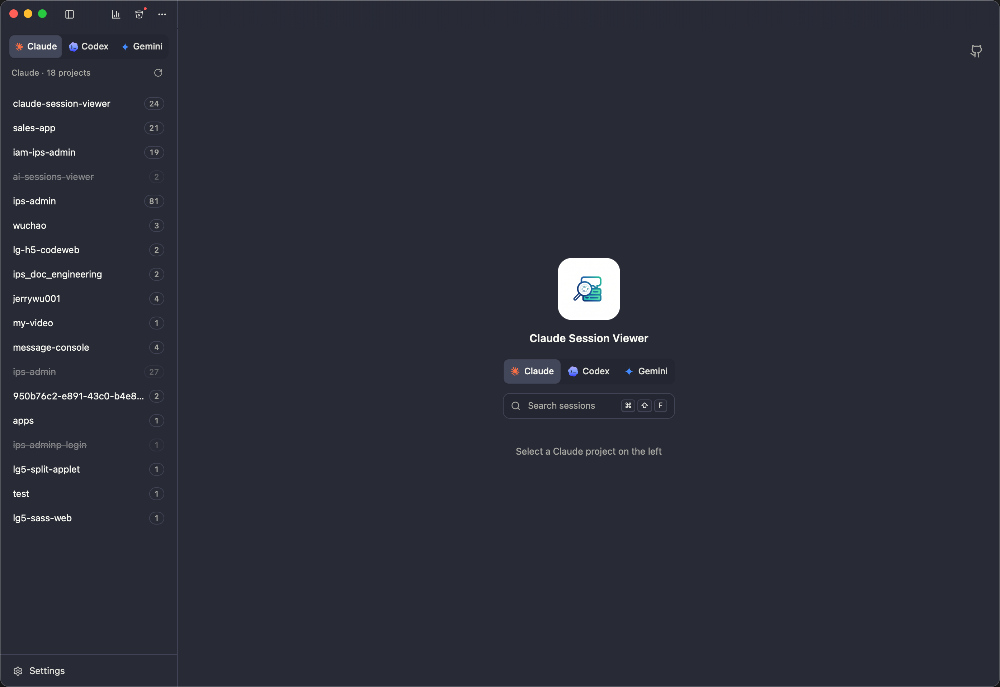
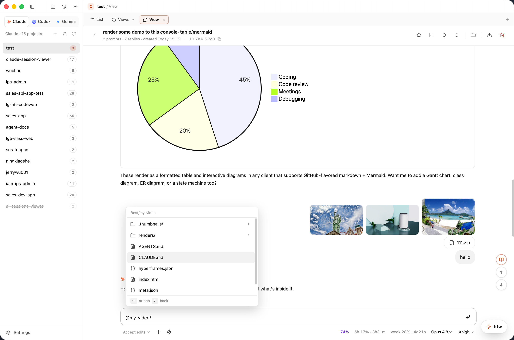
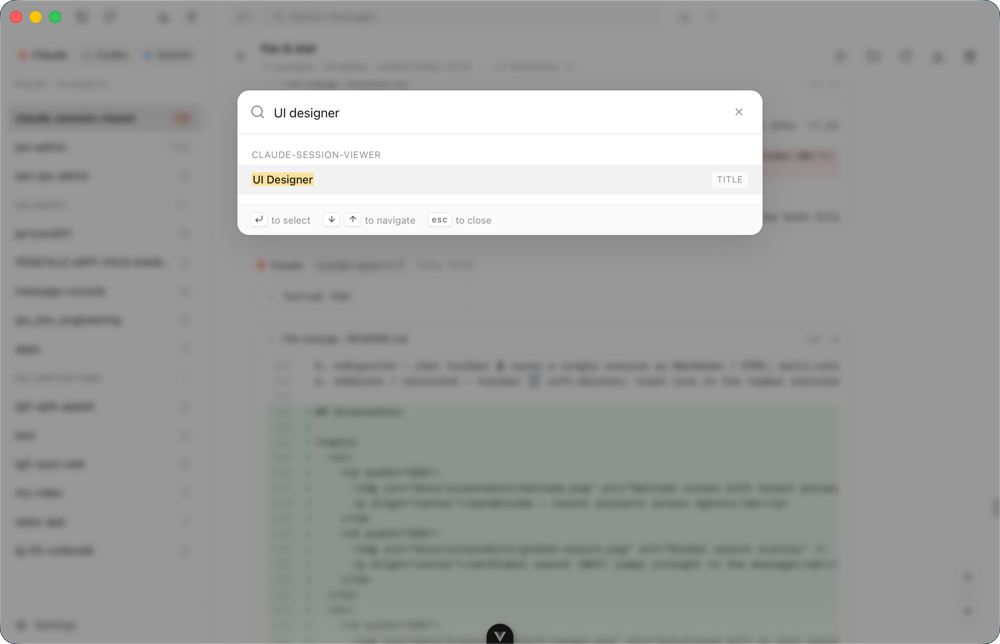
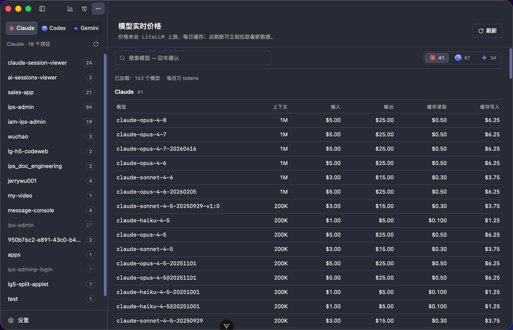
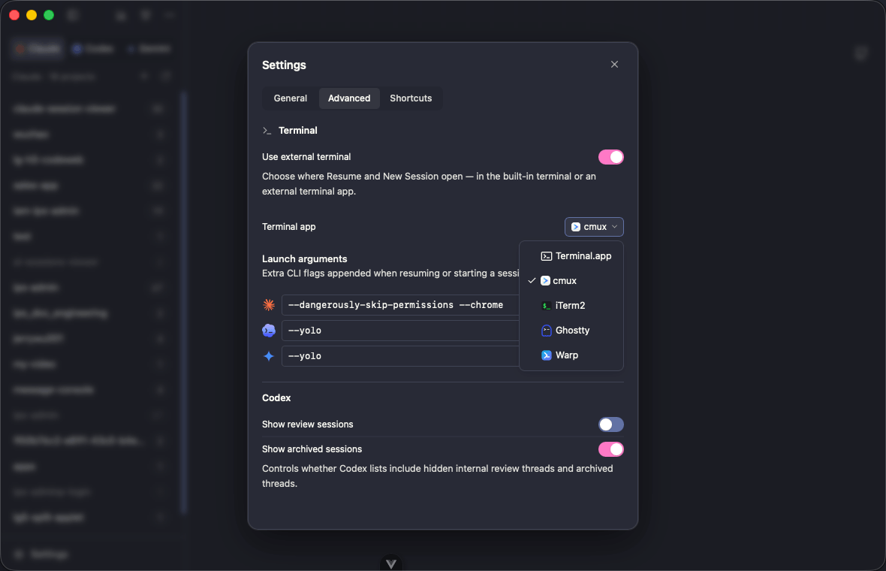
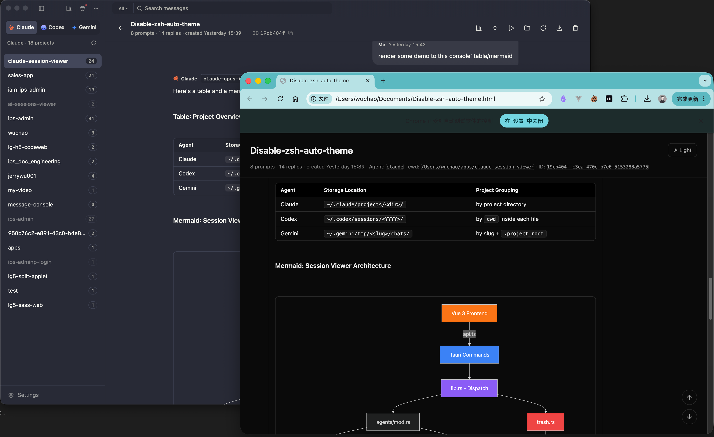

<div align="center">

# Claude Session Viewer

[](https://github.com/jerrywu001/cc-sessions-viewer/releases)
[](https://github.com/jerrywu001/cc-sessions-viewer/releases)
[](https://tauri.app/)
[](https://github.com/jerrywu001/cc-sessions-viewer/releases/latest)
[](https://vuejs.org)
[](LICENSE)

[English](README.md) · [中文](README.zh-CN.md) · **日本語** · [CHANGELOG](CHANGELOG.md)

<p align="center"><strong>Claude Code</strong>、<strong>Codex</strong>、<strong>Antigravity CLI</strong>、<strong>opencode</strong> 専用のネイティブデスクトップブラウザ。<br/>4 つの CLI のローカルセッション履歴を一元的に読み取り、検索し、管理します。</p>

</div>

https://github.com/user-attachments/assets/9bcb92a8-e5b8-40e5-b492-af252162309b

---

## 主な機能

- **忠実な再現** — 思考プロセス、ツール呼び出しのペアリング、構造化 Diff、インライン画像を完全に表示
- **グローバル検索** — プロジェクトを横断する即時検索（⌘⇧F）で特定のメッセージへ直行
- **アプリ内チャット** — 内蔵チャットでセッションを新規作成・再開。モデル / 推論強度（Opus **Ultracode** 対応）/ 権限モードをその場で切り替え（ターミナル不要）
- **ワンクリック再開** — 埋め込みターミナルまたは外部アプリでセッションを再開・新規作成 — **Terminal.app**、**cmux**、**iTerm2**、**Ghostty**、**Warp** に対応
- **Shell ターミナルタブ** — エージェントセッションの横に純粋なシェルタブを開き、プロジェクトディレクトリで任意のコマンドを実行可能。タブは再起動後も保持
- **画面分割** — 任意のプロジェクトを左右または上下に分割し、各ペインが独自のタブ列を持つ。タブはペイン内で並べ替えたり、別のペインへドラッグして移動でき、すべての操作にキーボードショートカットあり（設定 → ショートカット）。ペインのレイアウトはプロジェクトごとに再起動後も保持
- **cmux 深い統合** — cwd で既存ワークスペースを自動再利用、実行中のセッションを青フラッシュで特定、スマート分割方向、ディレクトリ名でタブ命名
- **起動引数** — エージェントごとに CLI フラグ（例：`--dangerously-skip-permissions`）を設定、再開・新規作成時に自動追加
- **プロンプトへジャンプ** — ロケートボタンで全ユーザープロンプトを一覧表示、クリックで対象メッセージへスクロール＆ハイライト
- **ビュー履歴** — プロジェクトごとに独立した、検索可能な「開いたビュー」の履歴。お気に入り対応で、過去の閲覧／チャットビューにワンクリックで復帰
- **詳細な統計** — LiteLLM のリアルタイム料金でトークン消費とコストを集計、プロジェクト/モデル/ツール別に分析
- **メニューバー統計** — macOS トレイアイコンで各エージェントの Today / 7d / 30d コストとトークン量を一覧表示
- **リアルタイム料金表** — Claude / Codex の料金テーブルを上流から自動更新
- **柔軟なエクスポート** — 単一または複数セッションをオフラインで読める Markdown / HTML / 可逆 JSON としてエクスポート
- **ブックマーク** — 任意のフォルダをサイドバーにピン留め、エージェントごとに管理
- **リネームと削除** — セッション名の変更は CLI に同期、ソフト削除は共有ゴミ箱へ移動（復元可能）
- **読み取り専用の安全性** — オリジナルの JSONL は一切変更・削除しません

## スクリーンショット

<table>
  <tr>
    <td width="50%">
      
      <p align="center"><em>メインビュー — サイドバー、セッション一覧、チャット</em></p>
    </td>
    <td width="50%">
      
      <p align="center"><em>忠実な再現 — 思考、ツール呼び出し、構造化 Diff</em></p>
    </td>
  </tr>
  <tr>
    <td width="50%">
      
      <p align="center"><em>画面分割 — 複数セッションを並べて表示、タブをペイン間でドラッグ</em></p>
    </td>
    <td width="50%">
      
      <p align="center"><em>アプリ内チャット — Mermaid・表の描画、@ファイル メンション、画像添付</em></p>
    </td>
  </tr>
  <tr>
    <td width="50%">
      
      <p align="center"><em>埋め込みターミナル — ワンクリックで再開・新規作成</em></p>
    </td>
    <td width="50%">
      
      <p align="center"><em>グローバル検索（⌘⇧F）で目的のメッセージへ直行</em></p>
    </td>
  </tr>
  <tr>
    <td width="50%">
      
      <p align="center"><em>プロジェクト · モデル · ツール別のトークン・コスト分析</em></p>
    </td>
    <td width="50%">
      
      <p align="center"><em>メニューバー統計 — 各エージェントのコストとトークン概要</em></p>
    </td>
  </tr>
  <tr>
    <td width="50%">
      
      <p align="center"><em>リアルタイムモデル料金表</em></p>
    </td>
    <td width="50%">
      
      <p align="center"><em>共有ゴミ箱 — ソフト削除とワンクリック復元</em></p>
    </td>
  </tr>
  <tr>
    <td width="50%">
      
      <p align="center"><em>設定 — ターミナル選択と起動引数</em></p>
    </td>
    <td width="50%">
      
      <p align="center"><em>エクスポート HTML — 完全オフライン、ブラウザで開ける</em></p>
    </td>
  </tr>
</table>

## インストール

[Releases](https://github.com/jerrywu001/cc-sessions-viewer/releases) からプラットフォームに合ったインストーラをダウンロード：

| プラットフォーム | ファイル |
| --- | --- |
| macOS (Apple Silicon + Intel) | `.dmg` |
| Windows x64 | `-setup.exe` / `.msi` |
| Linux x86_64 | `.deb` / `.AppImage` |

macOS 版 `.app` は **ad-hoc 署名済み・未公証** のため、初回起動時に「Apple は…検証できません」というダイアログが出ることがあります。回避方法は 2 つ：

- Finder で `.app` を右クリック → **開く** → ダイアログで再度「開く」を押す（初回のみ）。
- または、ターミナルで隔離属性を外す：
  ```bash
  sudo xattr -dr com.apple.quarantine "/Applications/Sessions Viewer.app"
  ```

Linux 版 `.AppImage` はポータブル形式 —— `chmod +x` で実行可能になります。`.deb` のインストール：
```bash
sudo apt install ./cc-sessions-viewer_<ver>_amd64.deb
```

## 開発

```bash
git clone https://github.com/jerrywu001/cc-sessions-viewer.git
cd cc-sessions-viewer
npm install
npm run tauri dev      # 開発モード
npm run tauri build    # バンドル
```

必要環境：Node 20+、Rust stable。アーキテクチャの詳細は [`CLAUDE.md`](CLAUDE.md) を参照。

## コントリビュート

PR 歓迎。[Conventional Commits](https://www.conventionalcommits.org/)（`feat:` / `fix:` / `docs:` ...）でお願いします。

## Star History

<a href="https://www.star-history.com/?type=date&repos=jerrywu001/cc-sessions-viewer">
 <picture>
   <source media="(prefers-color-scheme: dark)" srcset="https://api.star-history.com/chart?repos=jerrywu001/cc-sessions-viewer&type=date&theme=dark&legend=top-left" />
   <source media="(prefers-color-scheme: light)" srcset="https://api.star-history.com/chart?repos=jerrywu001/cc-sessions-viewer&type=date&legend=top-left" />
   
 </picture>
</a>

## スポンサー支援
オープンソースプロジェクトの維持には多くの時間とリソースが必要です。あなたのスポンサーシップは以下に直接役立てられます：

- 🛠️ 継続的な開発とアップデート

- 🐛 迅速なバグ修正と問題解決

- 📚 ドキュメントの改善とサンプルの拡充

### 支援方法：

- GitHub Sponsors
  
[GitHub Sponsors](https://github.com/sponsors/jerrywu001)（推奨 · 手数料無料）

- Alipay / WeChat
  
<table style="display: flex; width: 500px;">
  <tr>
    <td style="margin-right: 16px;">
      
    </td>
    <td style="margin-right: 16px;">
      
    </td>
  </tr>
</table>

## ライセンス

[MIT](LICENSE) © jerrywu001 · [@jerrywu185](https://x.com/jerrywu185)
