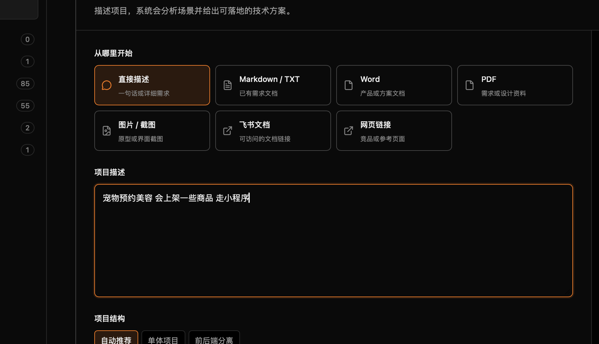
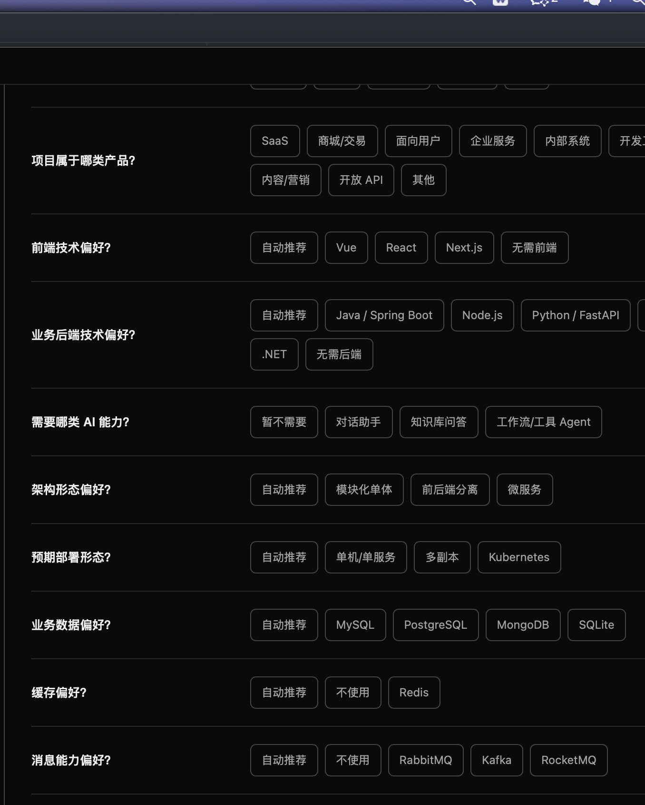
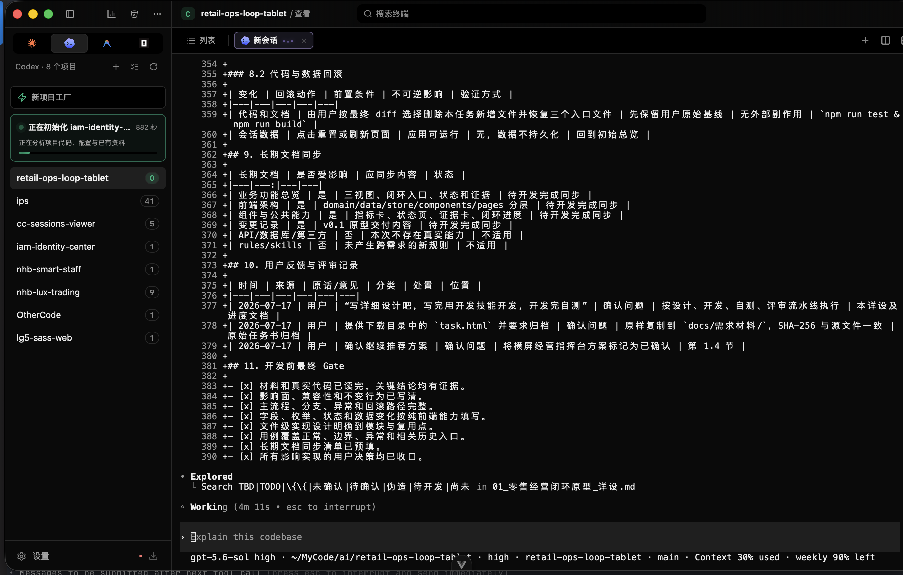

<div align="center">

# Vibe Coding Platform

[](https://github.com/wangaixin0302-hachi/vibe-coding-platform/releases)
[](https://github.com/wangaixin0302-hachi/vibe-coding-platform/releases)
[](https://tauri.app/)
[](https://vuejs.org)

[English](README.md) · **中文** · [日本語](README.ja.md) · [CHANGELOG](CHANGELOG.md)

<p align="center">一个本地优先的桌面工作台：保留多智能体会话浏览能力，并提供新项目创建、旧项目初始化与 AI 辅助技术选型。<br/>从需求到可运行项目骨架，再回到同一处持续开发。</p>

</div>

https://github.com/user-attachments/assets/9bcb92a8-e5b8-40e5-b492-af252162309b

---

## 核心特性

- **项目工厂** — 从一句话、文档、截图或链接整理需求，按项目场景给出技术决策、最少必要的补充问题和可运行的项目骨架
- **项目初始化** — 读取既有项目的代码、配置与资料，在侧栏展示初始化进度，并将项目规则与会话工作台放在一起
- **忠实还原** — 完整呈现思考链路、工具调用配对、结构化 Diff 与内嵌截图
- **全局搜索** — 跨项目秒搜（⌘⇧F）直达具体消息
- **应用内对话** — 在内置聊天里新开或续聊会话，实时切换模型、推理强度（含 Opus **Ultracode**）与权限模式，无需打开终端
- **一键恢复** — 在窗口内嵌终端或外部终端中直接恢复/新建会话——支持 **Terminal.app**、**cmux**、**iTerm2**、**Ghostty** 和 **Warp**
- **Shell 终端标签** — 在 agent 会话旁开启纯 shell 标签页，直接在项目目录执行任意命令；标签状态跨重启保留
- **分屏** — 把任意项目拆成左右并排或上下堆叠的多个分屏，每个分屏有独立的标签栏；标签可在分屏内重新排序，也可拖到其他分屏，每个操作都有快捷键（见 设置 → 快捷键）。每个项目的分屏布局跨重启保留
- **cmux 深度集成** — 按 cwd 自动复用已有 workspace，定位正在运行的会话并蓝色闪烁提示，智能选择拆分方向，新标签页自动以目录名命名
- **启动参数** — 为每个 agent 单独配置 CLI 参数（如 `--dangerously-skip-permissions`），恢复/新建会话时自动追加
- **定位提问** — 聊天标题栏的定位按钮列出所有用户提问，点击即滚动到目标消息并闪烁高亮
- **视图历史** — 每个项目独立、可搜索的「打开过的视图」历史，支持收藏；一键回到任意历史的只读或对话视图
- **深度统计** — 基于 LiteLLM 实时价目聚合 Token 消耗与成本，按项目/模型/工具多维分析
- **菜单栏统计** — macOS 托盘图标一览各 agent 的 Today / 7d / 30d 花费与 Token 量
- **实时模型价格** — 可浏览的 Claude / Codex 价格表，数据源自动更新
- **灵活导出** — 单会话或批量导出为离线可读的 Markdown / HTML / 无损 JSON
- **书签** — 将任意文件夹固定到侧栏快速访问，按 agent 独立管理
- **重命名与删除** — 会话重命名同步回 CLI，软删除移入共享回收站并支持还原
- **只读安全** — 原始 JSONL 全程只读，绝不物理抹除

## 截图

### 项目工厂与项目初始化

<table>
  <tr>
    <td width="50%">
      
      <p align="center"><em>从一句话、文档、截图或链接描述新项目</em></p>
    </td>
    <td width="50%">
      
      <p align="center"><em>只补充 AI 无法确定、且会影响选型的关键决策</em></p>
    </td>
  </tr>
  <tr>
    <td width="50%">
      
      <p align="center"><em>初始化已有项目并跟踪实时分析进度</em></p>
    </td>
    <td width="50%"></td>
  </tr>
</table>

### 会话工作台

<table>
  <tr>
    <td width="50%">
      
      <p align="center"><em>主视图 — 侧栏、会话列表与聊天</em></p>
    </td>
    <td width="50%">
      
      <p align="center"><em>忠实还原 — 思考、工具调用、结构化 Diff</em></p>
    </td>
  </tr>
  <tr>
    <td width="50%">
      
      <p align="center"><em>分屏 — 多个会话并排显示，标签可在分屏间拖动</em></p>
    </td>
    <td width="50%">
      
      <p align="center"><em>应用内聊天 — Mermaid 与表格渲染、@ 提及文件、粘贴图片</em></p>
    </td>
  </tr>
  <tr>
    <td width="50%">
      
      <p align="center"><em>内嵌终端 — 一键恢复或新建会话</em></p>
    </td>
    <td width="50%">
      
      <p align="center"><em>全局搜索（⌘⇧F）直达目标消息</em></p>
    </td>
  </tr>
  <tr>
    <td width="50%">
      
      <p align="center"><em>按项目 · 模型 · 工具维度分析 Token 与成本</em></p>
    </td>
    <td width="50%">
      
      <p align="center"><em>菜单栏统计 — 各 agent 花费与 Token 概览</em></p>
    </td>
  </tr>
  <tr>
    <td width="50%">
      
      <p align="center"><em>实时模型价格面板</em></p>
    </td>
    <td width="50%">
      
      <p align="center"><em>共享回收站 — 软删除，一键恢复</em></p>
    </td>
  </tr>
  <tr>
    <td width="50%">
      
      <p align="center"><em>设置 — 终端选择与启动参数</em></p>
    </td>
    <td width="50%">
      
      <p align="center"><em>导出 HTML — 完全离线，浏览器直接打开</em></p>
    </td>
  </tr>
</table>

## 安装

到 [Releases](https://github.com/wangaixin0302-hachi/vibe-coding-platform/releases) 下载对应平台的安装包：

| 平台 | 文件 |
| --- | --- |
| macOS (Apple Silicon + Intel) | `.dmg` |
| Windows x64 | `-setup.exe` / `.msi` |
| Linux x86_64 | `.deb` / `.AppImage` |

macOS 上 `.app` 是 **ad-hoc 签名、未公证**，首次打开可能弹出「Apple 无法验证…」。两种绕过方式：

- Finder 里右键应用 → **打开** → 弹窗里再确认（一次即可）。
- 或在终端清掉隔离属性：
  ```bash
  sudo xattr -dr com.apple.quarantine "/Applications/Vibe Coding Platform.app"
  ```

Linux 上 `.AppImage` 是便携格式 —— `chmod +x` 后直接运行。`.deb` 安装：
```bash
sudo apt install ./vibe-coding-platform_<ver>_amd64.deb
```

## 开发

```bash
git clone https://github.com/wangaixin0302-hachi/vibe-coding-platform.git
cd vibe-coding-platform
npm install
npm run tauri dev      # 开发模式
npm run tauri build    # 打包
```

依赖：Node 20+、Rust stable。架构详见 [`CLAUDE.md`](CLAUDE.md)。

## 贡献

欢迎 PR。请使用 [Conventional Commits](https://www.conventionalcommits.org/)（`feat:` / `fix:` / `docs:` ...）。

## 赞助支持
维护一个开源项目需要投入大量时间与精力。你的赞助将直接用于：

- 🛠️ 持续开发与更新

- 🐛 快速修复 Bug、解决问题

- 📚 完善文档、补充更多示例

### 支付宝 / 微信
  
<table>
  <tr>
    <td align="center">
      
      <br />支付宝
    </td>
    <td align="center">
      
      <br />微信支付
    </td>
  </tr>
</table>
