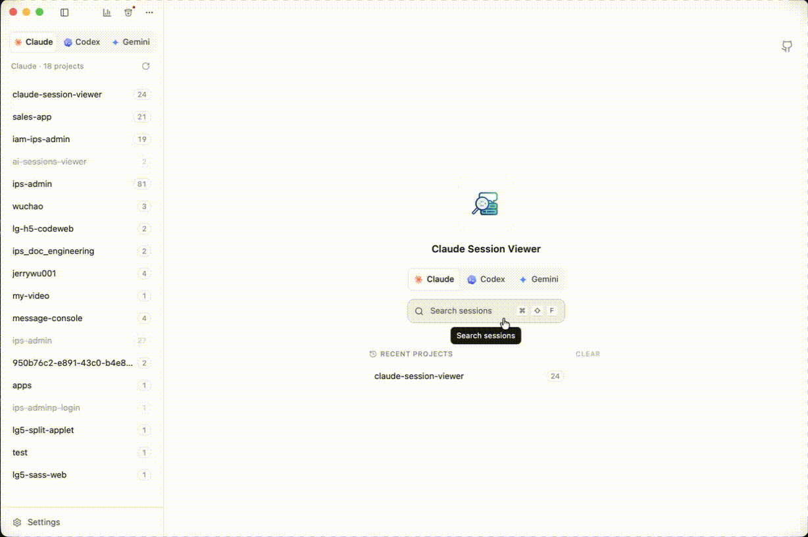
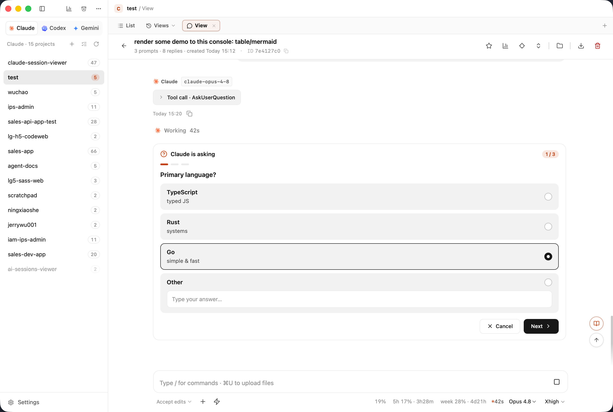

# linux.do 安利帖文案

> 草稿，准备发到 [linux.do](https://linux.do)。图片走的是仓库内相对路径，在 VS Code / GitHub 里能直接预览；
> 真发帖的时候 Discourse 得自己上传图片，把每张图重新拖进编辑器替换掉就行。

---

## 标题（三选一）

1. 受不了每次翻 Claude Code 历史都得去扒 JSONL，我写了个桌面端
2. 把 Claude Code / Codex / Gemini 的会话历史塞进一个窗口，还能直接在里面接着聊
3. 安利个自己写的小工具：三个 AI CLI 的会话记录统一管起来

---

## 正文

各位，安利个我自己天天在用、也是我自己写的小工具：Claude Session Viewer。开源免费，Win / Mac / Linux 都有，原生 Tauri 写的，不是 Electron 套壳，所以开起来很快、也不吃内存。

起因挺简单的。我同时在用 Claude Code、Codex、Gemini CLI，跑着跑着就烦：想回头看某次会话到底改了啥、当时怎么想的，特别费劲。Claude 的记录在 `~/.claude/projects` 底下一堆 JSONL，Codex 和 Gemini 又各存各的、格式还不一样。要么在终端里 `--resume` 一个个碰运气，要么自己写脚本扒。忍了一阵，干脆做了这个。

它干的事一句话就能说清：把三家的本地会话全塞进同一个界面，按 项目 / 会话 / 对话 三层理好，能读能搜能导出，看到一半还能直接接着聊。对原始文件全程只读，删除也只是挪进回收站、不会真 `rm` 掉——这点我比较在意，毕竟是辛辛苦苦攒下来的对话。

下面挑几个我自己用得最多的说。

### 应用内直接对话

这个功能是后来才加的，结果现在反倒成了我开得最勤的页面。不用切回终端，直接在 app 里新开会话、或者接着某条历史往下聊。模型、推理强度（Opus 的 Ultracode 也在）、权限模式都能随手切。Markdown 表格和 Mermaid 图会正常渲染，`@` 一下能把项目里的文件带进去，图片直接拖或者粘。

有个细节我自己挺满意：Claude 用 AskUserQuestion 反问你的时候，选项会在聊天里直接变成能点的卡片，不用切回去敲数字。

### 会话回放

这是最早做的，也是整个 app 的地基。思考过程、工具调用、结构化 diff、内嵌的截图，全按原样还原，不是把 JSON 拍平成一坨纯文本。

### 一键恢复 / 内嵌终端

想接着在真终端里跑也行。窗口里内嵌了一个终端能直接 resume，也能甩给外部的，Terminal.app、cmux、iTerm2、Ghostty、Warp 都支持。每个 agent 还能单独配启动参数，比如懒得每次确认权限的，挂个 `--dangerously-skip-permissions` 就完事。

### 全局搜索

⌘⇧F，跨项目搜，直接跳到那条消息。没别的，就是快。

### 花了多少钱，一眼看到

价格走 LiteLLM 的实时数据，按项目、模型、工具分开算。macOS 上还能塞进菜单栏，不用打开 app 就能瞄一眼今天 / 近 7 天 / 近 30 天烧了多少。说实话自从这个数字天天怼我眼前，我用 Opus 收敛了不少。

### 其它零碎的

懒得一个个配图了，列一下：

- 会话旁边能开纯 shell 标签，在项目目录里随便敲命令，重启之后还在
- cmux 用户应该会喜欢，集成得比较深：按 cwd 复用 workspace、定位正在跑的会话、标签自动按目录名命名
- 把所有用户提问拎出来列一排，点一下就跳过去
- 「看过的视图」有自己的历史，能收藏，一键回到上次读到哪
- 导出支持 Markdown / HTML / JSON，离线也能看
- 常用文件夹能钉到侧栏
- 重命名会同步回 CLI，删除是软删、能还原

### 下载 & 仓库

- 仓库在这：https://github.com/jerrywu001/cc-sessions-viewer 觉得有用的话点个 star，对我真的是很大的鼓励
- 安装包：[Releases](https://github.com/jerrywu001/cc-sessions-viewer/releases)
  - macOS（M 系 + Intel）：`.dmg`
  - Windows x64：`.exe` / `.msi`
  - Linux x86_64：`.deb` / `.AppImage`
- MIT 协议。有 bug 直接提 issue，想要啥功能评论区喊我，大概率会做。

macOS 第一次打开可能报「无法验证开发者」，因为只做了 ad-hoc 签名、没公证，右键点「打开」确认一次就好。
