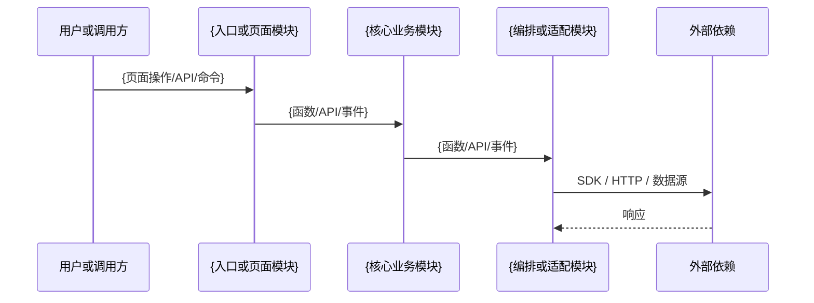
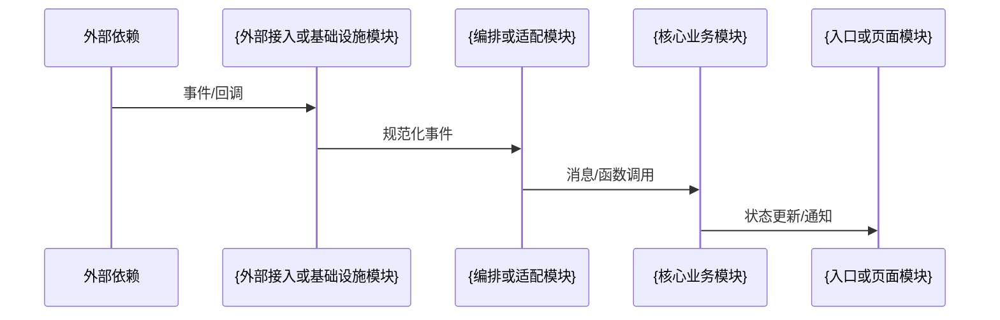
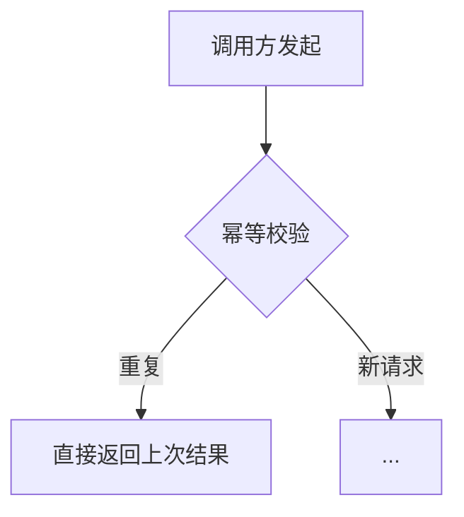

# {功能名称} 详细设计

> 版本：v1.0
> 状态：草稿 / 评审中 / 已定稿 / 已实现
> 作者：
> 日期：YYYY-MM-DD
> 需求/任务背景：
> 项目形态：前端 / 后端 / 全栈 / 库或工具；涉及模块：{模块清单}
> 核心关键词：

---

## 📁 文档归档位置（强制路径约定）

⚠️ **本节要求**：所有详设 / 进度文档必须按以下规则归档，**禁止放错位置**。

| 文档类型 | 路径规则 | 示例 |
|---|---|---|
| 详细设计文档 | `docs/v{版本号}/详细设计/{序号}_{功能名称}_详设.md` | `docs/v1.2/详细设计/01_订单导出_详设.md` |
| 开发进度文档 | `docs/v{版本号}/开发进度/{序号}_{功能名称}_进度.md` | `docs/v1.2/开发进度/01_订单导出_进度.md` |
| **开发自测归档**（Phase 4 自测产物，**按需建** —— 有业务文件 / 页面产物才建）| `docs/v{版本号}/开发自测归档/{序号}_{功能名称}_自测产物/` | `docs/v1.0.1/开发自测归档/04_报表导出_自测产物/`（含新生成的 PNG / HTML 模板样品 / 真实业务文件等“最终结果产物”）|
| 项目长期文档 | `docs/latest/{主题目录}/{文档名}.md` | `docs/latest/{主题目录}/{主题}说明.md`、`docs/latest/{主题目录}/{主题}清单.md` |

> ⚠️ **开发自测归档目录纪律（用户原话 {规则生效日期}「只放你自测重要的结果」+「以后记得都要这么干哦」+「没有什么产物就不要归档」）**：
>
> - **按需建，不是默认必建**：本需求 Phase 4 自测真有“业务文件 / 页面产物”产出才建（如页面截图 / HTML 模板 / 跑通的 xlsx / 真实 PDF）；纯算法 / 纯逻辑 / 不涉及文件 / 不涉及页面的需求**不建**
> - **只放重要结果**：① 最终业务真品（开发期要直接拷过去用的）② 真实业务样本（评审 / 部署测试要看的）
> - **禁止放过程产物**：自测脚本 `.py` / 跑通日志 `.log` / 从外部环境或对象存储下载的临时副本 / chrome-devtools 截图 / `*_自测留档.md` 总结文档 —— 这些跑完即删
> - 真要建时，版本目录下没有 `开发自测归档/` 父目录则一并新建
> - 详细黑白名单 + 历史案例 + 与详设 §9 / 进度 §2.3 的分工见 `.claude/skills/detail-design-writer/references/phase4-self-test-policy.md` §3
| 项目总览 | `docs/latest/业务/业务功能总览.md` | 全局唯一 |

**路径字段说明**：

- `{主题目录}`：例如 `用户中心` / `订单` / `报表` / `第三方接入`，按项目实际主题划分
- `{版本号}`：例如 `v2.0` / `v2.1`（同一版本内的功能在同一子目录）
- `{序号}`：例如 `01` / `02`（同一 v 版本内顺延，01 = 第一个，02 = 第二个）
- `{功能名称}`：与前端应用功能命名一致，例如 `用户登录改造` / `订单导出` / `组件库升级`

**详设与进度文档必须成对**：序号 + 功能名称完全一致（差异只在后缀 `_详设.md` / `_进度.md`），便于交叉索引。

---

> **本文件是 {项目} 详设文档"模板 + 约束"合一版本**：每章节顶部 ⚠️ 块是**硬性要求**，正文是**占位符**；不满足 ⚠️ 块要求的文档视为"详设不完整，不可进入开发"。
>
> ## 📚 写详设前必读 latest/ 长期文档（**这里是项目最新真源，写详设前先翻一遍熟悉项目**）
>
> 以下 相关目录是 {项目} **每次开发完都会回流的长期文档**——内容最新、覆盖最广，是写详设前最高效的项目入门 + 不重复造轮子检查路径：
>
> | 目录 | 用途 | 何时必读 |
> |---|---|---|
> | `docs/latest/业务/业务功能总览.md` | 项目全景图（微服务划分 / 表归属 / 业务模块 / 接口索引）| **每次写详设前必读** |
> | `docs/latest/接口文档/` | 当前所有对外 / 管理台 / {跨模块调用方式} 接口的最新契约 | 涉及新接口 / 改接口时必读，看是否能复用 |
> | `docs/latest/{主题目录}/` | 当前主题的长期说明、契约、边界与清单| 涉及该主题时必读 |
>
> **🔴 强制**：详设 §0 前置确认必须确认"已读 latest/ 下相关目录"才能进入正文。
>
> ---
>
> **其它配套**：
> - 进度模板：[开发进度文档模板.md](./开发进度文档模板.md)
> - 规则库：`.claude/rules/README.md`（含 `architecture/long-doc-sync.md` 长期文档同步规则）
> - 项目 skills：`.claude/skills/` 或 `.agents/skills/`（按项目实际软链结构）
> - 分析与对照 skill：`{项目skill路径}`（铁律：只按真实代码、正式资料和可复现证据下结论，禁止臆想）

---

## 🔗 外部资料与契约来源（涉及外部依赖时强制）

⚠️ **本节要求**：详设涉及的每一个外部 API、SDK、设计稿、协议或数据源，**必须在表格里挂出原始 URL / 本地文件路径 + SDK 或调用入口**，方便评审 / 开发 / 排查时直接跳转核对。**禁止只写接口名不写 URL**。

| 接口用途 | API path | HTTP 方法 | SDK / 调用入口 | 资料地址 |
|---|---|---|---|---|
| {例：创建} | `/rest/v1.0/xxx` | POST | `XxxClient.method` | https://open.xxx.com/docs/... |
| {例：查询} | `/rest/v1.0/xxx` | GET | `XxxClient.method` | https://open.xxx.com/docs/... |
| {例：事件/回调} | (外部依赖推送到 {项目}) | POST | (统一事件入口) | https://open.xxx.com/docs/... |
| {例：撤销/补偿} | `/rest/v1.0/xxx` | POST | `XxxClient.method` | https://open.xxx.com/docs/... |

> 复用 {项目} 已有契约或组件也要挂 URL，标注"复用现有 Xxx处理器"。

---

## 0. 前置确认

⚠️ **写正文前必做**（任一未完成不能进入下一章）：

- [ ] 🔴 **已浏览 latest/ 长期文档**（项目最新真源，写详设前必读）：
  - `latest/业务/业务功能总览.md` —— 项目全景图，看是否重复造轮子
  - `latest/接口文档/` —— 涉及新接口 / 改接口时看有无可复用
  - `latest/外部依赖/{外部依赖}/` —— 接外部依赖时看现有外部依赖业务说明 + 回调清单
- [ ] 已读项目总览 `docs/latest/业务/业务功能总览.md`，确认本需求不重复造轮子
- [ ] 已识别命中的 **项目/领域专属 skill**：`{项目或领域skill}`（不存在则说明并按模板创建）
  - 需要新增 skill 时必须先 grep 现有 skills；仅在确有稳定、可复用的项目知识时创建，承担项目框架、公共能力、领域约束与常见陷阱
  - 已有 skill：`{skill 名称}`；证据：`{路径}`
- [ ] 已识别本需求命中的 **rules**（按项目规则索引逐项列出）；前端、后端、数据、第三方集成仅加载实际命中的规则
- [ ] 已识别命中的 **前置 skill**：`{项目框架skill}`（如不存在，填写 N/A + 证据）
- [ ] 已识别命中的 rules（按 `.claude/rules/README.md` 触发条件映射列出）：
- [ ] 迁移/对标类需求已完整读取来源项目或历史实现：`{路径/commit/文档}`

> **开发标准工作流（"4 件套"，所有外部依赖通用）**：
> ① **项目/领域 skill** `{项目或领域skill}`（用户提外部依赖关键词自动加载） + ② **任务 skill** `{任务skill}`（自动加载） + ③ 本详设 + 配套进度文档 + ④ `.claude/rules/*`（pattern 命中自动触发）
> 用户只需说一句"实现 {功能名称}"即可触发整套，详见 CLAUDE.md "项目开发标准流程"。

---

## 1. 方案概述

⚠️ **本节要求**：业务背景 / 功能目标 / 适用范围 / **非目标范围**（明确不做什么）/ 必要时给术语。

### 1.1 业务背景
（为什么要做这个需求）

### 1.2 功能目标
（具体要实现什么能力，1-3 条）

### 1.3 适用范围
（哪些业务 / 用户 / 调用方类型）

### 1.4 非目标范围
（本次明确不做什么）

### 1.5 术语说明
（必要时）

---

## 2. 兼容性与影响分析

⚠️ **本节要求**：必须单独成表，不得散落描述。**禁止漏填或写"无影响"敷衍**。

| 维度 | 是否影响 | 影响内容 | 兼容策略 |
|---|---|---|---|
| 老接口调用方 | | | |
| 老数据 | | | |
| 老 SQL / Mapper | | | |
| 老 异步消息 消费方 | | | |
| 老回调处理 | | | |
| 管理台 / 前端 | | | |

---

## 3. 模块归属与调用链路

⚠️ **本节要求**：
- 必须含模块职责表 + 主请求链路（Mermaid）+ 回调链路 + 异步消息 链路
- 落点规则：先服从项目现有架构与模块边界；禁止为了本需求新增平行分层或绕过公共入口。后端/全栈项目填写服务链路，前端项目填写页面、路由、状态、API 与组件链路：
  - 核心业务状态与领域逻辑 → `{核心业务模块}`
  - 外部依赖编排与适配 → `{集成或适配模块}`
  - 入口、查询与展示 → `{入口或页面模块}`

### 3.1 模块职责

| 模块 | 本次承担 |
|---|---|
| {入口或页面模块} | |
| {核心业务模块} | |
| {编排或适配模块} | |
| {外部接入或基础设施模块} | |

### 3.2 主请求链路



### 3.3 回调链路（若有）



### 3.4 异步 / 补偿链路（若有）

---

## 4. 复用 vs 新增设计决策

⚠️ **本节要求**：先做决策表再写实现。**禁止跳过"复用 vs 新增"分析**。

| 设计对象 | 复用 / 新增 / 修改 | 落点 | 理由 |
|---|---|---|---|

---

## 5. 接口与交互契约设计

⚠️ **本节要求**：
- 每个受影响契约必须给出：名称 / 所属模块 / 形态 / 路径或事件 / 输入 / 输出 / 错误 / 权限 / 兼容性。后端填写 API，前端填写组件 Props、路由参数、状态事件和调用 API；不适用项写 N/A + 原因
- 错误必须复用项目现有错误类型或错误码体系，禁止裸字符串和自造平行体系
- 凡影响前端或调用方，必须同步 §10 独立前端接入说明；纯前端需求也必须写清页面、状态、组件与 API 影响
- 涉及鉴权时必须写明权限资源、校验位置和配置同步点；无鉴权的内部函数或公开资源写 N/A + 原因

### 5.1 {接口名 1}

| 项 | 内容 |
|---|---|
| 接口名称 | |
| 所属模块 | |
| 契约形态 | 页面交互 / 函数 / API / 事件 / 外部调用 / 回调 / 异步消息 |
| 新增 or 修改 | |
| 路径 + HTTP 方法 | |
| 性质(执行 / 查询) | |
| **权限资源/权限码**（涉及鉴权时必填） | `{项目既有权限命名}` |
| **权限配置同步**（涉及鉴权时必填） | `{配置文件/权限中心/路由守卫落点}` |
| 幂等键 | |
| 并发控制粒度（共享状态变更时必填） | |
| 原子性/事务边界（写操作必填） | |
| 异常码 | |
| 兼容性 | |

**请求参数表**

| 字段名 | 中文名 | 类型 | 必填 | 示例 | 说明 | 来源 |
|---|---|---|---|---|---|---|

**响应参数表**

| 字段名 | 中文名 | 类型 | 必返 | 示例 | 说明 |
|---|---|---|---|---|---|

### 5.2 {接口名 2}
（按 5.1 格式重复）

---

## 5A. 外部依赖请求字段映射（涉及外部依赖时强制）

⚠️ **本节要求**：
- 详设涉及的**每一个调外部契约**，都必须给出"外部字段 → 项目字段"完整映射表
- 字段映射**禁止臆想**：必须严格按官方文档（§头部已挂 URL）逐字段对照；按 `.claude/skills/{对照分析skill}/SKILL.md` 铁律走
- 取值字段必须明确：`{上下文对象}.{字段}` / `{请求对象}.{字段}` / `{权威数据源}.{字段}` / `{常量}` 等
- 存在租户、主体、用户或账户上下文时，必须从项目权威数据源取值；禁止信任外部回调或上游可篡改字段
- 凡是有"枚举值"语义的字段，必须在"备注"列写明枚举类名 + 公共方法（如 `BusinessTypeEnum.TYPE_A.getCode()`）

### 5A.1 {接口名 1} 请求字段映射表

> **下表行内容是"以{外部依赖}为例"的演示**，实际写详设时按当前接入外部依赖的官方文档逐字段填写，**外部字段名 / 类型 / 取值规则均按当前外部依赖**。

| # | 外部字段 | 中文名 | 类型 | 是否必传 | 含义 | {项目} 取值 | 备注 / 枚举类 |
|---|---|---|---|---|---|---|---|
| 1 | `tenantOrOwnerId` | 租户/主体标识 | string(11) | 是 | 权威主体{外部依赖}主体标识 | `{上下文对象}.getAuthoritativeOwnerId()` | **服务商模式必须从 {权威关联表或服务} 真源取**，禁止从上游 契约对象 透传 |
| 2 | `businessOwnerId` | 业务调用方编号 | string(64) | 是 | 业务对象标识 | `{上下文对象}.getBusinessOwnerId()` | 同上 |
| 3 | `orderId` | 调用方业务请求号 | string(64) | 是 | {项目} 业务单号 | `{上下文对象}.getBusinessKey()`（= {项目} orderId / taskId / requestId 等） | 幂等键 |
| 4 | `value` | 业务数值 | number | 是 | 单位、精度与舍入规则按项目约定 | `{请求对象}.getValue()` → `{项目既有转换工具}.normalize(...)` | 全链路 {项目精确数值类型} |
| 5 | `callbackUrl` | 异步通知地址 | string(256) | 是 | 外部事件/回调地址 | 从 `{外部交互表}.callback_url` 取 + `{项目既有URL工具}.fill(url, businessKey)` 拼 path | 按 `{项目外部集成规则}` |
| 6 | `processMode` | 处理模式 | string | 否 | 分配处理类型 | 本次固定 `"REAL_TIME"` / 后续按业务取 | 枚举：SYNC / ASYNC / SCHEDULED |
| ... | ... | ... | ... | ... | ... | ... | ... |

### 5A.2 {接口名 2} 请求字段映射表
（按 5A.1 格式重复，每个调外部契约都要有一张）

---

## 5B. 外部依赖响应字段映射（同步返回）

⚠️ **本节要求**：每一个调外部契约的**同步响应字段**必须列出，并明确：
- {项目} 落到哪个表的哪个字段（如果落库）
- 错误码 code 处理（成功条件与错误映射必须引用正式契约和项目错误体系）

### 5B.1 {接口名 1} 响应字段映射表

| # | 外部字段 | 中文名 | 类型 | 含义 | {项目} 落点（表.字段 / 契约对象 字段） | 备注 |
|---|---|---|---|---|---|---|
| 1 | `code` | 返回码 | string | 接口成功标识 | 用于 `validateExternalResponse` 校验 | 按外部契约识别成功；失败映射到项目既有错误类型 |
| 2 | `message` | 返回信息 | string | 失败时的提示 | 落 `{外部交互表}.error_msg_format` | |
| 3 | `externalId` | {外部依赖}业务标识 | string | 外部依赖内部单号 | `{主业务表}.external_id` | |
| 4 | `redirectUrl` | 业务页面链接 | string | 前端跳转地址 | `{主业务表}.{扩展信息字段}` 内 `{响应扩展对象}.url` | 沿用 `{响应扩展对象}` 透传约定 |

### 5B.2 错误码映射表

| 外部依赖子码 | 含义 | {项目} 处理 | {项目} 错误码 |
|---|---|---|---|
| `00000` | 成功 | 继续 | - |
| `00002` | 参数错误 | 抛错 | `{EXTERNAL_PARAM_ERROR}` |
| `00102` | 业务单据已成功 | 调查询同步 | - |
| `99999` | 系统异常 | 抛错 | `{EXTERNAL_SYSTEM_ERROR}` |
| ... | ... | ... | ... |

---

## 5C. 外部事件/回调字段映射（异步通知）

⚠️ **本节要求**：
- 每条回调必须列出**外部依赖通知字段 → {项目} 落库 / 推进字段**完整映射
- **外部状态/类型值**（status / businessType / sourceType 等）**必须**对应到 {项目} 已有的枚举、联合类型、常量或映射器；具体形式服从项目现有语言与框架规范
- **禁止**外部原值直接落 {项目} 核心模型字段（必须先映射）

### 5C.1 {回调名 1} 字段映射表

| # | 外部字段 | 中文名 | 含义 | {项目} 落点（表.字段 / 异步消息 契约对象 字段） | 取值 / 映射规则 |
|---|---|---|---|---|---|
| 1 | `tenantOrOwnerId` | 租户/主体标识 | 权威主体 | `{领域结果对象}.ownerId` | **不可信**，必须 `{权威数据查询方法}(data.getBusinessOwnerId())` 反查 `{权威关联表或服务}.owner_id` 真源 |
| 2 | `businessOwnerId` | 业务主体标识 | 业务对象标识 | （反查 {权威关联表或服务} 拿 {项目} `business_owner_id`）| 反查后落 `{领域结果对象}.businessOwnerId`（{项目} 内部测试主体标识）|
| 3 | `orderId` | 调用方业务请求号 | {项目} 业务主键 | `{领域结果对象}.businessKey` | 直接对应 |
| 4 | `externalId` | {外部依赖}业务标识 | | `{主业务表}.external_id` | |
| 5 | `status` | 业务状态 | 外部状态 | `{主业务表}.status` | **映射** → 见 §5D |
| 6 | `businessType` | 业务类型 | 外部枚举 | `{主业务表}.business_type` | **映射** → 见 §5D |
| 7 | `sourceType` | 外部依赖类型 | 外部枚举 | `{主业务表}.source_type` | **映射** → 见 §5D |
| 8 | `failCode` | 失败码 | 失败标识 | `{外部交互表}.external_error_message` | 拼接 failCode + failReason |
| 9 | `failReason` | 失败原因 | | 同上 | |
| ... | ... | ... | ... | ... | ... |

---

## 5D. 外部枚举/类型 → {项目} 类型映射（**禁止外部原值直接进入核心模型**）

⚠️ **本节要求**：
- 所有“状态 / 类型 / 方向 / 业务类型 / 外部依赖”等外部值，**必须**对应到 {项目} 已有的枚举、联合类型、常量或映射器
- 转换、展示和状态判定方法必须复用项目既有公共能力；不存在时才按项目语言与目录规范新增
- 代码落点服从项目真实目录，**禁止因为模板示例重复造类型或工具**
- 涉及核心模型持久化或客户端状态写入的，**禁止外部原值直接赋值**，必须先经项目类型系统或映射器转换

### 5D.1 状态枚举映射

| 外部字段 / 取值 | {项目} 类型/映射器 | {项目} 内部值 | 转换/判断方法 |
|---|---|---|---|
| `status=PROCESSING` | `{BusinessStatus类型}` | `PROCESSING` | `{项目既有状态转换方法}` |
| `status=SUCCEEDED` | 同上 | `SUCCEEDED` | `{项目既有成功态判断方法}` |
| `status=FAILED` | 同上 | `FAILED` | `{项目既有失败态判断方法}` |
| `status=TIME_OUT` | 同上 | `{项目超时映射值}` | `{项目既有超时映射方法}` |
| `status=CLOSE` | 同上 | `CANCELLED` | `{项目既有关闭态判断方法}` |

### 5D.2 业务类型枚举映射

| 外部依赖 `businessType` 值 | {项目} 内部类型值 | 转换方法 |
|---|---|---|
| `TYPE_A` | `{内部类型}.TYPE_A` | `{项目既有类型转换方法}` |
| `TYPE_B` | `{内部类型}.TYPE_B` | 同上 |
| `TYPE_C` | `{内部类型}.TYPE_C` | 同上 |
| `TYPE_D` | `{内部类型}.TYPE_D` | 同上 |
| ... | ... | ... |

> 持久化或写入客户端状态前先用项目既有转换方法映射；展示时使用项目既有名称解析或国际化机制。

### 5D.3 外部依赖枚举映射

| 外部依赖 `sourceType` 值 | {项目} 内部类型值 | 转换方法 |
|---|---|---|
| `SOURCE_A` | `{内部来源类型}.SOURCE_A` | `{项目既有来源转换方法}` |
| `SOURCE_B` | `{内部来源类型}.SOURCE_B` | 同上 |
| `SOURCE_C` | `{内部来源类型}.SOURCE_C` | 同上 |
| ... | ... | ... |

### 5D.4 其它枚举（按需补，列出所有涉及的）

例：processMode / objectType / sourceType / lifecycleStatus 等。

### 5D.5 新增枚举值（**禁止漏列**）

⚠️ **本节要求**：本次详设如果要**新增枚举、联合类型或常量值**，只列下列两张表：

- **禁止贴整段类型定义原文**；只列新增值、语义、调用点和项目既有转换/判断方法
- 标准方法和文件位置服从项目当前语言、框架与代码规范，不在详设里另造一套

**表 1：新增枚举类（如有）**

| 类型/映射器 | 所属模块与路径 | 类型 | 是否含状态判断方法 | 备注 |
|---|---|---|---|---|
| 例：`XxxStatus` | `{公共模块}/{类型目录}` | 状态枚举/联合类型 | 是（沿用项目现有方法）| 本次为新类型，code/name 见表 2 |

**表 2：新增枚举值（涵盖"新枚举类的全部值"+"在已有枚举类追加的值"）**

| 类型/映射器 | 新增 code | 新增 name | 对应外部原值 | 契约/类型声明同步引用点 | 备注 |
|---|---|---|---|---|---|
| 例：`BusinessType`（已有） | `TYPE_A` | `类型 A` | {外部依赖} `businessType=TYPE_A` | `{请求契约或类型定义}.businessType` | 本次新增 |

> **强制**：表 2 列出的所有新增值，必须同步更新所有引用该枚举的 `@Schema(description = "枚举：code:name，...")` —— 引用点在表 2"@Schema 同步引用点"列逐一列出，禁止遗漏。

---

## 6. 数据与持久化设计

⚠️ **本节要求**：
- 先做表归属决策 → 再写字段设计 → 最后给 DDL
- 数值、时间、标识和 JSON 字段必须沿用项目现有类型、精度、时区和默认值约定
- 主键、审计字段、软删除和版本字段必须沿用项目既有基类或表约定
- 改表 / 加字段必须说明：为何现有字段不够 / 是否需要回填 / 影响哪些 SQL
- 存在多环境迁移目录时按项目现有环境完整生成；单环境或无数据库项目写 N/A + 证据

⚠️ **数据库/本地持久化条件约束**：仅后端、全栈或包含持久化的项目填写；纯前端且无本地持久化时，本章表格写 N/A + 代码证据。
- 先识别项目真实迁移机制、baseline、schema 真源和环境目录；禁止凭模板假设工具或路径
- 已有迁移工具时所有变更必须追加新 migration，禁止修改已执行迁移；无迁移工具时严格服从项目现有 schema 管理方式并记录原因
- DDL 文件命名：`V{版本}__{描述}.sql`（例：`V1.0.1.1__create_file_export_task.sql` / `V1.2.1__add_feature_fields.sql`），放在 `{项目实际迁移目录}/{env}/`
- 禁止覆盖历史迁移、生产快照或生成文件；是否同步 baseline 以项目既有规则为准
- 项目存在多环境迁移目录时保持结构一致；不存在则不得擅自新建
- 迁移必须可重复验证且失败可见；禁止用 repair、跳过或兜底掩盖错误
- **采用软删除的模型不允许绕过项目迁移机制手改表**，必须走 {数据库迁移工具} —— 防止某环境漏跑导致字段不一致

### 6.1 模型决策表

| 表名 | 复用 / 新增 / 修改 | 落点模块 | 理由 |
|---|---|---|---|

### 6.2 表字段设计

**表名：xxx**

| 字段名 | 类型 | 非空 | 默认值 | 索引 | 说明 | 理由 |
|---|---|---|---|---|---|---|

### 6.3 迁移脚本与结构真源同步（按项目实际机制）

**核心规则**：先识别项目真实持久化机制。已有 migration/baseline 时按项目规则增量更新并保持结构真源同步；无数据库时写 N/A + 证据，禁止为了套模板引入数据库。

🔴 **结构同步强约束（适用时）**：迁移执行源与人类/工具读取的结构真源必须按项目既有规则同步；若项目只有一个真源，不得虚构第二份。

| 写入位置 | 角色 | 何时执行 |
|---|---|---|
| ① **{数据库迁移工具} migration**：`{项目实际迁移目录}/{env}/{迁移文件}` | **实际执行**：已交付环境（{真实验证环境} / test / prod）服务启动时 {数据库迁移工具} 自动 apply（incremental 升级），保证生产库结构正确 | 每次部署自动 |
| ② **baseline 同步更新**：`{项目结构真源路径}`| **当前最新结构真源**：必须**同步反映**所有 {数据库迁移工具} migration 已加的字段 / 表 / 索引，AI 和开发人员随时翻这个文件就能看到"当前生产库长什么样" | 新建环境一次性 apply（含本表 + V*.sql 同号增量执行历史）|

**双写口径**：
- 新建表 → ② baseline 加完整 CREATE TABLE；① {数据库迁移工具} 也写完整 CREATE TABLE IF NOT EXISTS
- 加字段 → ② baseline 在原 CREATE TABLE 里把新字段插到正确位置（保持业务顺序）；① {数据库迁移工具} 用 ALTER TABLE ADD COLUMN
- 加索引 → ② baseline KEY 段追加；① {数据库迁移工具} 用 ALTER TABLE ADD KEY
- 配置数据 init → ② baseline `INSERT ... ON DUPLICATE KEY UPDATE`；① {数据库迁移工具} 同款

**适用范围**：仅同步本次实际受影响的模块、数据库和环境，不擅自扩大。

**文件命名 + 路径**：

```
{项目实际迁移目录}/{env}/{项目版本规则}_{序号}__{snake_case描述}.{脚本后缀}
```

**版本号约定**（仅在项目使用数据库迁移工具时强制）：

- **格式**：严格沿用项目当前迁移工具和历史脚本格式，示例仅写为 `{项目版本规则}_{序号}`，不得由模板发明新规则
- **与系统版本对齐**：若项目迁移脚本与发布版本绑定，必须沿用同一期编号空间；若不绑定，写明项目真实递增规则
- **每个数据源独立编号空间**：按项目真实数据源和迁移历史维护连续编号，禁止与已有脚本冲突
- **同版本多份详设共用编号空间**：同一数据源内按业务依赖顺序顺延，跨详设全局不冲突
- **{snake_case 描述}**：`add_xxx_to_yyy_table` / `create_zzz_table` / `alter_aaa_index` 等动作短语
- **{env}**：只生成项目真实存在且规则要求维护的环境；禁止凭空增加环境

**示例**（v1.2 这一期）：

| 脚本路径 | 数据源 | 迁移工具 | 变更动作 | 回滚/兼容策略 |
|---|---|---|---|---|
| `{项目实际迁移目录}/{env}/{迁移脚本文件}` | `{数据源}` | `{项目迁移工具}` | `{建表/加字段/改索引等}` | `{策略}` |

**编号空间规划表**（每份详设 §6 必须给出，多份详设全局合并核对）：

| 库 | 编号 | 文件名 | 内容 | 来源详设 |
|---|---|---|---|---|
| `{数据源}` | `{项目迁移版本 1}` | `{迁移脚本文件 1}` | 主模型字段补齐 | 01 功能主线 |
| `{数据源}` | `{项目迁移版本 2}` | `{迁移脚本文件 2}` | 约束或索引调整 | 02 |
| ... | ... | ... | ... | ... |

**禁止**：

- **只写 {数据库迁移工具} 不同步更新 `sql/{env}/1.0.0.sql` baseline**（违反双写约束 = AI / 开发人员翻 baseline 看不到当前最新结构，新环境部署后结构落后）
- **只改 baseline 不写 {数据库迁移工具}**（违反双写约束 = 已交付环境部署后字段没有，运行时报错）
- 缺 {真实验证环境}/test/prod 任一环境的 migration 文件 / baseline
- 同一版本号下两个 `V*.sql` 冲突（多份详设必须全局核对编号空间）
- 用与系统版本脱节的编号（如系统是 v1.2 但写 `V2.0.X`）
- 已交付的 migration 文件被改动 / 删除（{数据库迁移工具} 校验 checksum 会失败 → 服务启动报错）

---

## 7. 业务流程设计

⚠️ **本节要求**：
- 每个核心流程必须 **图（Mermaid）+ 步骤说明** 同时存在
- 状态机必须列：初始态 / 处理中态 / 终态 / 触发条件 / 是否可逆 / 终态不可覆盖规则
- 终态保护通过对应枚举 `isXxxStatus()` / `getUnBeUpdateStatusList()` 实现
- 涉及金额、计量、配额或精度计算时，必须列公式、单位、舍入与边界，并验证前后口径一致；不涉及则写 N/A

### 7.1 主流程



**步骤说明**：

1. ...
2. ...

### 7.2 异常流程

### 7.3 状态机 + 状态流转映射

⚠️ **本节要求**：
- 状态机必须含"外部状态 → {项目} 状态"映射列（与 §5D.1 完全对齐）
- 终态保护必须用枚举 `isXxxStatus()` / `getUnBeUpdateStatusList()`（按 `code/enum.md`），**禁止字符串比较**

⚠️ **列名约束**：
- **"{项目} 当前状态" / "{项目} 下一状态"** 是 {项目} 核心模型字段（`status` / `status` 等）的取值，禁止与外部状态混称
- **"触发事件（外部状态 / 业务动作）"** 列里所有外部原值用反引号包起来，例如 `` 回调 `status=SUCCEEDED` ``，避免和 {项目} 状态混淆

| 对象 | {项目} 当前状态 | 触发事件（外部状态 / 业务动作）| {项目} 下一状态 | 是否终态 | 落库字段 | 备注 |
|---|---|---|---|---|---|---|
| 例：{主业务表} | BUILD | 调外部依赖创建成功 | PROCESSING | 否 | status | external_id = externalId |
| 例：{主业务表} | PROCESSING | 回调 `status=SUCCEEDED` | SUCCEEDED | 是 | status + success_time | + 执行项目既有成功副作用 |
| 例：{主业务表} | PROCESSING | 回调 `status=FAILED` | FAILED | 是 | status + external_error_message | 失败原因落 bankStatusMsgFormat |
| 例：{主业务表} | PROCESSING | 查询 `status=TIME_OUT` | FAILED | 是 | 同上 | "业务单据已过期"语义 |
| 终态 | SUCCEEDED/FAILED/CANCELLED | 任何输入 | 不变 | - | - | 终态保护用 `XxxStatusEnum.getUnBeUpdateStatusList()` |

### 7.4 精确数值计算（涉及金额/计量/配额时）

| 计算项 | 公式 | 变量说明 | 示例 | 边界说明 |
|---|---|---|---|---|

**精确数值变动表**

| 触发时机 | 对象 / 字段 | 加 / 减 | 精确数值来源 |
|---|---|---|---|

---

## 8. 代码设计

⚠️ **本节要求**：按模块拆分，列出新增 / 修改 / 删除类。关键方法职责必须到方法粒度。**禁止写"实现 xxx 逻辑"这种空话**。
>
> **硬约束**（违反任一即不可入审）：
> 1. 禁止魔法字符串：apiCode / Header / 外部字段必须常量化
> 2. 状态判断必须用枚举 `isXxxStatus()`，禁止字符串比较
> 3. 方法拆分清晰：`build / validate / invoke / handle`
> 4. 异常用 `项目既有业务异常类型 + 错误码`，禁止裸抛 `运行时异常`
> 5. 精确数值沿用项目既有类型、单位、精度和舍入规则
> 6. 外部依赖 处理器 必须复用模板，禁止新增并行顶层模板
> 7. 回调统一入口，禁止新增外部依赖专属 `回调处理器接口入口`

⚠️ **类名约束**：
- **禁止在详设里写全限定类名**（`com.xxx.yyy.ZzzClass` 长串路径），统一用简单类名（`ZzzClass`）
- 包路径在"所属模块"列里用简短形式表达即可（如 `{模块简称} / {目录简称}`）
- {项目} 全项目**类名必须全局唯一**——不允许两个不同包下出现同名类（命名冲突会让人写代码时 import 错包）

### 8.1 新增类清单

| 类名 | 所属模块 / 包简称 | 职责 |
|---|---|---|
| 例：`{Feature}Handler` | {模块简称} / {目录简称} | 实现功能主流程 |

### 8.2 修改类清单

| 类名 | 所属模块 / 包简称 | 修改的方法 | 改动内容 |
|---|---|---|---|
| 例：`{Feature}Service` | {模块简称} / {目录简称} | 新增 `handleFeature` | 业务编排（详见 §7） |

### 8.3 关键方法职责

（必须到方法粒度）

---

## 8.9 🔴 实现状态门禁清单(开发完 / 自测完 / 交付前必须全 ✓)

> **铁律**:详设里写的每个 **响应字段 / 请求字段 / 错误码 / 业务分支 / 缓存/协调组件 Key / 异步消息 topic / 安全机制（权限/幂等/并发/输入限制/类型校验等）**,必须在下方两张表落 production 代码 grep 真存在 + 集成/E2E 测试真断言两个 ✓。任一 ✗ = **不许交付 / 不许说「开发完」/ 不许说「测完」**。
>
> 详设是叙述 + 表格混排,字段散落各章,开发容易把详设当背景跳过,测试只能断言代码已有字段 → 字段漏掉时测试也漏 → 假绿到交付。本章用 inventory + grep 命令兜底,把"字段必须落 production"和"必须有断言"这两件事变成可机械核验的 checkbox。

### 8.9.A production 必须实现项(开发完 grep 落点真存在才打 ✓)

| # | 类别 | 详设位置 | 内容(精确到字段名 / 错误码 / Key) | production 落点(类#方法) | grep 命令 | 状态 |
|---|---|---|---|---|---|---|
| 1 | 响应/UI 字段 | §5.x line N | `{契约或组件}.fieldName` | `{实现文件}#{方法/组件}` | `rg -n "fieldName" {实现文件}` | ⏳ |
| 2 | 错误码/错误状态 | §5.4 line N | `{ERROR_CODE}` | `{错误定义文件}` + 触发点 | `rg -n "{ERROR_CODE}" {源码目录}` | ⏳ |
| 3 | 缓存/协调组件 Key（适用时） | §6 line N | `{项目}:XXX:YYY:{业务标识}` TTL Ns | `{实现文件}#{方法}` | `rg -n "{Key关键词}" {源码目录}` | ⏳ |
| 4 | 权限/隔离约束（适用时） | §0 引项目安全规则 | `{项目权限或隔离方式}` | `{入口文件}#{方法/路由/组件}` | `rg -n "{权限关键词}" {入口文件}` | ⏳ |
| 5 | 并发/唯一约束（适用时） | §X line N | `{项目既有并发或唯一性机制}` | `{实现文件}#{方法}` | `rg -n "{并发或唯一性关键词}" {源码目录}` | ⏳ |
| 6 | 枚举/联合类型校验 | §10 line N | `{契约字段}` + `{项目类型校验方式}` | `{契约或类型定义文件}` | `rg -n "{字段或类型关键词}" {源码目录}` | ⏳ |
| 7 | 安全机制（适用时） | §5.x.x 约束 | 文件大小上限 / 类型白名单 / 防伪 Token / 输入校验等 | `{实现文件}#{入口}` | `rg -n "{校验关键词}" {源码目录}` | ⏳ |
| ... | | | | | | |

### 8.9.B 集成/E2E 测试必须断言项(测试完 grep 断言真存在才打 ✓)

| # | case ID | 详设 §9.1 | 必须断言内容 | 测试方法名 | grep 命令 | 状态 |
|---|---|---|---|---|---|---|
| 1 | F25 | line N | `context.fieldName` 非空且等于 X | `caseN_xxx_xxx` | `grep -nE "context.fieldName" {集成测试文件}` | ⏳ |
| 2 | F26 | line N | 抛 `{ERROR_CODE}` | `caseN_xxx_throws_error` | `grep -nE "{ERROR_CODE}" {集成测试文件}` | ⏳ |
| 3 | F27 | line N | 跨边界查询返回空结果 / 不含其他边界的数据 | `caseN_crossBoundary_xxx` | `grep -nE "{跨边界断言关键词}" {集成测试文件}` | ⏳ |
| ... | | | | | | |

### 8.9.C 三方对照硬卡口（详设/实现/测试）

交付 前 reviewer 必须:
1. 表 A 每行检索一遍 production 落点真存在(`rg -n "{pattern}" {项目源码目录}`)
2. 表 B 每行 grep 一遍集成/E2E 测试方法名 + 断言真存在(`grep -nE "{pattern}" {项目测试目录}`)
3. 任一 ⏳ → 打回开发 / 测试补
4. 全 ✓ 才能 approve

**绝对禁止**:
- ❌ 表 A/B 写"待办" / "TODO" / "未实现 — 交付后补"
- ❌ 跑通 {定向测试命令} 就跳过 grep 自检
- ❌ 表里的"详设位置"写成"详见 §X"(必须精确到 line N,review 1 秒能找到)

---

## 9. TDD 与自测

⚠️ **本节要求**（严格按 项目自测规则 + 根级 Agent 规则中的验证闭环）：

**核心理念（详设-测试双向闭环）**：

> 详设是「开发预期」的真源，测试类是「预期验证」的真源——两者必须双向闭环：
> - 改详设 = 改了预期 → 对应测试 case 必须同步更新（否则代码和测试就脱钩）
> - 详设草稿评审通过后才能进开发 → 进开发前要先把测试类写完跑通（不允许"边开发边补测试"）
> - 评审详设时，§9 测试结论矛盾（如「已 PASS」但留档表空白）是 **P0 阻断项**

**最高红线（进开发硬性条件，违反即不可进开发）**：

> ⚠️ **两轮闭环硬约束**（按 `.claude/rules/code/self-test-required.md` 铁律 6）：
>
> **第 1 轮（详设可行性验证）**：① 写完详设全部章节 → ② 按 §9.1 写测试类，实现仅留 `throw new UnsupportedOperationException` 骨架 → ③ 跑测试**必须全红**（控制台/commit 证据贴进度文档 §3）→ ④ 用户评审通过
>
> **第 2 轮（开发自测）**：⑤ 写实现让测试转绿 → ⑥ 自测全绿 + {真实验证环境} 集成 case 真实链路打通 → ⑦ 进度文档 §8 全 ✅ 才能向用户汇报「开发完成」
>
> **第 1 轮未完成（含用户评审），禁止进入第 2 轮**。一气呵成把详设+测试+实现都做完 = 流程违规，必须在进度文档 §7.2 如实复盘。

1. **TDD 强制顺序**：详设字段 / 接口 / 状态机变更对应的测试类**必须先写完跑红**，并经用户评审通过，才能进入开发实现
2. **测试不全绿 → 详设 v2.x 不可定稿**：§9.1 测试 case 表存在「失败」或「待开发」行 = 详设处于"草稿/评审中"状态，不能进开发
3. **禁止"先开发再补测试"**：绕过两轮闭环视为流程违规；评审详设时把"测试类先红、评审后转绿"作为 **P0 阻断项**
4. **§9.3 / §9.4 留档必须填实际数据**：写「已 PASS」但留档表全空 = 矛盾，**P0 必改**；未真测的 case「测试状态」列必须保持 `待开发`，禁止假断言「已通过」
5. **新功能必走 {真实验证环境} 集成自测**：真实应用入口 + 真实业务代码 + 真实可用依赖 + 可验证副作用；通过标准 = HTTP 200 / 项目响应码=0 / 外部返回成功 / 预期副作用正确 / 回调推进到终态
6. **离线单元/行为测试不能替代 {真实验证环境} 集成自测**：可作为字段映射 / 状态判定 / 序列化 / 工具方法等“纯逻辑”的辅助；新核心流程 / 外部依赖 / 异步事件 / 跨模块协作必须有 {真实验证环境} 集成自测
7. **自测产生的真实业务标识 / 测试主体标识必须记录到 §9.4 留档表**（{真实验证环境} 集成）+ 进度文档 §3 自测区
8. **详设 TDD 测试资产必须长期保留**（关键变更）：本节列出的所有测试资产（轨道 A `{单元/行为测试资产}` + 轨道 B `{集成/E2E测试资产}`）都是验证详设可行性的核心交付物，**禁止随意删除**。仅当测试资产**不对应**详设 §9 用例表任一行（纯粹为修 bug 临时复现与验证）时才允许测完即删——这类临时资产**禁止写进详设**。具体口径以当前项目自测规则为准
10. 🔴 **测试双轨制硬约束**（最高红线）：每个需求必须同时覆盖 **轨道 A：开发前 TDD** 与 **轨道 B：开发后真实链路验证**；文件数量、命名和框架服从项目现有测试规范，测试资产按项目规则保留。同质 case 应在项目既有测试组织方式内合并，**严禁**为同一职责拆出多个重复测试文件；**严禁**只保留单轨（只有单元/行为测试 = 没真实走代码；只有集成/E2E 测试 = 没 TDD 骨架）；**严禁**用 fake 上下文或全量 mock 冒充“开发完成后真实走代码”。修 bug 临时测试不归本约束，按项目自测规则处置。
9. 🔴 **详设修订必须同步改 {项目测试语言} 测试类 + 跑通自测**（最易漏，反复强调）：
   - 任何对详设字段 / 接口 / 状态机 / 精确数值公式 / SQL DDL / 错误码 / 业务流程的修订（含复评收口、bug 修正、跨文档对齐），必须**立即**：
     - (a) 同步更新 §9.1 测试 case 表的「期望输出」「断言」「关联测试类路径」三列
     - (b) **打开对应轨道 B 的 `.{测试文件后缀}` 测试类文件，按新的预期改断言**——不是只改 §9 文档表，**`.{测试文件后缀}` 文件本身要 Edit 改**
     - (c) `{定向测试命令} -Dtest={测试类}` 或 main 方法直接跑，确保**全绿**
     - (d) 进度文档 §3 自测区贴 commit 哈希 + 跑通时间 + 影响的测试方法名
   - **三件事（§9 表 / `.{测试文件后缀}` 文件 / 跑通）缺一不可**——只改 §9 文档没改 `.{测试文件后缀}` 文件 = 文档和测试脱钩、下次开发跑测试必红；只改 `.{测试文件后缀}` 没改 §9 = 详设和测试断言对不上、评审不过；改了不跑 = 假交付
   - 评审 / 复评时如发现详设修订项与 `.{测试文件后缀}` 测试类断言不一致，**直接打回，P0 阻断**
   - **代理 / 协作者执行修订任务时**：prompt 必须显式包含「同步改 `.{测试文件后缀}` 测试类 + 跑通」一项，不允许出现"不要写测试类 / 不要改测试类"的反向限制（除非确实是纯文档级排版改动如 typo / 路径占位 / 章节重排）

### 9.0 测试类双轨结构（双轨验证结构 — 两类验证缺一不可）

⚠️ **本节要求（双轨制硬约束）**：

> 每个需求必须同时组织「开发前 TDD」与「开发完成后真实链路自测」。优先复用项目已有测试目录和命名；是否合并文件由项目测试规范决定，但每个 case 都必须可追溯到详设。

**测试类双轨制详细约束**：

- **轨道 A —— 开发前 TDD 离线测试类**
  - 目的：测详设可行性骨架；**写在实现之前**；在用户评审详设阶段跑红，证明详设描述的行为合约能被代码层兑现
  - 命名：`{项目约定的单元/行为测试名}`
  - 位置：项目既有单元测试目录 `{单元测试目录}`
  - 形态：项目既有单元测试框架；隔离 DB、网络、消息和不可控外部依赖
  - 范围：所有纯逻辑断言（状态枚举完整性 / 内部纯函数 / 序列化契约 / 异常隔离 / 业务零感知）
  - case 编号：与 §9.1 用例表「输入 / 期望输出 / 关联测试方法名」严格一一对应
  - 长期保留：详设修订后必须同步改断言 + 跑通；丢失 = 详设可行性无法被验证
- **轨道 B —— 开发完成后真实走代码自测类**
  - 目的：开发实现完成后，证明**真实 {运行时框架} 上下文 + 真实代理 + 真实业务方法 + 真实第三方 + 真实落地副作用**全链路打通
  - 命名：`{项目约定的集成/E2E测试名}`
  - 位置：项目既有集成/E2E测试目录 `{集成测试目录}`
  - 形态：按项目既有方式启动真实应用/组件上下文，调用真实入口并验证可控环境中的真实副作用
  - **5 条真实（缺一不可）**：① 真实应用或组件上下文 ② 真实入口 ③ 真实核心代码（非 mock）④ 真实可控依赖 ⑤ 真实可观测副作用
  - case 编号：与 §9.1 用例表「集成测试」行严格一一对应
  - 长期保留：每次详设修订 / 实现修订都必须重跑

| 轨道 | 唯一允许的测试类（每个需求 1 个）| 落点示例 | 留删策略 | 详设留档位置 |
|---|---|---|---|---|
| **轨道 A：开发前 TDD 离线** | `{单元/行为测试文件或套件}`| `{单元测试目录}/{测试文件}` | **长期保留**（详设可行性真源，禁止随意删除）| §9.3 离线单元/行为测试留档（贴跑通证据 + 真实文件路径）|
| **轨道 B：开发后端到端真实走代码** | `{集成/E2E测试文件或套件}`| `{集成测试目录}/{测试文件}` | **长期保留**，定稿后开发完成仍可重跑，不删 | §9.4 {真实验证环境} 集成留档（贴真实业务标识 + 时间戳 + 外部返回码 + SQL 摘要）|

**禁止事项（违反 = 详设打回）**：

- ❌ 按横向维度拆多个职责重复的零散测试文件
- ❌ 只保留单轨（只有单元/行为测试没有集成/E2E 测试 = 没真实走代码；反之 = 没 TDD 骨架）
- ❌ 修 bug 临时测试与双轨长期资产混在一起（临时资产按项目自测规则处置，且**不写进详设 §9**）
- ❌ 用 fake JoinPoint / mock {运行时框架} 冒充"开发完成后真实走代码"
- ❌ 详设 §9.1 「关联测试类路径」列出现 `{单元/行为测试资产}` / `{集成/E2E测试资产}` 以外的测试类名

**开发完成后能否找到对应测试类去跑**（用户最高优先级）：

- 详设 §9.1 的「关联测试资产」列必须指向轨道 A 或轨道 B 的真实文件/套件，其它名一律视为违规
- 详设 §9.2 {真实验证环境} 集成自测用例必须显式列出 **`{集成/E2E测试资产}` 的入口方法名**，方便后续 `{定向测试命令} -Dtest={集成/E2E测试资产}#methodName` 重跑
- 项目里**没用过的接口测试类**（既不是双轨之一、也不属于回归资产）一律删除，不留

### 9.1 测试 case 清单（**必须以表格形式列出，禁止只写"已 PASS"**）

⚠️ **本节要求**：
- 详设涉及的**每一项**「新增字段 / 新增接口 / 新增状态枚举值 / 新增错误码 / 新增分支」都必须在下表里有至少 1 个 case 覆盖
- **测试粒度越细越好**：宁可 8 个 1 行 case，不要 1 个 100 行 case
- 修复类需求必须同时覆盖「修复原 case」+「regression 老 case」两类，两类都列入下表
- 「关联测试类路径」列**必须指向两类验证之一**：① 轨道 A `{单元/行为测试资产}` 真实 `.{测试文件后缀}` 路径 ② 轨道 B `{集成/E2E测试资产}` 真实 `.{测试文件后缀}` 路径；**禁止**出现其它命名（按 §9.0 双轨制硬约束）

| # | 用例编号 | 测试目标（一句话） | 输入（关键参数） | 期望输出（产生副作用字段 / 错误码 / 状态枚举值） | 关联测试类路径 | 测试方法名 | 测试状态 |
|---|---|---|---|---|---|---|---|
| 1 | R1 | 正向主流程：输入有效，返回期望结果并产生正确副作用 | {合法输入/边界值/业务主键} | {预期响应字段/页面状态/文件/数据记录/事件}符合契约 | {真实验证环境} 集成 / {真实入口}（见 §9.2 用例 1）| {测试方法名} | 待开发 |
| 2 | R2 | 异步事件或回调推进到预期状态（适用时） | {外部依赖}完成处理 → {事件或回调载荷} | {核心模型}.status={预期状态} / {预期副作用} | {真实验证环境} 集成 / {事件或回调入口} | {测试方法名} | 待开发 |
| 3 | R3 | 不可逆状态保护：终态不可被非法事件覆盖（适用时） | 对象已处于终态 / 输入非法后续事件 | 核心模型状态保持不变 / {项目既有状态保护方式}拦截 | {单元测试目录}/{状态保护测试文件} | {terminalStateGuardCase} | 待开发 |
| 4 | R4 | 错误映射：外部依赖返回参数错误 | 模拟外部依赖返回错误 | 抛 `{项目错误码}.{EXTERNAL_PARAM_ERROR}` 或返回项目约定错误结果 | {单元测试目录}/{外部错误映射测试文件} | {paramErrorMappingCase} | 待开发 |
| 5 | R5 | 权威数据源：主体标识只从项目真源读取（适用时） | {权威数据源}.ownerId={TEST_OWNER_ID} | 外部请求主体标识来自权威数据源，**不取**回调或上游可篡改字段 | {单元测试目录}/{权威数据源测试文件} | {ownerIdFromAuthoritativeSourceCase} | 待开发 |
| 6 | R6 | 枚举/联合类型映射正确 | 输入 `{TYPE_A}` | 项目既有映射方法返回预期业务含义 | {单元测试目录}/{枚举或类型映射测试文件} | {typeMappingCase} | 待开发 |
| ... | ... | ... | ... | ... | ... | ... | ... |

**「测试状态」枚举值**（必须用以下三选一，禁止其它写法）：

| 取值 | 含义 | 是否允许定稿详设 |
|---|---|---|
| `待开发` | 测试类未写 / 未跑通 | ❌ 不允许定稿（详设处于草稿态）|
| `已通过` | 测试资产已写 + 全绿 + 留档已填（{真实验证环境} 集成 / 离线单元或行为测试均按项目规则保留）| ✅ 允许定稿 |
| `失败：{原因}` | 跑通但断言失败 / 跑挂 | ❌ 不允许定稿，必须修代码或修详设 |

**最少必测覆盖清单**（按 `self-test-required.md §1.5` 必须满足）：

- [ ] 每个新建 / 变更的状态或联合类型值：流转 + 终态保护 + 项目既有查询/转换方法都验
- [ ] 精确数值边界（适用时）：零值 / 最小单位 / 最大值 / 负数 / 超精度输入，按项目规则断言
- [ ] 幂等键：重复触发 N 次只生效 1 次
- [ ] 外部依赖真实调通（{真实验证环境} 集成）：外部返回真实成功码 + {项目} 预期副作用 + 异步回调推到终态
- [ ] 每个新增 `throw new 项目既有业务异常类型(XXX)`：都有 case 触发
- [ ] 每个新加的 if / else / switch 分支：分支覆盖率追求 100%
- [ ] 修复类需求：bug 报告原 case「修复前红 / 修复后绿」+ regression 老 case 仍通过

### 9.2 {真实验证环境} 集成自测用例详情（按 §9.1 编号展开）

按下方格式列**每一个 {真实验证环境} 集成 case**（覆盖正向 + 失败 + 异步事件/回调 + 精确数值边界 + 状态保护；不适用项写明原因）。

```
> **下方用例内容以“带外部依赖的正向主流程”为示例**，实际写详设时按当前项目形态、业务和外部依赖改写；纯前端可改为页面操作与 UI 断言，库/工具可改为公开 API 或命令行入口。

## 用例 R1：主流程真实链路验证

### 入口请求（接口入口）
入口：{真实应用入口，例如页面操作、API、命令或事件}
入参（curl）：
  {真实验证命令或自动化测试入口} \
    -H 'Authorization: Bearer <{真实验证环境}-token>' \
    -H 'Content-Type: application/json' \
    -d '{
      "businessKey": "{TEST_BUSINESS_KEY}",
      "type": "{TYPE_A}",
      "value": "{BOUNDARY_VALUE}",
      "description": "测试-{功能名称}",
      "callbackUrl": "{环境访问地址}/{回调路径}"
    }'

### 期望外部响应
- 调外部依赖 API：{METHOD} {EXTERNAL_API_PATH}
- 期望返回：{外部成功标识} / {外部业务标识}非空 / {关键响应字段}符合契约

### 期望 {项目} 产生副作用（{真实验证环境} 库 SQL 验证）
- {核心模型或页面状态}：status={处理中状态} / {外部业务标识}非空 / {关键字段}符合契约
- {外部交互记录或客户端状态}：status={处理中状态} / callback_url 或返回路径符合预期
- {请求记录/事件/文件/缓存等副作用}：{关键字段与预期值}

### 异步回调验证（用例 R2）
- 触发：按项目真实方式让 {外部依赖} 完成业务处理
- 期望回调：{外部依赖} POST 到 {项目回调路径}
- 期望 {项目} 状态推进：
  - {核心模型}.status：{处理中状态} → {成功状态}
  - {完成时间或等价字段}：非空
  - {数据记录/页面/文件/事件}：产生预期副作用
  - {汇总/索引/缓存/派生状态}：与核心模型一致

### 通过标准（任一不满足即未通过）
- [ ] HTTP 200 + 项目成功标识符合契约
- [ ] 页面跳转、接口响应、命令输出或公开 API 结果符合当前项目契约
- [ ] 所有预期副作用正确（按项目类型附页面、状态、文件、SQL 或事件证据）
- [ ] 异步事件推进到预期状态，且相关副作用正确
```

> 至少覆盖：正向、边界、异常、原 bug case、回归、权限/隔离、并发/幂等（适用时）、外部依赖成功/失败（适用时）、状态与精确数值（适用时）

### 9.3 离线单元/行为测试留档（按 §9.1 编号展开）

⚠️ **本节要求**：每个走“离线单元/行为测试”路径（§9.1 关联测试资产列）的 case 必须在下表填实际数据，**禁止空白**。长期测试资产按项目规则保留在仓库，不得无故删除。

| # | 用例编号 | 测试类绝对路径（仓库内真实存在） | 跑通命令 | 关键断言输出 | 测试状态 |
|---|---|---|---|---|---|
| 1 | R3 | {单元测试目录}/{状态保护测试文件} | `{项目定向测试命令}` | ✓ {terminalStateGuardCase} 通过 / 终态不可覆盖 / 3/3 全绿 | 已通过 |
| 2 | R4 | （执行后回填）| | | 待开发 |
| ... | ... | ... | ... | ... | ... |

### 9.4 {真实验证环境} 集成自测真实数据留档（按 §9.1 编号展开）

⚠️ **本节要求**：每个走"{真实验证环境} 集成自测"路径的 case 必须在下表填实际数据，**禁止空白**。

| # | 用例编号 | {真实验证环境} 测试主体标识 | testBusinessKey | externalId / 外部标识 | 执行时间戳 | 外部返回码 | {项目} 产生副作用关键字段（贴 SQL 查询结果摘要）| 测试状态 |
|---|---|---|---|---|---|---|---|---|
| 1 | R1 | {TEST_SUBJECT_ID} | {TEST_BUSINESS_KEY} | （执行后回填）| YYYY-MM-DD HH:mm:ss | {EXTERNAL_SUCCESS_CODE} | {主业务表}.status=PROCESSING / external_id=... | 待开发 |
| 2 | R2 | （同上）| （同上）| （同上）| （回调时间）| 回调 status=SUCCEEDED | {主业务表}.status=SUCCEEDED / {业务流水表} 新增 1 条 IN | 待开发 |
| ... | ... | ... | ... | ... | ... | ... | ... | ... |

### 9.5 改详设的同步检查清单（**每次详设 v2.x → v2.y 必走，双向闭环**）

⚠️ **本节要求**：详设进入下一版本（v2.0 → v2.1 / v2.0.1 / hotfix）时，按下表逐项核对 §9，**全部 ✅ 才允许重新评审**。

> **双向闭环原则**：§5 / §6 / §7 / §8 任一节有改动 → §9 必有对应 case / 留档同步更新；反之 §9 case 跑挂或新增 → §5 / §6 / §7 / §8 必须回头看是否预期写错了。**单向更新（只改详设不改 §9，或只改 §9 不回头核详设）一律视为流程违规**。

| 触发改动 | 必须同步检查 §9 的项 | 检查内容 | ✅ |
|---|---|---|---|
| §5（接口 / 字段映射）有改动 | §9.1 测试 case 表 | 新增字段是否覆盖「写入」case + 「读出」case | ☐ |
| §5A / §5B / §5C（外部字段映射）有改动 | §9.1 测试 case 表 | 新增外部字段映射是否有 case 验证序列化前后值一致 | ☐ |
| §5D（外部枚举映射）有改动 | §9.1 测试 case 表 | 每个新增枚举值是否有 `getEnum` / `getNameByCode` / `isXxxStatus` 三方法 case | ☐ |
| §6（DDL / {数据库迁移工具} migration）有改动 | §9.4 {真实验证环境} 集成留档 | 新字段是否需要补 {真实验证环境} 集成 case 验证产生副作用 | ☐ |
| §7（业务流程 / 状态机）有改动 | §9.1 + §9.2 | 新状态流转是否有 case / 终态保护是否有 case / 异常分支是否覆盖 | ☐ |
| §8（错误码 / 新增异常）有改动 | §9.1 测试 case 表 | 每个新错误码是否有 case 触发它（mock 外部返回 / 构造异常输入）| ☐ |
| §8（代码设计 / 新增 if/else/switch 分支）有改动 | §9.1 测试 case 表 | 每个新分支是否都有 case 覆盖（分支覆盖率追求 100%）| ☐ |
| §10（前端改动清单）有改动 | §9.1 测试 case 表 | 前端依赖字段是否在 case 中验证非空 / 类型一致 | ☐ |

**强制原则**：**任一行未 ✅ → 详设不允许进开发**。检查完毕后，把本节复制到进度文档 §3 自测区作为对照表。

### 9.6 评审清单（**测试类同步 = P0 阻断项**）

⚠️ **详设评审时按下表逐项过；任一 P0 不通过 = 评审打回，不允许进开发**。

| 检查项 | 优先级 | 不通过表现 | 处置 |
|---|---|---|---|
| §9.1 表已填实际 case（不是占位）| P0 | 表内只剩示例 R1~R6 没改 | 打回，必须按本详设业务填实际 case |
| §9.1 「测试状态」无 `待开发` 残留 | P0 | 详设标"已定稿"但仍有 `待开发` | 打回，全部测过才能定稿 |
| §9.3 / §9.4 留档不全空 | P0 | §9.3 写「已 PASS」但留档表全空 | 打回，必须填实际跑通证据 |
| §9.5 同步检查清单全 ✅ | P0 | 任一行未勾 | 打回，逐项补齐 |
| 修复类需求：bug 报告原 case 已列入 §9.1 | P0 | 修复类详设但 §9.1 没原 case | 打回，必须先复现再修 |
| 修复类需求：regression 老 case 已列入 §9.1 | P0 | 缺老 case → 改坏存量风险 | 打回，必须证明存量行为不变 |
| §9.1 必测覆盖清单（最少必测）全勾 | P0 | 缺精确数值边界 / 终态保护 / 幂等 等任一项 | 打回，按 §9.1 必测清单补 |
| §9.4 {真实验证环境} 集成 case 含外部依赖真实成功码 | P0 | 写了 case 但没外部返回码或全是 mock | 打回，必须真打可控真实环境 |
| §9.0 双轨表只有 2 行（轨道 A `{单元/行为测试资产}` + 轨道 B `{集成/E2E测试资产}`）| P0 | 出现第三个或更多测试类（按 业务服务/Aspect/Reporter/Util 等横向拆零散）| 打回，按 §9.0 双轨制硬约束合并到 2 个类内部 |
| §9.1 「关联测试类路径」列只指向上述 2 个类名 | P0 | 出现 `*ReporterBehaviorTest` / `*AspectBehaviorTest` 等横向命名 | 打回，按 §9.0 双轨制硬约束统一 |
| §9.6 本评审清单自身完成 | P0 | 评审会议未走清单 | 流程违规，评审不算数 |

### 9.7 交付关注点

- 配置变更：
- SQL 执行顺序（含 {数据库迁移工具} migration 版本号）：
- 回滚策略：
- 监控点：

---

## 10. 前端接入说明（**独立文档 — 本节仅作指针**）

⚠️ **架构调整（{规则生效日期}）**：本模板起，「前端改动清单」**不再写在详设里**，拆出来作为**独立可执行交付物**：

| 路径 | 内容 |
|---|---|
| `v{版本号}/前端接入说明/{序号}_{功能名称}/前端接入说明.md` | 给前端看的完整接口契约 + 改动点说明 |
| `v{版本号}/前端接入说明/{序号}_{功能名称}/img/` | 受影响页面、组件或原型截图 |

**模板**：`docs/latest/规范约束/前端接入说明模板.md`

**本章节填法**（详设里只写指针，不写具体接口契约）：

```
本需求前端接入说明已拆为独立文档：
- 文档：`v{版本}/前端接入说明/{序号}_{功能名}/前端接入说明.md`
- 截图：`v{版本}/前端接入说明/{序号}_{功能名}/img/`
- 改动概要：前端 N 个改动点 + 后端 M 个契约变更（具体见独立文档）
```

⚠️ **全生命周期同步约束**（详见 `.claude/rules/code/frontend-changelog.md`）：

| 触发时机 | 同步动作 |
|---|---|
| 详设阶段写完 / 修订 | 拆出 / 更新独立前端接入说明文档 |
| 详设评审 / 复评改了接口契约 | 同步改前端接入说明文档（不允许只改详设不改）|
| **开发过程中**改了接口路径 / 字段 / 错误码 / 报文结构 | **当次 commit 同步改前端接入说明文档** |
| Phase 6 / 交付前 | 跟实际代码 grep 一遍接口契约一致 |

**违反 = 前端跟旧契约对接联调踩坑 = 严重违规**。

---

<!-- 下方 §10.1 / §10.2 模板片段保留供历史详设迁移期参考；新需求详设不再填这里，全部走独立前端接入说明文档 -->

### 10.1 新增接口（**已迁移到独立文档，新需求不填本节**）

```
1. 新增接口 {METHOD} {API_PATH}
请求参数报文：
{
  "businessOwnerId": "{TEST_SUBJECT_ID}",  // 测试主体标识
  "amount": "100.00",             // 业务数值（单位按契约）
  "sourceType": "SOURCE_A"             // 来源类型（枚举：SOURCE_A:{其他外部依赖}业务处理，{EXTERNAL_SYSTEM}:{外部依赖}业务处理）
}
响应参数报文：
{
  "orderNo": "R202601000001",     // 业务标识
  "status": "SUCCEEDED",            // 业务状态（枚举：SUCCEEDED:成功，FAILED:失败，PROCESSING:处理中）
  "statusName": "成功"            // 业务状态描述
}
```

### 10.2 旧接口字段变更（**已迁移到独立文档，新需求不填本节**）

```
2. 旧接口 {METHOD} {EXISTING_API_PATH}
新增字段：
  - sourceType: 来源类型（枚举：SOURCE_A:{其他外部依赖}业务处理，{EXTERNAL_SYSTEM}:{外部依赖}业务处理）
  - sourceName: 来源名称
删除字段：
  - oldField: 已废弃
```

---

## 11. 关联文档

- 关联进度文档：`docs/v{版本号}/开发进度/v{内部版本}/{序号}_{功能名称}_进度.md`
- 关联项目长期文档：`docs/latest/{主题目录}/`（开发完成后必须按 §12 回流）
- 关联来源项目/历史实现：
- 关联 issue / 需求文档：

---

## 12. 项目知识与 skill 回流清单（**开发 + 测试全部完成后必做**）

⚠️ **本节要求**：
- 详设阶段先**预填**本次需求预计会更新的位置（skill + rules + 长期文档）
- 进入开发后只**追加 / 修正**，不删空，确保交付前清单完整
- **开发 + {真实验证环境} 集成自测全部通过后**，按此清单逐项回流；权威源是 **skill**（AI Agent 触发依赖），公共文档同步更新（人类阅读源）
- 回流完成后在进度文档 §7.4 打 ✅

> **权威源说明**：
> - **`{项目skill路径}`（SKILL.md + references/）** —— AI Agent 可复用知识源，覆盖项目公共能力、框架用法、稳定流程、踩坑与 rules 指针；只回流可跨需求复用的内容
> - **`docs/latest/{主题目录}/`** —— 人类阅读源，**只保留**人类需要长期阅读的业务说明、契约和清单两类不重复内容（不再有"外部依赖接入公共文档.md"等总纲，已迁移到 skill）

### 12.1 回流清单（详设阶段预填，开发期间迭代）

| # | 回流目标位置 | 本次新增 / 修订内容 | 回流原因 | 完成 |
|---|---|---|---|---|
| 1 | **skill `{项目skill路径}/references/capability-registry.md`** | 追加一行「{能力} / {入口} / {复用组件}」（例：{外部依赖}接入时 → 「功能主流程 / `{EXTERNAL_OPERATION_CODE}` / `{Feature}Handler`」） | AI Agent 下次接入同外部依赖时一眼看到 | ☐ |
| 2 | **skill `{项目skill路径}/references/pitfalls.md`** | 本次发现的外部依赖独家踩坑（例：{外部依赖} 某公共组件存在明确使用边界）；**只回流"会再次发生在其他业务"的坑**，业务一次性细节留在进度文档 §7.2 | 跨业务复用 | ☐ |
| 3 | `docs/latest/{主题目录}/{主题}清单.md` | 新增长期有效的入口、事件或契约一行（例：`{EVENT_OR_API}`） | 回调地址表完整性 | ☐ |
| 4 | `docs/latest/{主题目录}/{主题}说明.md` | 新业务流程图、关键时序或边界补充 | 新业务讲解（人类阅读源） | ☐ |
| ... | ... | ... | ... | ☐ |

> **判断标准**：能在"未来其他同项目后续需求"里被复用的知识 → 必须回流到 skill + 公共文档；只与本次业务强绑定的细节（如本次具体 测试业务标识 / 测试主体标识）→ 不回流。

> **判断标准**：能在"未来其他同项目后续需求"里被复用的知识 → 必须回流；只与本次业务强绑定的细节（如本次具体 测试业务标识 / 测试主体标识）→ 不回流。

### 12.2 不回流的内容（明确边界）

| 类型 | 例子 | 去向 |
|---|---|---|
| 本次具体测试数据 | 真实 测试业务标识 / 测试主体标识 | 留在进度文档 §3.3 {真实验证环境} 真实测试数据留档 |
| 本次具体踩坑 | 某次开发误用了非权威数据源 | 留在进度文档 §7.2 踩坑记录，**只有"该坑会再次发生在其他业务"才回流到公共文档 §5** |
| 本次内部类/组件名 | `{Feature}Handler` | 留在本详设 §8；仅当形成稳定公共能力时才回流 |

---

## 附录 A：禁止事项（评审硬门槛）

1. 禁止空话："复用现有逻辑"、"后续补充" 但无落点
2. 禁止漏改动点：改已有类必须到方法粒度
3. 禁止漏边界场景：重复请求 / 重复回调 / 超时 / 终态冲突 / 部分成功
4. 禁止接口无参数表、模型无字段表、流程无步骤说明
5. 禁止迁移/对标场景脱离真实来源项目、正式文档或可复现证据臆造规则
6. 禁止未读 rules / skills 就直接产出详设
7. 禁止擅自增加项目没有采用的灰度、降级、缓存、重试或兜底机制
8. **禁止外部字段映射臆想**：必须按官方文档逐字段对照（按 `.claude/skills/{对照分析skill}/SKILL.md` 铁律），任何"防御性兜底 / 优先级判断 / 默认值"在官方文档没写就不准加
9. **禁止外部原值直接落 {项目} 核心模型**：所有 status / businessType / sourceType / objectType / direction 等枚举字段必须先调 `XxxEnum.getEnum(外部原值)` 转换
10. **禁止从不可信外部输入推导权威主体、权限、金额或状态**：必须 从项目权威数据源读取，并给出代码或数据证据
11. **禁止漏挂外部依赖官方文档 URL**：每个用到的外部契约（创建/查询/回调/逆向处理/...）资料地址必须列在头部"外部依赖资料地址"表里
12. **禁止文档放错位置**：详设/进度必须按头部"📁 文档归档位置"规则路径归档
13. **禁止在详设里写全限定类名**（FQN，含项目包名长路径）——统一用简单类名，包路径在"所属模块/包简称"列简短表达
14. **类名全局唯一**：{项目} 全项目（任意模块）类名不允许重复——新建类前必须 grep 全项目确认无同名类
15. **禁止贴整段代码（{项目测试语言} 类、方法体、SQL DDL、Properties）**：能用**表格**表达的用表格（字段映射 / 枚举 / 错误码 / 状态机 / 类清单）；能用 **JSON** 表达的用 JSON（请求/响应/回调报文）；只有"外部依赖 SDK 调用签名"或"无法用表表达的关键 1~3 行"才允许贴片段
16. **只贴读者必须关心的部分**：枚举新增就贴新增的那几行字段表，**禁止把整个枚举原文（含 getter / 构造 / 不变的旧值）抄进来**；类改造只列新增 / 改动的方法签名，**禁止 dump 整个类**
17. **禁止跳过 skill 回流**：详设 §12 必须预填回流清单；开发 + {真实验证环境} 自测通过后**必须**把通用知识同步到对应项目/领域 skill（`{项目skill路径}`）；业务流程 / 回调清单补充到 `docs/latest/{主题目录}/` 对应文件；并在进度文档 §7.4 打 ✅。**禁止**"开发完了直接进下一个需求"
18. **🔴 DDL 双写强约束（v1.0 已交付后所有版本都走 {数据库迁移工具}，无版本例外）**：1.0.0 之后任意版本（v1.0.1 / v1.1 / v1.2 / v2.0 / ...）所有表字段 / 索引 / 配置数据 init 改动**必须**双写：① {数据库迁移工具} migration `db/migration/{env}/V{版本}__xxx.sql`（实际执行）+ ② baseline `sql/{env}/1.0.0.sql` / `1.0.0-init-config.sql`（同步更新到"当前最新完整结构"，是 AI / 开发人员翻库的真源）；**禁止**只写一处；**禁止**缺 {真实验证环境}/test/prod 任一环境；**禁止**改动已交付的 migration 文件（checksum 会失败导致启动报错）。三服务（`{入口或页面模块}` / `{核心业务模块}` / `{编排或适配模块}`）3 库 × 3 env = 9 套都要同步

---

## 附录 B：交付前自检清单

提交评审前对照走一遍，全 ✅ 才能算定稿：

- [ ] 文档已按"📁 文档归档位置"规则放对路径
- [ ] 头部"🔗 外部依赖资料地址"表已挂全（创建/查询/回调/逆向处理/...）
- [ ] 已读项目总览，确认无重复造轮子
- [ ] 已读命中的 skills 和 rules
- [ ] 已核对来源项目（迁移/对标场景）或外部正式资料（集成场景）
- [ ] 复用 vs 新增决策表已填
- [ ] 接口参数 / 响应表已填，包括异常码
- [ ] **§5A 外部依赖请求字段映射表已填**（每个调外部契约一张）
- [ ] **§5B 外部响应字段映射表已填 + 错误码映射表已填**
- [ ] **§5C 外部事件/回调字段映射表已填**（每个回调一张）
- [ ] **§5D 外部枚举 → {项目} 枚举映射表已填**（status / businessType / sourceType / 其它枚举全列）
- [ ] **§5D.5 新增枚举值已列"新增枚举字段表"（code/name/所属枚举类）+ @Schema 同步更新清单**（涉及新增枚举时，**禁止贴整个枚举类原文**）
- [ ] **全文无大段贴代码**（附录 A §15/§16：能用表 / JSON 表达的都用表 / JSON）
- [ ] **§6 DDL 双写已就绪**（① {数据库迁移工具} migration `db/migration/{env}/V{版本}__xxx.sql` 三套 + ② baseline `sql/{env}/1.0.0.sql` 同步更新到当前最新结构，所有实际受影响模块与环境按项目规则同步，附录 A §18）
- [ ] **§12 skill 回流清单已预填**（开发 + 自测通过后按清单逐项落到 `.claude/skills/{外部依赖专属skill}/references/`，附录 A §17）
- [ ] **类清单无 FQN**（§8 全部用简单类名，包路径在"所属模块/包简称"列简短表达）
- [ ] **类名全局唯一**（已 grep 全项目确认无同名类）
- [ ] 状态流转表含"外部状态 → {项目} 状态"映射列，终态保护明确
- [ ] 精确数值计算表已填（涉及金额/计量/配额时）
- [ ] 表结构变更已写理由
- [ ] 代码改动点已到方法级
- [ ] 异常 / 幂等 / 锁 / 事务 / 事件重复处理已覆盖
- [ ] 兼容性影响分析表已填
- [ ] 前端改动清单已列（涉及前端时）
