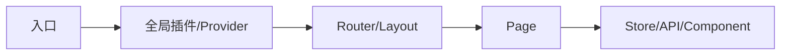

# {{项目名}} 前端架构

## 生成门禁

- 必须从 package manifest、构建配置、入口、目录和真实 import 关系中提取。
- 不把已安装但未使用的依赖写入核心技术栈，不把后端/数据库架构写入本文。

## 技术栈

| 分类 | 技术/版本 | 项目用途 | 证据 |
| --- | --- | --- | --- |
| 框架 | {{内容}} | {{用途}} | `{{package 路径}}` |
| 语言 | {{内容}} | {{用途}} | `{{配置}}` |
| 构建 | {{内容}} | {{用途}} | `{{配置}}` |
| 路由/状态/请求/UI | {{内容}} | {{用途}} | `{{路径}}` |
| 测试 | {{内容}} | {{用途}} | `{{路径}}` |

## 目录与模块边界

| 路径 | 职责 | 允许依赖 | 禁止承载 | 代表文件 |
| --- | --- | --- | --- | --- |
| `{{path}}` | {{职责}} | {{允许}} | {{禁止}} | `{{file}}` |

## 启动与渲染链路

## 路由、布局与权限

| 能力 | 实现位置 | 核心机制 | 证据 |
| --- | --- | --- | --- |
| 路由 | `{{路径}}` | {{静态/动态/文件路由}} | `{{行号}}` |
| 布局 | `{{路径}}` | {{机制}} | `{{行号}}` |
| 权限 | `{{路径}}` | {{守卫/指令/组件}} | `{{行号}}` |

## 状态与数据流

| 状态类型 | 权威位置 | 读写入口 | 持久化 | 约束 |
| --- | --- | --- | --- | --- |
| 服务端/全局/页面/表单 | `{{store/hook}}` | `{{method}}` | {{方式}} | {{约束}} |

## 请求与错误处理

| 能力 | 公共实现 | 使用方式 | 禁止重复实现 |
| --- | --- | --- | --- |
| 请求封装 | `{{路径}}` | `{{client}}` | {{说明}} |
| 鉴权注入 | `{{路径}}` | {{方式}} | {{说明}} |
| 错误处理 | `{{路径}}` | {{方式}} | {{说明}} |
| Loading/空态 | `{{路径}}` | {{方式}} | {{说明}} |

## 公共能力与复用约束

| 能力/组件 | 路径 | 适用场景 | API/用法 | 新增前检查 |
| --- | --- | --- | --- | --- |
| {{能力}} | `{{路径}}` | {{场景}} | `{{入口}}` | {{检索词/同类实现}} |

## 样式与交互约束

| 项目 | 当前做法 | 证据 |
| --- | --- | --- |
| 主题/token | {{内容}} | `{{路径}}` |
| 响应式 | {{内容}} | `{{路径}}` |
| 表单/弹窗/反馈 | {{内容}} | `{{路径}}` |
| 可访问性/键盘 | {{内容或未发现统一约定}} | `{{路径}}` |

## 构建与测试

| 目的 | 命令 | 配置证据 |
| --- | --- | --- |
| 安装依赖 | `{{命令}}` | `{{package manager}}` |
| 开发启动 | `{{命令}}` | `{{script}}` |
| 单测 | `{{命令}}` | `{{config}}` |
| 构建 | `{{命令}}` | `{{script}}` |

## 维护规则

- 新增框架级能力前检索现有组件、hooks、store、request client 和 utils。
- 目录、依赖方向、全局数据流或公共能力变化后同步本文及项目规则。
