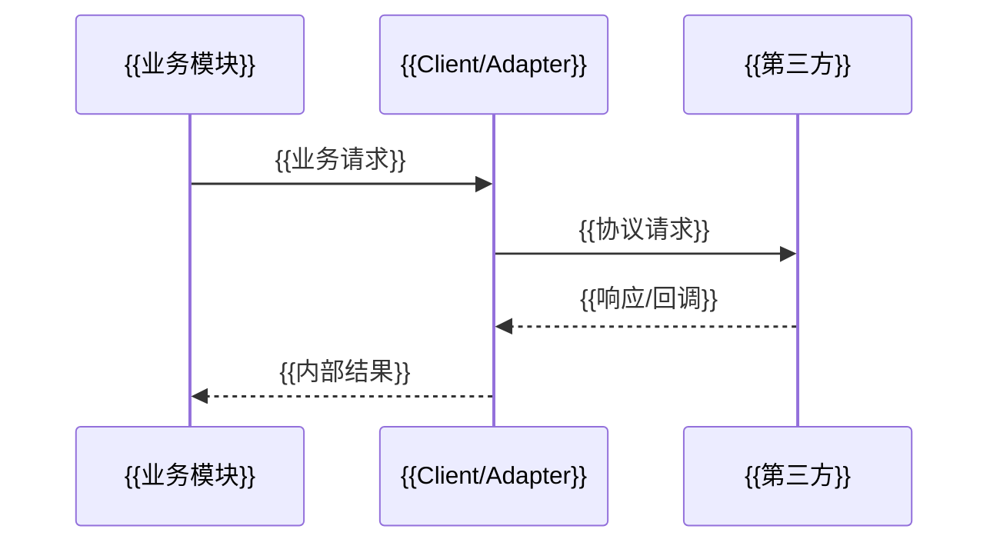

# {{第三方名称}} 集成说明

## 生成门禁

- 仅在代码或配置中存在真实第三方 HTTP/SDK/MQ/文件交换集成时生成；普通内部模块调用不生成。
- 一个重要第三方一份文档，存放于长期文档的“第三方集成”目录。
- 密钥、token、证书私钥、完整账号和生产地址必须脱敏，禁止写入文档。
- 官方契约无法访问时注明证据范围，不得根据 SDK 方法名编造字段语义。

## 集成概览

| 项目 | 内容 | 证据 |
| --- | --- | --- |
| 第三方/产品 | {{名称}} | {{官方资料或代码}} |
| 业务能力 | {{用途}} | `{{路径:行号}}` |
| 接入方式 | HTTP/SDK/MQ/SFTP/其他 | `{{路径:行号}}` |
| 使用模块 | {{模块}} | `{{路径}}` |
| 配置入口 | {{配置键，不写密钥值}} | `{{路径}}` |

## 调用链路

## 能力与接口

| 能力 | 入口 | Client/SDK 方法 | 请求/响应类型 | 超时/重试 | 代码证据 |
| --- | --- | --- | --- | --- | --- |
| {{能力}} | `{{业务入口}}` | `{{method}}` | `{{DTO}}` | {{策略}} | `{{路径:行号}}` |

## 安全与配置

| 项目 | 实现 | 证据 |
| --- | --- | --- |
| 鉴权/签名 | {{方式}} | `{{路径:行号}}` |
| 加密/解密 | {{方式或不适用}} | `{{路径:行号}}` |
| 回调验签 | {{方式或无回调}} | `{{路径:行号}}` |
| 敏感信息管理 | {{环境变量/配置中心/密钥服务}} | `{{路径}}` |
| 超时、重试、限流 | {{真实策略}} | `{{路径:行号}}` |

## 字段与状态映射

| 内部语义 | 内部字段/状态 | 第三方字段/状态 | 转换位置 | 备注 |
| --- | --- | --- | --- | --- |
| {{语义}} | `{{value}}` | `{{value}}` | `{{路径:行号}}` | {{说明}} |

## 异常与边界

| 场景 | 当前行为 | 是否重试 | 幂等/补偿 | 证据 |
| --- | --- | --- | --- | --- |
| {{场景}} | {{行为}} | 是/否 | {{机制}} | `{{路径:行号}}` |

## 维护规则

- SDK、API 版本、字段、签名算法、状态映射变化时同步本文及相关接口/回调文档。
- 只有配置项但没有代码调用时写“检测到配置，未发现可确认调用链”，不得标记已接入。
